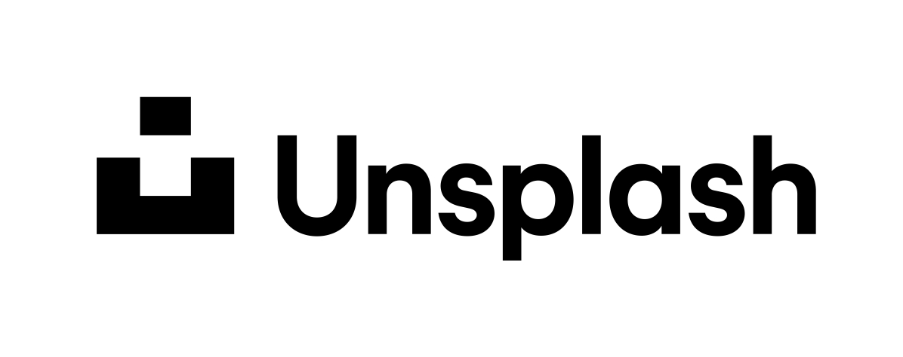
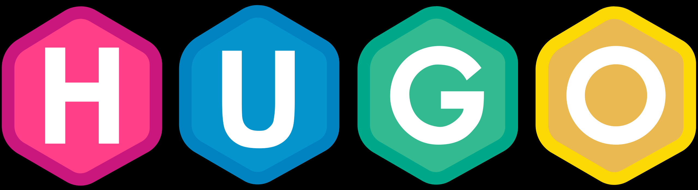
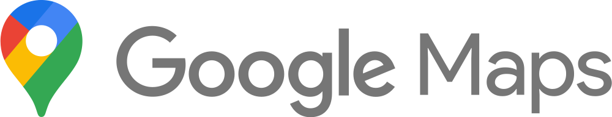

 
 

<h3 class="no-blur">Contacto</h3>

nanjakorewa0***gmail.com (sustituye *** por @) · <a href="https://twitter.com/nanjakorewa">DM en X</a> · [issues en GitHub](https://github.com/nanjakorewa/GeoGuessrTips/issues).  
Puedes mencionar o referenciar el contenido de este sitio en transmisiones u otras actividades con total libertad; ¡siempre lo agradezco!

<h4 class="no-blur">Preguntas frecuentes</h4>

- Q. ¿Puedo utilizar el contenido de este sitio con fines educativos?
  - A. Por supuesto.
- Q. Hay páginas que no muestran información posterior a 2024.
  - A. La mayor parte del contenido se escribió en 2023 mientras hacía directos. En aquel momento ni siquiera servicios como plonkit tenían consejos para todos los países, y tampoco existían referencias similares en japonés. Creé este sitio para organizar mis apuntes personales, de modo que aún quedan secciones pendientes de actualizar con información como las coberturas de Google Car de 2025.
- Q. ¿Podrías incluir capturas de Street View?
  - A. Las condiciones de Google no permiten reutilizar imágenes de Street View, así que recurro a recursos en dominio público y materiales de licencia abierta.

 

<h3 class="no-blur">Resumen</h3>

Empecé a jugar GeoGuessr hacia febrero de 2023.

Esta página funciona como un cuaderno donde guardo lugares interesantes que encuentro durante las partidas, casi como si fueran capturas de pantalla. Si detectas errores o tienes sugerencias, comparte un comentario o abre un issue en GitHub. Incluir la fuente original facilita mucho el trabajo y la citaré con el siguiente formato.

Ejemplo) こんにちは{}こんばんは{}さようなら{{% ref "https://www.weblio.jp/content/%E5%B7%A6%E6%A7%98%E3%81%AA%E3%82%89" "『左様なら』" %}}

Todas las descripciones sobre países, regiones, ciudades e historia se escriben únicamente con el objetivo de jugar GeoGuessr, procurando mantener una postura neutral. Los mapas que aparecen aquí se basan en los límites mostrados dentro del juego y pueden diferir de las divisiones administrativas reales.

Para las imágenes con la etiqueta `CC-BY-`, consulta las <a href="https://creativecommons.jp/licenses/">licencias Creative Commons</a>. `GFDL` hace referencia a la <a href="https://ja.wikipedia.org/wiki/GNU_Free_Documentation_License">GNU Free Documentation License</a>. Si ves alguna imagen (que no sea de dominio público) sin la atribución correspondiente, avísame [desde aquí](https://github.com/nanjakorewa/GeoGuessrTips/issues).  
Las imágenes procedentes de USDA.gov enlazan al original según sus <a href="https://www.usda.gov/policies-and-links">Policies and Links</a>. La mayoría de los señalamientos de tráfico provienen de ilustraciones en dominio público; en unas pocas páginas —por ejemplo <a href="https://geopinning.space/rule/europe/baltic-state/latvia/">Letonia</a>— hay material con crédito explícito. Los productos y logotipos corporativos se muestran solo con fines de referencia dentro del uso legítimo y no implican patrocinio. Si detectas algún uso problemático, ponte en contacto mediante los comentarios o los métodos anteriores y lo corregiré cuanto antes. Las demás citas cumplen el artículo 32, párrafo 1, de la Ley de Derechos de Autor de Japón.

Los mapas mostrados pueden omitir islas remotas o zonas diminutas para simplificar la visualización, y las posiciones de Street View representadas pueden no coincidir con la forma del mapa. Ten en cuenta que se trata de un cuaderno personal, así que de vez en cuando podría anotar temas que no estén directamente relacionados con GeoGuessr.

<h3 class="no-blur">Imágenes de fondo y herramientas utilizadas</h3>

 

<h3 class="no-blur">Política de privacidad y descargos de responsabilidad</h3>

 

<h4 class="no-blur">Descargo de responsabilidad</h4>

No puedo asumir responsabilidad por las acciones que realicen los usuarios basándose en la información publicada aquí, ni por los daños que puedan sufrir los usuarios o terceros al utilizar este sitio.

<h4 class="no-blur">Sobre Google Analytics y otros servicios</h4>

Google y otras redes publicitarias emplean cookies para mostrar anuncios basados en las visitas previas a este y otros sitios. Este sitio utiliza Google Analytics para analizar el tráfico. Los datos recopilados se anonimizan y no permiten identificarte. Si lo prefieres, puedes desactivar las cookies desde la configuración de tu navegador.

Este sitio participa en el programa Amazon Associates y obtiene ingresos de las compras que cumplan los requisitos. Algunos enlaces externos son de afiliados, lo que significa que el sitio puede recibir una comisión si completas una compra. Esto no supone ningún cargo adicional para ti.

***

*Última actualización: 20-10-2025*
