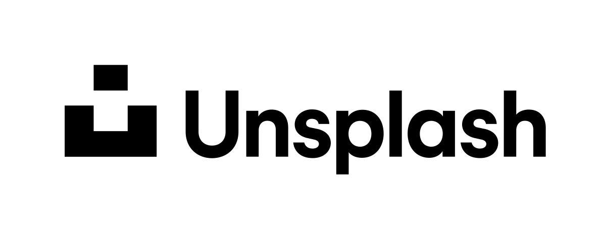

ジオゲッサーを2023年の2月からはじめました。このページではプレイ中に気になった物や面白そうな物の場所をスクショ替わりに保存してます。
間違っている点やコメントあればコメント欄かgithubのissueにて指摘していただけると幸いです。
出典のページもコメントに付けて頂けると嬉しいです（以下のような形で出典として記載します）。

例）こんにちは{}。こんばんは{}。さようなら{{% ref "https://www.weblio.jp/content/%E5%B7%A6%E6%A7%98%E3%81%AA%E3%82%89" "『左様なら』" %}}。

各画像の `CC-BY-` 表記については『<a href="https://creativecommons.jp/licenses/">クリエイティブ・コモンズ・ライセンスとは</a>』を参照してください。`GFDL`は『<a href="https://ja.wikipedia.org/wiki/GNU_Free_Documentation_License">GNU Free Documentation License</a>』のことを指しています。
パブリックドメインの画像以外で出典が記載されていないものを見つけたらお手数ですが[こちら](https://github.com/nanjakorewa/GeoGuessrTips/issues)にご指摘お願いします。USDA.gov上の画像は<a href="https://www.usda.gov/policies-and-links">『Policies and Links』</a>に基づいてパブリックドメインの情報として出典元のリンクを掲載して使用しています。標識はほとんどのページでパブリックドメインの画像を記載していますが<a href="https://geopinning.space/rule/europe/baltic-state/latvia/">ラトビア</a>など一部のページでのみ出典ありの引用があります。企業の製品や企業ロゴを記載することがありますが指名的フェアユース（つまり商標権者の商品や店舗を参照するための使用でありそのスポンサーシップや推奨を示唆するものではない）の範囲と判断しています。問題のある使い方にお気づきの場合はお手数ですがお問い合わせやコメント欄にてご連絡ください。可能な限り速やかに修正します。

表示される地図は表示の都合上で離島や詳細な地域が描かれていない場合があります。また、ストリートビューで訪れていない場所は地図に描かれていない場合があります。そのため実際の形状とは異なる場合がある点ご了承ください。

あと、あくまで自分用のメモなのでジオゲッサー関係ないこともメモするかもしれません。

<h2 class="no-blur">背景画像・使用ツール</h2>

<dlv style="text-align:left;pointer-events:none;">

 

<h2 class="no-blur">プライバシーポリシー・免責事項</h2>

 

<h3 class="no-blur">免責事項</h3>

利用者が当Webサイトの情報を用いて行う一切の行為に関して、一切の責任を負わないものとします。
また、利用者が当Webサイトを利用したことにより生じた利用者の損害及び利用者が第三者に与えた損害に関して、一切の責任を負わないものとします。

<h3 class="no-blur">Googleアナリティクス等について</h3>

Googleを含む広告配信事業者は、Cookie を使用して、ユーザーがそのウェブサイトや他のウェブサイトに過去にアクセスした際の情報に基づいて広告を配信しています。
この目的は、ユーザーがそのサイトや他のサイトにアクセスした際の情報に基づいて、Google やそのパートナーが適切な広告をユーザーに表示するためです。
当サイトでは、Googleによるアクセス解析ツール「Googleアナリティクス」を利用しています。
このGoogleアナリティクスはトラフィックデータの収集のためにCookieを使用しています。このトラフィックデータは匿名で収集されており、個人を特定するものではありません。この機能はCookieを無効にすることで収集を拒否することが出来ますので、お使いのブラウザの設定をご確認ください。

<h3 class="no-blur">お問い合わせ</h3>

<a href="https://ssl.form-mailer.jp/fms/167b8369777173">こちら</a> or <a href="https://twitter.com/nanjakorewa">twitter</a> or [githubのissues](https://github.com/nanjakorewa/GeoGuessrTips/issues) にお願いします。

