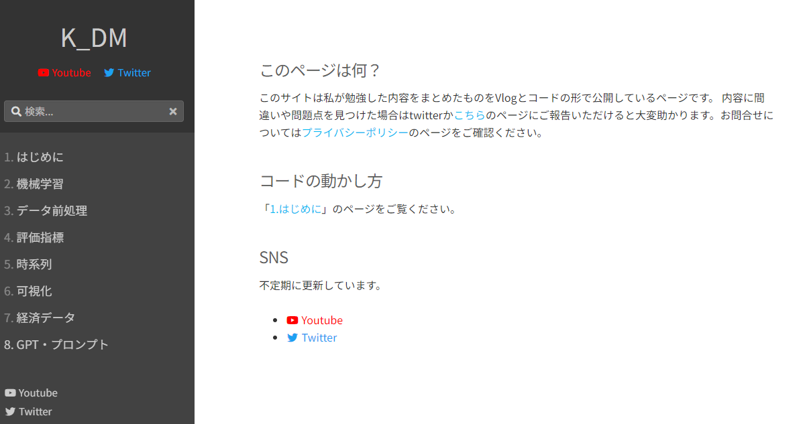
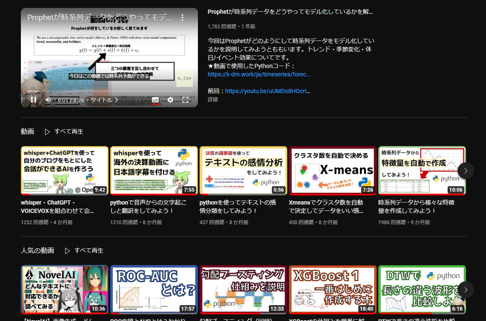
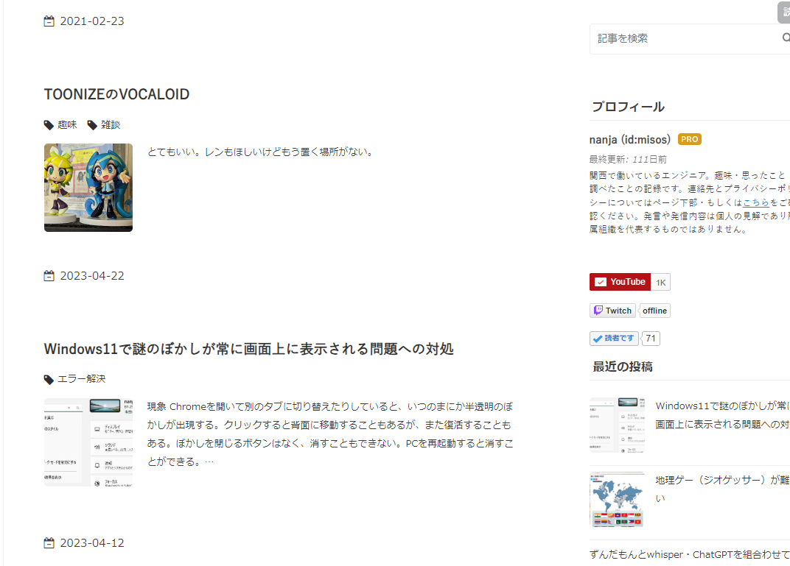
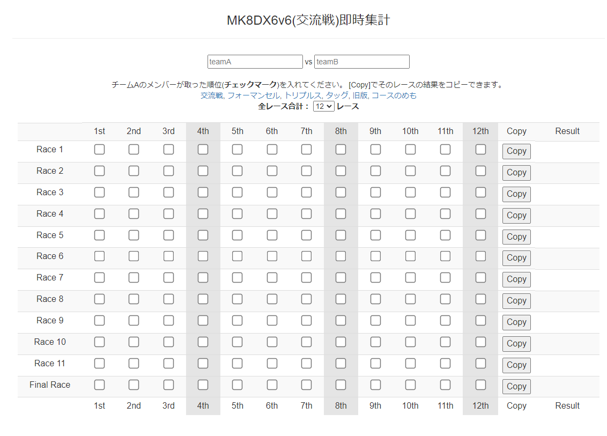

## 自分について

主に関西で働いている社会人です。山に行ったりゲーム配信したり演劇観たりするのが好きです。SNSのアカウントは以下をメインに使用しています。

- [nanjakorewa@twitter](https://x.com/nanjakorewa)
- [nanja@youtube](https://www.youtube.com/@nanjakorewa)
- [他SNSアカウント一覧](https://lit.link/nanjakorewa)

## 作ったもの・作っているもの

### K_DM

自分の勉強したことを記録するyoutubeチャンネル＋コードベース。

### めも

とりあえず書くところが無い時に投稿するブログ。大学の頃の勉強ログとかから一番長く続いていますが最近は更新頻度がかなり少ないです。

## ゲームのツール

大昔（2017年頃）に友達と雑談しながら作った某ゲームの交流戦の即時集計器。

