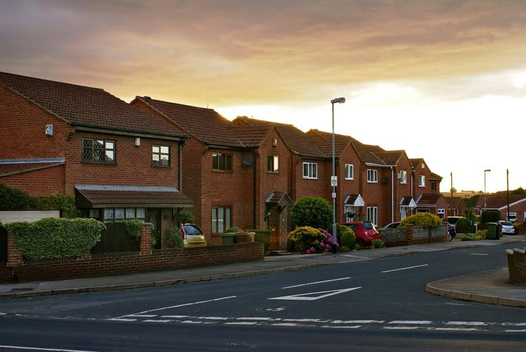
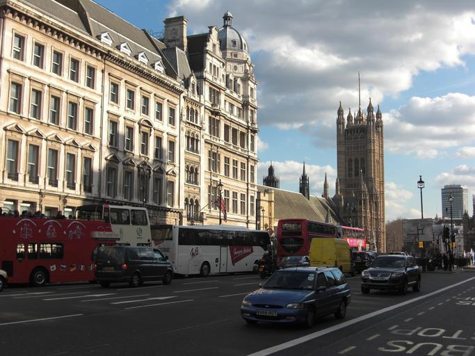
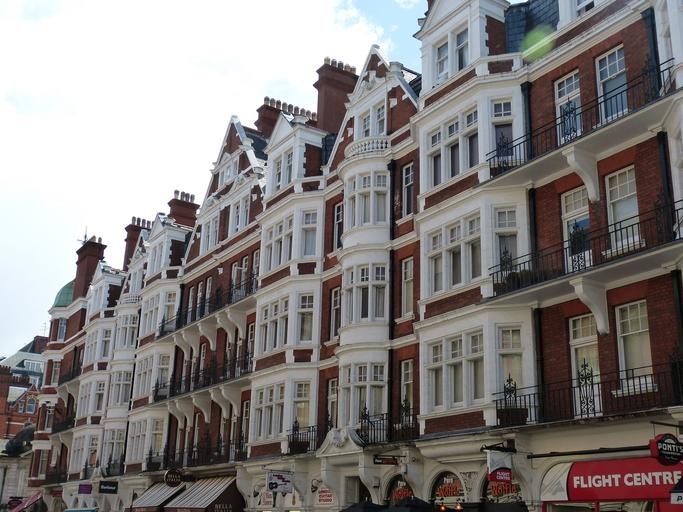
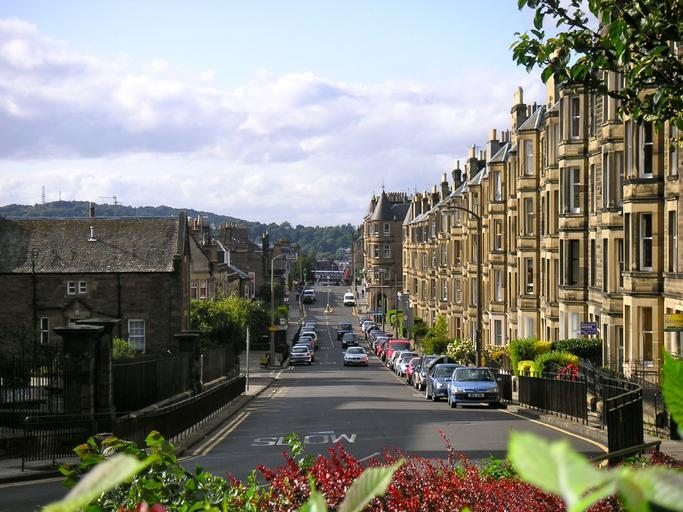
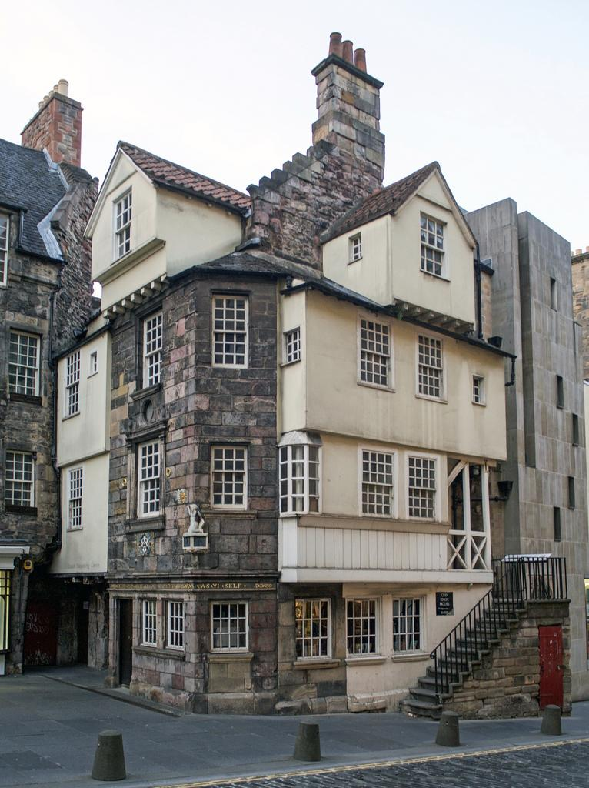
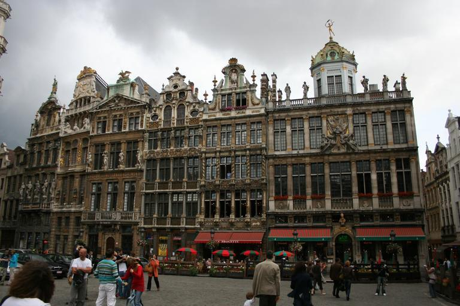
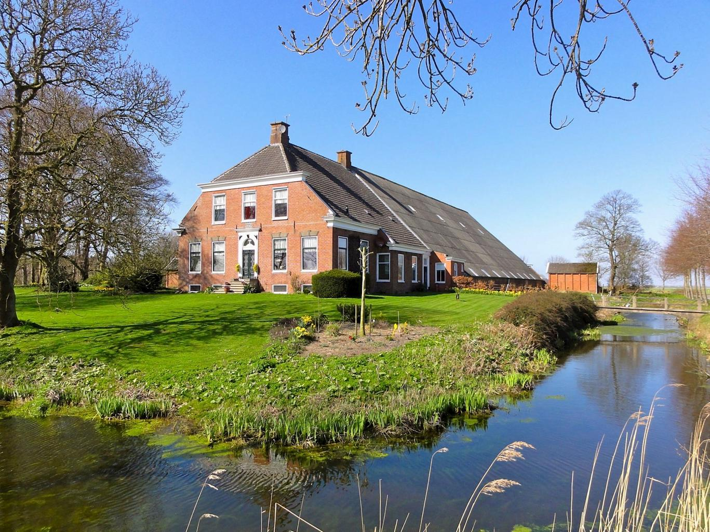
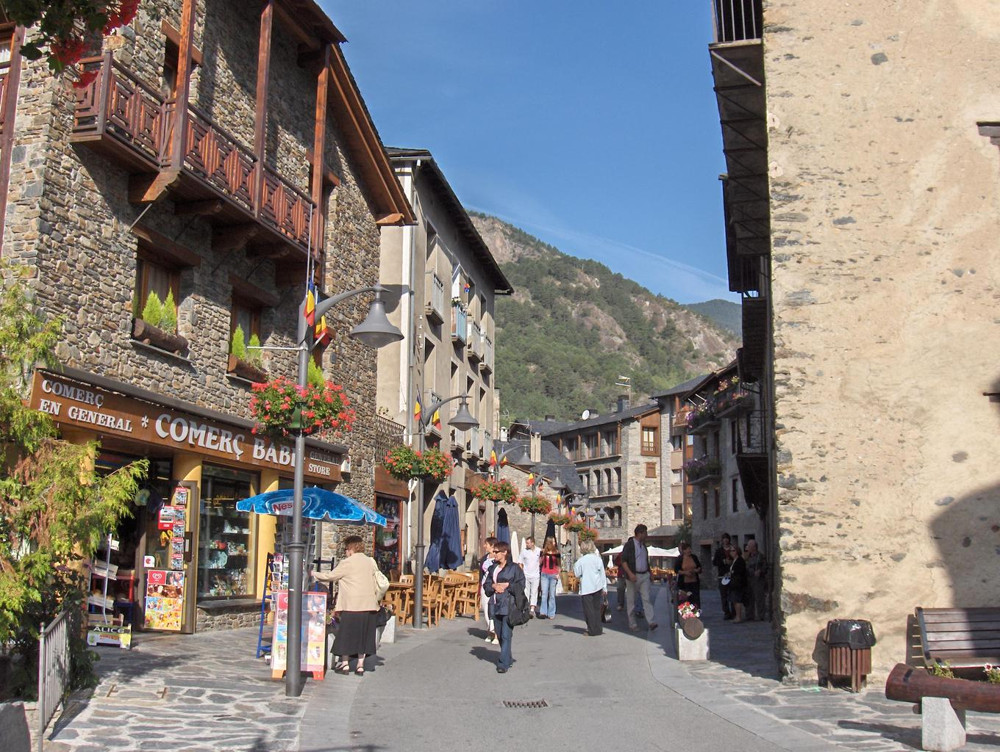

## イギリス

{}
{}

{}
{}

{}
{}

{}
{}

## ベルギー

{}
{}

{}
{}

{}
{}

## ルクセンブルグ

{}
{}
{}
オランダと比べ山がちで、水路が少なく、家が全体的に白っぽく、自転車用の道路数が少ないように思える
{}

<iframe src="https://www.google.com/maps/embed?pb=!4v1683434330069!6m8!1m7!1ssVm9Cww70uzgqXpjbwQt6w!2m2!1d49.68209834094256!2d6.317010560278868!3f307.2501!4f0!5f0.7820865974627469" width="590" height="200" style="border:0;" allowfullscreen="" loading="lazy" referrerpolicy="no-referrer-when-downgrade"></iframe>
<iframe src="https://www.google.com/maps/embed?pb=!4v1683435121370!6m8!1m7!1sHmGSCGzdY_HkcGKSkV95Nw!2m2!1d49.96778324514281!2d5.935690846746911!3f14.436097007289195!4f-1.244007018556303!5f0.7820865974627469" width="590" height="200" style="border:0;" allowfullscreen="" loading="lazy" referrerpolicy="no-referrer-when-downgrade"></iframe>

{}
{}

## オランダ

{}
{}

{}
{}
{}
ルクセンブルグより赤っぽく、全体が平らで、自転車の道が整備されていて、水路が多く存在する。
{}

<iframe src="https://www.google.com/maps/embed?pb=!4v1683434463539!6m8!1m7!1sFseWjQdrAPP7bTzNA8-GIQ!2m2!1d52.07918016906321!2d5.012722519736225!3f99.99801285043178!4f6.083790045224262!5f0.4023600797274389" width="590" height="200" style="border:0;" allowfullscreen="" loading="lazy" referrerpolicy="no-referrer-when-downgrade"></iframe>
<iframe src="https://www.google.com/maps/embed?pb=!4v1683434768973!6m8!1m7!1sFHdufdWRIuBZBCEYXfP_Jw!2m2!1d51.61001662635626!2d4.783697127008571!3f69.23490907551012!4f-10.18750717407363!5f1.5381176529204632" width="590" height="200" style="border:0;" allowfullscreen="" loading="lazy" referrerpolicy="no-referrer-when-downgrade"></iframe>

{}
{}

## ブルガリア

{}
{}

{}
{}

<iframe src="https://www.google.com/maps/embed?pb=!4v1685277272011!6m8!1m7!1shnJTwK5lyKLFrph9zU9BHg!2m2!1d42.62927646518973!2d23.30853855298601!3f25.154376498287945!4f6.78741799512386!5f0.7820865974627469" width="400" height="350" style="border:0;" allowfullscreen="" loading="lazy" referrerpolicy="no-referrer-when-downgrade"></iframe>

{}
{}

## アンドラ

{}
{}

{}
{}
{}
周りが山がちで石壁の模様の壁のアパート・マンションが多い。
{}

<iframe src="https://www.google.com/maps/embed?pb=!4v1683082299994!6m8!1m7!1s8TbqX8oQcGDil0fA5BCCNw!2m2!1d42.46165511734775!2d1.488639127183163!3f324.45601179014636!4f9.447478902995243!5f1.5382304245170149" width="295" height="295" style="border:0;" allowfullscreen="" loading="lazy" referrerpolicy="no-referrer-when-downgrade"></iframe>
<iframe src="https://www.google.com/maps/embed?pb=!4v1683082338929!6m8!1m7!1sFzDiCwMCtCdQoHYhyenbEQ!2m2!1d42.54232367447579!2d1.733097542070016!3f109.24678879707952!4f8.419238264232078!5f2.8615595643766327" width="295" height="295" style="border:0;" allowfullscreen="" loading="lazy" referrerpolicy="no-referrer-when-downgrade"></iframe>

{}
{}