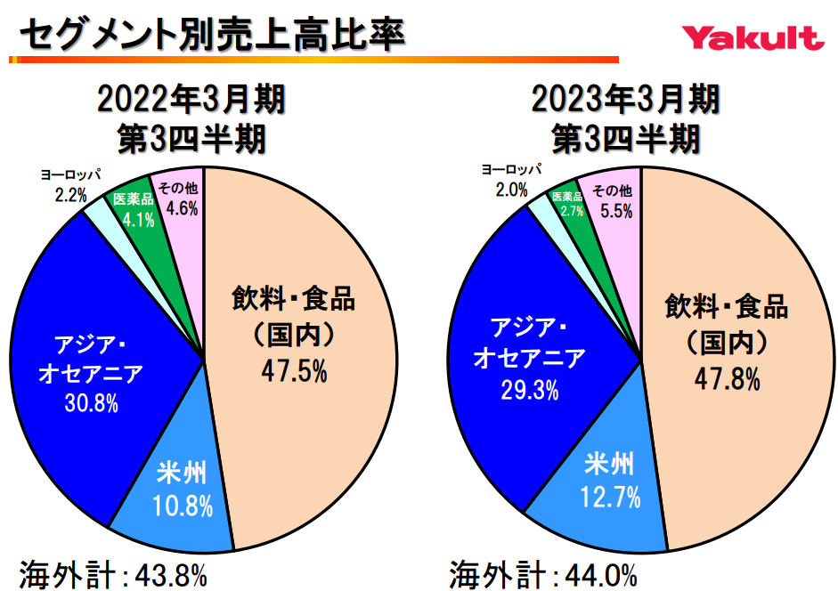

## アジア
### フィリピン

<iframe src="https://www.google.com/maps/embed?pb=!4v1677719234898!6m8!1m7!1sXRRI0ZPD0HVecPilDIzvbw!2m2!1d14.61018214529929!2d121.0053685512792!3f172.94113162802867!4f2.9077667941647007!5f3.325193203789971" width="295" height="295" style="border:0;" allowfullscreen="" loading="lazy" referrerpolicy="no-referrer-when-downgrade"></iframe>

ローヤルクラウン・コーラ（RC Cola）は世界シェアがコカ・コーラ、ペプシに続く3位であるコーラ味の飲料水（？）。フィリピンのMacay HoldingsがRC Global Beverages Inc.を買収した関係か、フィリピンでは看板もある。アメリカでも一定数売られているらしい。
{}

<iframe src="https://www.google.com/maps/embed?pb=!4v1677719519814!6m8!1m7!1sM5JJ7bBen5hGu9qedtMtMw!2m2!1d14.61042217453185!2d121.0050769710356!3f265.5340837073119!4f-19.588728304062357!5f2.1174224834583755" width="295" height="295" style="border:0;" allowfullscreen="" loading="lazy" referrerpolicy="no-referrer-when-downgrade"></iframe>

フィリピンのコンビニにはヤクルトとその類似製品が多く並んでいる。カランバとミンダナオ島に工場がある。
{}
{}
{}

## 南米
### メキシコ

<iframe src="https://www.google.com/maps/embed?pb=!4v1677590662224!6m8!1m7!1soOw-ms97E42K-OYYWvcglA!2m2!1d19.41771037263682!2d-99.1310003470417!3f16.406711929618382!4f3.4760229556364237!5f3.325193203789971" width="295" height="295" style="border:0;" allowfullscreen="" loading="lazy" referrerpolicy="no-referrer-when-downgrade"></iframe>

Mexican Cokeのロゴの末尾のMRは”marca registrada”の省略形。Mexican Cokeは本家アメリカとは味が違うらしい。また、 Coca-Cola FEMSAまたはKOFとして知られ、メキシコのメキシコシティに本社を置くメキシコの飲料会社。世界最大のフランチャイズ コカ・コーラボトラー。
{}
{}

## ヨーロッパ
### セルビア

<iframe src="https://www.google.com/maps/embed?pb=!4v1677456670237!6m8!1m7!1svvCQNNDfVQxdXz7c0sTkYg!2m2!1d43.31884589466517!2d21.89954152225962!3f333.088020712717!4f-7.293999454183336!5f3.325193203789971" width="295" height="295" style="border:0;" allowfullscreen="" loading="lazy" referrerpolicy="no-referrer-when-downgrade"></iframe>

Frikomはセルビアのアイスクリームメーカーで、冷凍の果物、野菜、魚、ペストリーも販売しています。
{}

### クロアチア

<iframe src="https://www.google.com/maps/embed?pb=!4v1677754454522!6m8!1m7!1sRmDjXV2j8HFd3jBXz772Cw!2m2!1d44.12850153630271!2d15.22381030580157!3f260.30886780380433!4f-12.609291533317432!5f3.1503183707555253" width="295" height="295" style="border:0;" allowfullscreen="" loading="lazy" referrerpolicy="no-referrer-when-downgrade"></iframe>

Ledoはクロアチアを拠点とするアイスクリームと冷凍食品のメーカー。南東ヨーロッパで最大の冷凍食品とアイスクリームの生産者の1つ。
{}

