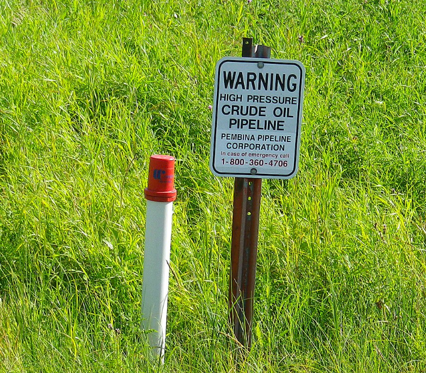

## 北米

### カナダ

<iframe src="https://www.google.com/maps/embed?pb=!4v1678281259970!6m8!1m7!1svTjbqOlqnB8Uzrp_DJLtEg!2m2!1d42.90064294764043!2d-82.41383973283051!3f279.34233687733166!4f-3.0928858055765573!5f3.325193203789971" width="295" height="295" style="border:0;" allowfullscreen="" loading="lazy" referrerpolicy="no-referrer-when-downgrade"></iframe>

!

ペンビナ・パイプライン (Pembina Pipeline Corporation)はカナダのミッドストリーム企業。毎月配当がもらえる数少ない企業だが、毎月固定で配当を払えるのはその事業形態（固定かつ長期の契約が多い）による安定した収入があることを示している。パイプラインが埋まっている箇所には看板があるため、ミッドストリーム企業の保有するパイプラインの配置を覚えていたならばこれをみればおよその地域が分かる...かも？
{}
{}

