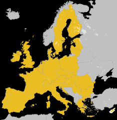

## 北米
### メキシコ

<iframe src="https://www.google.com/maps/embed?pb=!4v1677591292608!6m8!1m7!1s6f7fhnWfsUd3fRRc765tmA!2m2!1d54.69686837469684!2d25.29899849923187!3f353.35508483363355!4f4.49357373094243!5f3.093682458488531" width="295" height="295" style="border:0;" allowfullscreen="" loading="lazy" referrerpolicy="no-referrer-when-downgrade"></iframe>

リトアニアのスーパーマーケットチェーンの名前。
{}

## ヨーロッパ

<iframe src="https://www.google.com/maps/embed?pb=!4v1677721323215!6m8!1m7!1sTyOY_kAMpa22qQF54wsPiQ!2m2!1d45.73103612140538!2d21.18784703841284!3f180.05939482857062!4f20.732884245429346!5f0.734785256448784" width="295" height="295" style="border:0;" allowfullscreen="" loading="lazy" referrerpolicy="no-referrer-when-downgrade"></iframe>

ドイツのディスカウントスーパーマーケットのチェーン。ヨーロッパ全域に分布する。
{{% ahref "リドル" "https://ja.wikipedia.org/wiki/%E3%83%AA%E3%83%89%E3%83%AB" %}}

### イギリス

<iframe src="https://www.google.com/maps/embed?pb=!4v1677722961015!6m8!1m7!1sh8v8vR4_TSkQ_C22L7yZxA!2m2!1d55.85902575191221!2d-4.262501058570301!3f268.85345545134084!4f4.592661569665083!5f1.4885743440180237" width="295" height="295" style="border:0;" allowfullscreen="" loading="lazy" referrerpolicy="no-referrer-when-downgrade"></iframe>

英国のウェルウィン ガーデン シティに本社がある小売業者、11か国（インド・パキスタン・韓国・イギリスなど）で事業展開。
{}
{}

