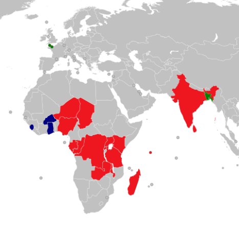

## 中南米

{}
{}

<iframe src="https://www.google.com/maps/embed?pb=!4v1678078151774!6m8!1m7!1sYBew9eXerxoal_r413JvdA!2m2!1d15.06418303328416!2d-91.8355842761859!3f59.97156991120351!4f-7.4276234480849155!5f3.265693632054433" width="295" height="295" style="border:0;" allowfullscreen="" loading="lazy" referrerpolicy="no-referrer-when-downgrade"></iframe>

Claro Mexico は、メキシコの電気通信グループであるAmérica Móvilの一部であるメキシコの会社。競合はTigoやMovistarなど。あったらほぼ中南米。
 {}

{}
{}

## アフリカ

{}
{}

<iframe src="https://www.google.com/maps/embed?pb=!4v1677913325386!6m8!1m7!1s566c9QI7aQZGUE-Yu8fUtQ!2m2!1d6.514146885971278!2d3.35676863552664!3f183.8477371905649!4f-0.23733045349406723!5f3.1491133933760214" width="295" height="295" style="border:0;" allowfullscreen="" loading="lazy" referrerpolicy="no-referrer-when-downgrade"></iframe>

バーティ・エアテルはインドの電気通信事業者でありインド国内で「Airtel」ブランドを展開している。そしてAirtel Africaはアフリカの 14 か国、主に東アフリカ、中央アフリカ、西アフリカに展開していて、<a href="https://ja.wikipedia.org/wiki/FTSE100%E7%A8%AE%E7%B7%8F%E5%90%88%E6%A0%AA%E4%BE%A1%E6%8C%87%E6%95%B0">FTSE100種総合株価指数</1>にも含まれる大企業。図はAirtelの事業範囲（出典：Airtel AfricaのWikipedia）。
{}

{}
{}

<iframe src="https://www.google.com/maps/embed?pb=!4v1677462071366!6m8!1m7!1swYFQBrslJ2cfJpxVOtFAEg!2m2!1d6.692917797069954!2d-1.622077409676407!3f276.7722025364622!4f-13.784673934113556!5f2.9858464428048155" width="295" height="295" style="border:0;" allowfullscreen="" loading="lazy" referrerpolicy="no-referrer-when-downgrade"></iframe>

Millicom International Cellular SA は、ラテンアメリカの新興市場に特化したルクセンブルグの固定回線およびモバイル通信サービスプロバイダー。ボリビア、コロンビア、コスタリカ、エルサルバドル、グアテマラ、ホンジュラス、ニカラグア、パナマ、パラグアイでサービスを提供していた。
アフリカ（チャド、コンゴ民主共和国、ガーナ、モーリシャス、ルワンダ、セネガル、シエラレオネ、タンザニア）でも事業をしていたが、2021年までに事業を売却したらしい。
{}
{}

{}
{}

<iframe src="https://www.google.com/maps/embed?pb=!4v1681156601869!6m8!1m7!1sFzzhfKKYdTuKuHRt91tTDw!2m2!1d-1.286406038743243!2d36.8280811193266!3f329.15201408064127!4f9.7236776257745!5f3.325193203789971" width="295" height="295" style="border:0;" allowfullscreen="" loading="lazy" referrerpolicy="no-referrer-when-downgrade"></iframe>

{}
{}

<iframe src="https://www.google.com/maps/embed?pb=!4v1677591495376!6m8!1m7!1sjRV2oBfBYNpnnkSNo-S7tg!2m2!1d-26.18934668940727!2d28.05771631823907!3f203.70561633241783!4f50.894807020271145!5f3.1716416634382556" width="295" height="295" style="border:0;" allowfullscreen="" loading="lazy" referrerpolicy="no-referrer-when-downgrade"></iframe>

ボーダコムは、南アフリカ共和国ハウテン州ヨハネスブルグ市都市圏に本社を置く携帯電話事業を営む企業。
{}

{}
{}
