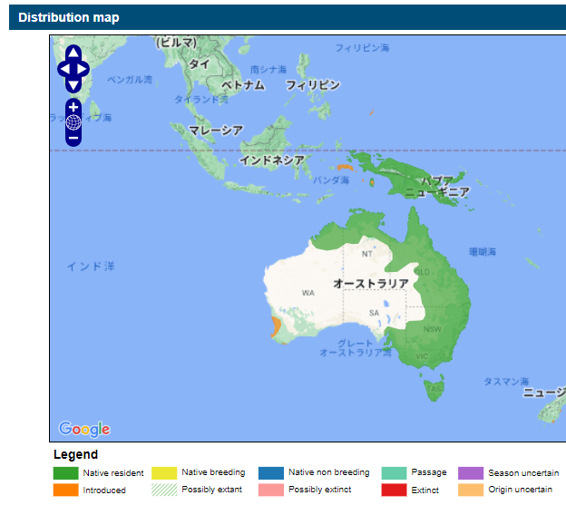

## オセアニア

### オーストラリア

<iframe src="https://www.google.com/maps/embed?pb=!4v1677464880910!6m8!1m7!1sxGJEIXGgzX9Z_7A7arztCg!2m2!1d-27.4701668778887!2d153.0372440216572!3f286.4461206099864!4f-14.322032255461394!5f3.325193203789971" width="295" height="295" style="border:0;" allowfullscreen="" loading="lazy" referrerpolicy="no-referrer-when-downgrade"></iframe>

ヤブツカツクリは、キジ目ツカツクリ科に分類される鳥類の一種。オーストラリア北東部から東部。海岸に沿った地域の森林や低木林に生息する。住宅地でもよく見かけ、あまり人を恐れず、時にはテーブルなどにある人の食物を奪うこともある。
{{% ahref "Australian brushturkey" "https://ja.wikipedia.org/wiki/%E3%83%A4%E3%83%96%E3%83%84%E3%82%AB%E3%83%84%E3%82%AF%E3%83%AA" %}}

キバタンの分布

キバタンはオーストラリア、及びパプアニューギニアに分布する大型のオウムの一種。パースとニュージーランドにも持ち込まれている。
{}

### ニュージーランド

<iframe src="https://www.google.com/maps/embed?pb=!4v1679741143728!6m8!1m7!1syirZDKaXugQP8U6cAeAMjg!2m2!1d-45.5327278331821!2d170.7398799203575!3f6.855891107297337!4f-12.392879224145844!5f3.325193203789971" width="295" height="295" style="border:0;" allowfullscreen="" loading="lazy" referrerpolicy="no-referrer-when-downgrade"></iframe>

## アジア
### インド

<iframe src="https://www.google.com/maps/embed?pb=!4v1680006764562!6m8!1m7!1s1oa_fVgZity80LBS3GvTtQ!2m2!1d23.01822162997455!2d72.56484212857283!3f279.9445138041662!4f-12.949070743173877!5f3.325193203789971" width="295" height="295" style="border:0;" allowfullscreen="" loading="lazy" referrerpolicy="no-referrer-when-downgrade"></iframe>

## ヨーロッパ

### イギリス

<iframe src="https://www.google.com/maps/embed?pb=!4v1680078882045!6m8!1m7!1sH_kAXSwVb4y8jeF7EKLgiA!2m2!1d51.6795211091502!2d-1.12876031154732!3f224.8161270716556!4f-19.666192298897784!5f3.293960553484509" width="295" height="295" style="border:0;" allowfullscreen="" loading="lazy" referrerpolicy="no-referrer-when-downgrade"></iframe>

### ルーマニア

<iframe src="https://www.google.com/maps/embed?pb=!4v1680077795323!6m8!1m7!1sbHAXJOK0BYryaGdISf5vaA!2m2!1d47.18237516665925!2d24.13398512970032!3f7.592590466435411!4f-15.16305902060742!5f3.1918224971072484" width="295" height="295" style="border:0;" allowfullscreen="" loading="lazy" referrerpolicy="no-referrer-when-downgrade"></iframe>

