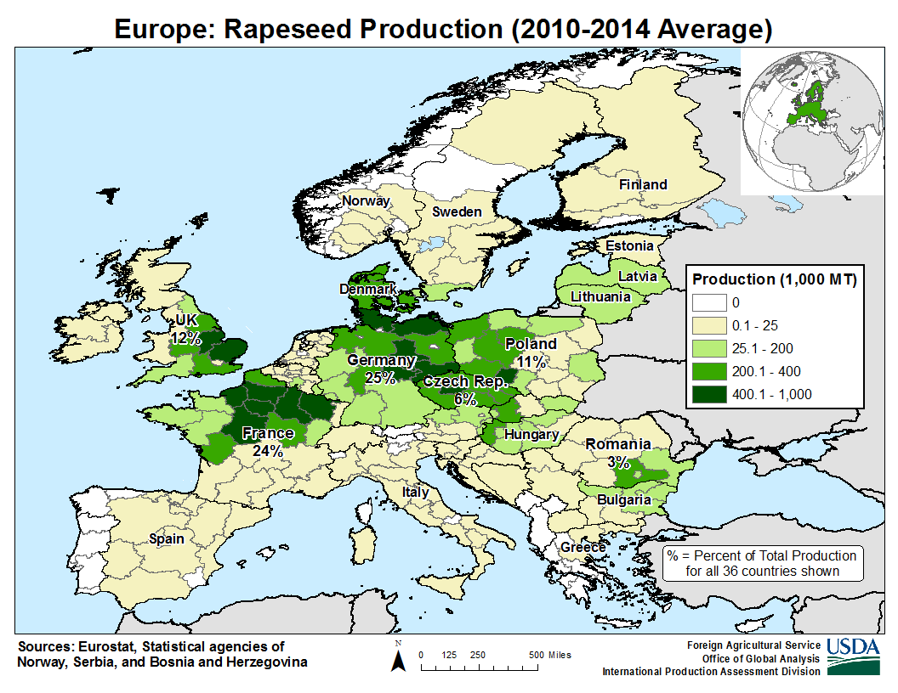
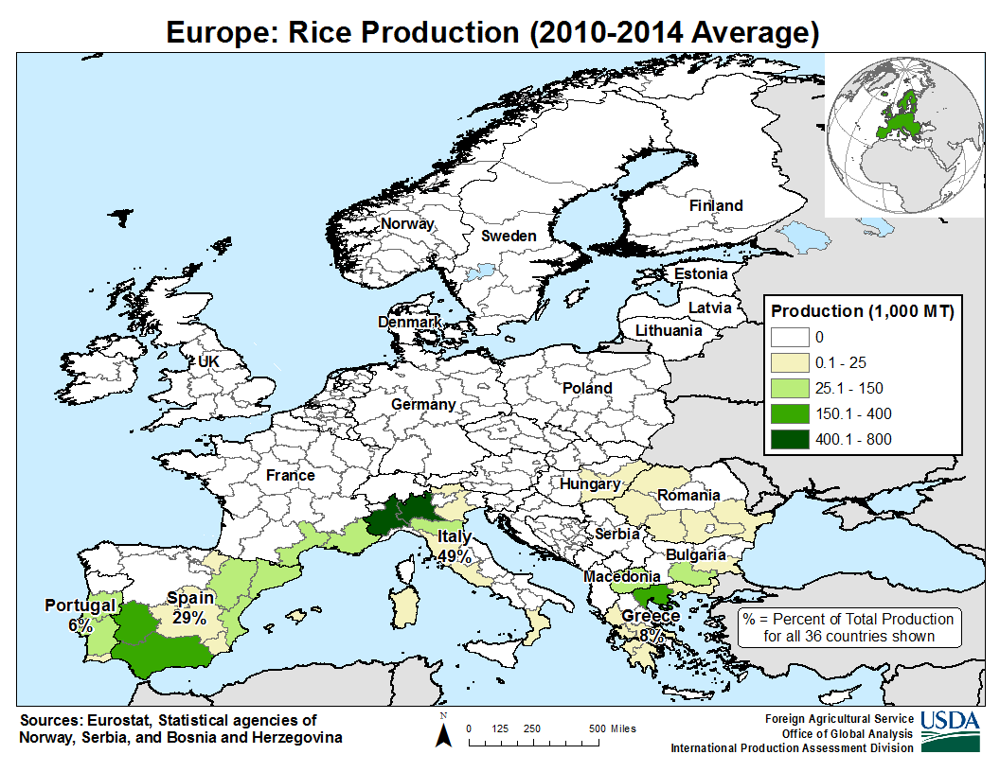
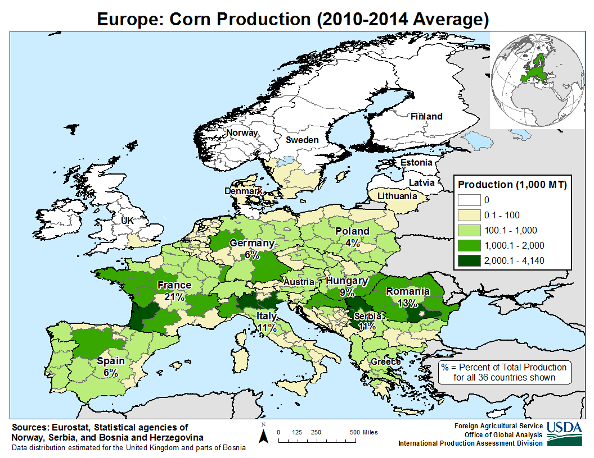
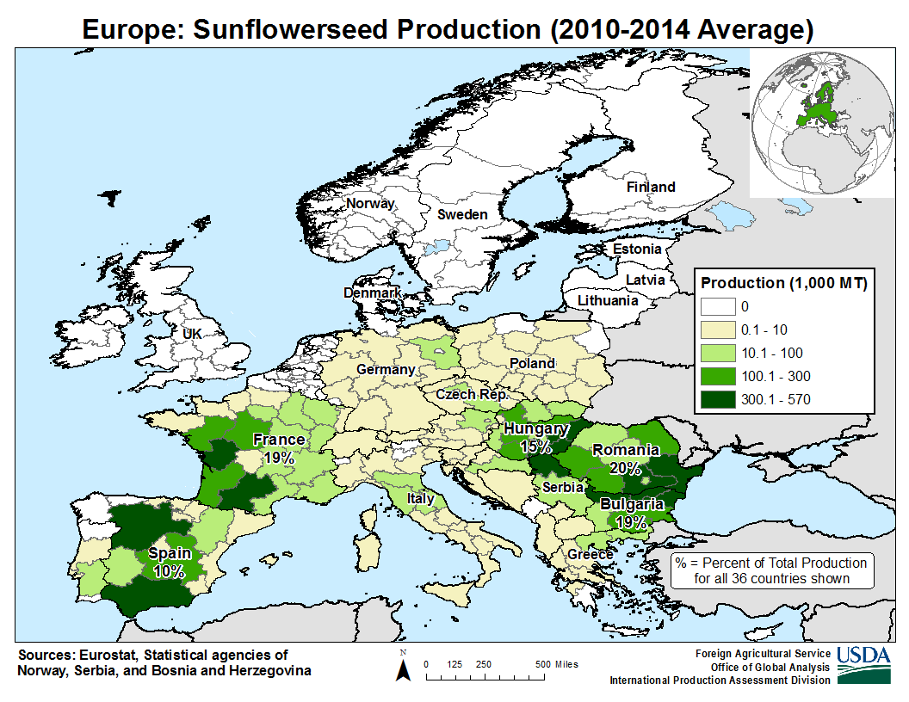

 

## 農業分布

    <ul class="rule-list">
        <li>データの出典：<a href="https://ipad.fas.usda.gov/rssiws/al/europe_cropprod.aspx">Europe - Crop Production Maps - U.S. Department of Agriculture(USDA)</a></li>
    </ul>

{}
{}

<iframe src="https://www.google.com/maps/embed?pb=!4v1684467180063!6m8!1m7!1sAFkLUASEB40x6QE0WyZFFA!2m2!1d49.7052550324619!2d1.000711810998524!3f163.57649839892989!4f-4.140214187011296!5f1.7586590975210155" width="90%" height="300" style="border:0;" allowfullscreen="" loading="lazy" referrerpolicy="no-referrer-when-downgrade"></iframe>

{}
黄色い小さな花の畑があるなら菜種かも？上の位置はフランス北部。
{}

{}
{}

<iframe src="https://www.google.com/maps/embed?pb=!4v1684466484459!6m8!1m7!1sxMurpWJVH50lFhizIgnHJA!2m2!1d45.35551015697354!2d9.057186053108605!3f80.47065037970007!4f-10.834428795593993!5f0.7820865974627469" width="90%" height="300" style="border:0;" allowfullscreen="" loading="lazy" referrerpolicy="no-referrer-when-downgrade"></iframe>

{}
乾燥している地域にはない。上の位置はイタリアの北部。
{}

{}
{}

{}
中央から北部にかけて多いが海沿い以外はどこでも存在する可能性あり
{}
{}
{}

{}
スペイン・フランス・ルーマニア付近に多い。
{}

<iframe src="https://www.google.com/maps/embed?pb=!4v1684467389092!6m8!1m7!1s7wcV-KGOUJrI-FVkKuen4g!2m2!1d42.26803244530361!2d-4.959664382599334!3f286.39343776806163!4f-7.1569512598281335!5f2.845416800929829" width="295" height="295" style="border:0;" allowfullscreen="" loading="lazy" referrerpolicy="no-referrer-when-downgrade"></iframe>
<iframe src="https://www.google.com/maps/embed?pb=!4v1684467401725!6m8!1m7!1sm_2-hKEYncxnb42xUcnetw!2m2!1d46.20466499330326!2d-0.3591168113380334!3f184.85!4f-5.609999999999999!5f3.22183129603009" width="295" height="295" style="border:0;" allowfullscreen="" loading="lazy" referrerpolicy="no-referrer-when-downgrade"></iframe>

{}
{}
