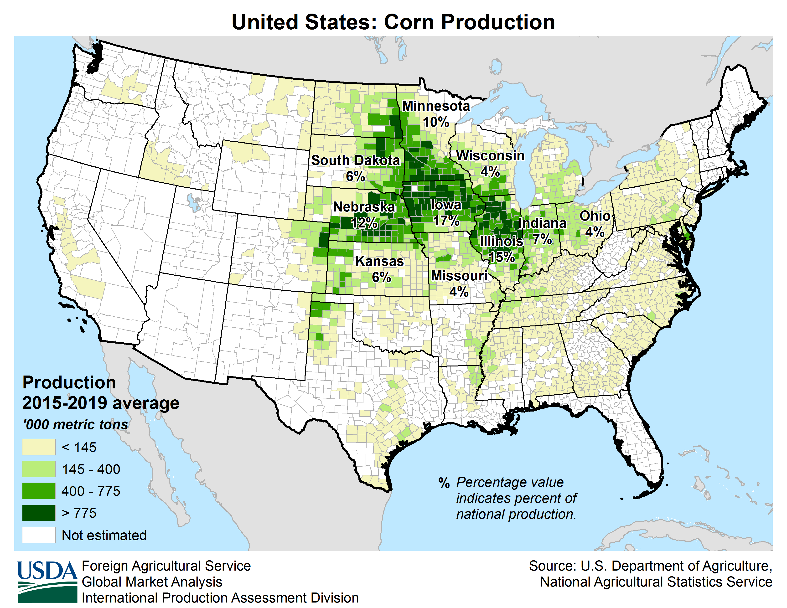
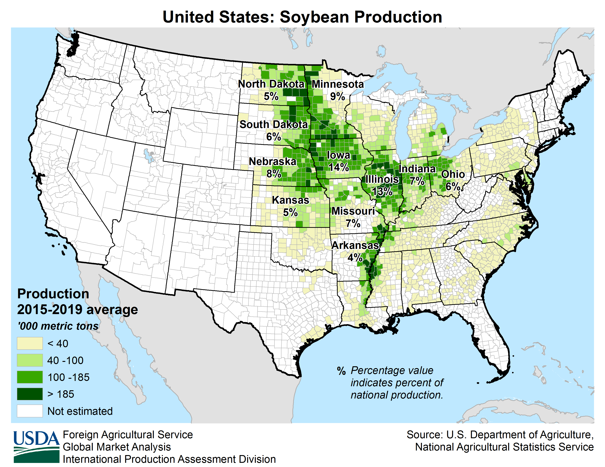
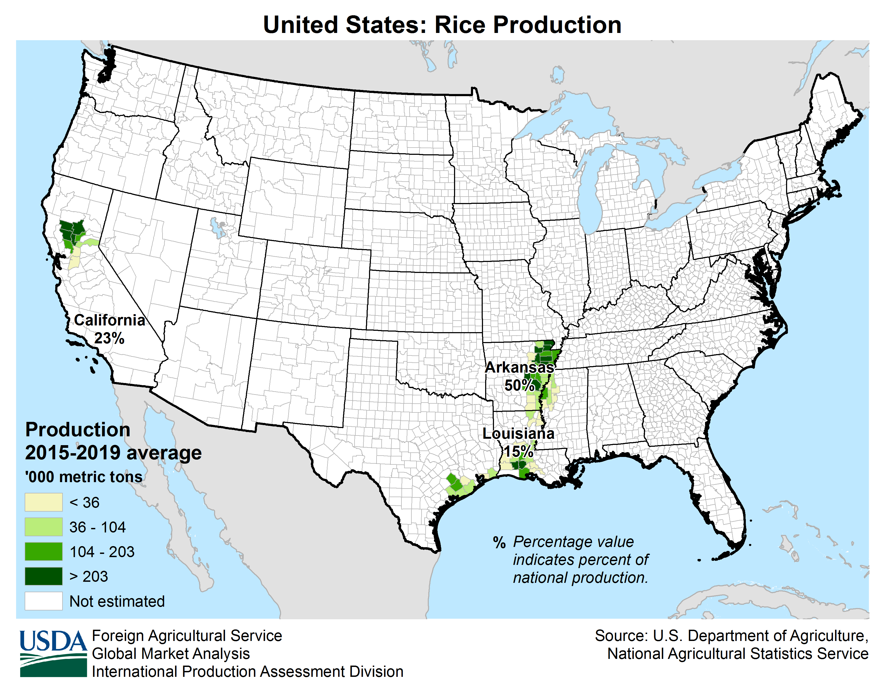
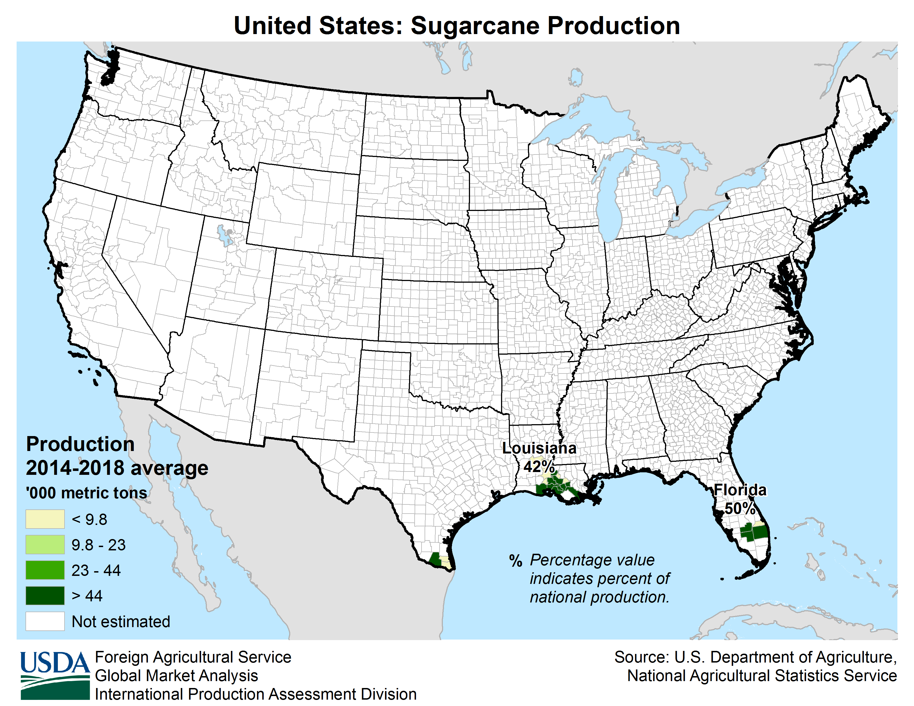

## Distribusi Pertanian

    <ul class="rule-list">
        <li>Jika ada jagung, lebih aman menuju ke wilayah tengah atau timur.</li>
        <li>Sawah padi: jika tiang listrik memiliki garis kuning, kemungkinan besar di California utara; jika tidak, maka di sepanjang Sungai Mississippi.</li>
        <li>Sumber data: <a href="https://www.usda.gov/policies-and-links">Departemen Pertanian AS (U.S. Department of Agriculture)</a></li>
    </ul>

{}
{}

{}
Jagung banyak diproduksi di sepanjang Corn Belt {}. Namun, jagung diproduksi secara luas di seluruh negeri, sehingga ini saja tidak cukup untuk memastikan lokasinya di wilayah tengah.
{}

<iframe src="https://www.google.com/maps/embed?pb=!4v1682733134448!6m8!1m7!1sdy4W4vPozx8ohCgjQeTPZw!2m2!1d41.176852598073!2d-87.79877689286823!3f271.2171390393599!4f-5.1519386637587985!5f1.5047631167738094" width="590" height="300" style="border:0;" allowfullscreen="" loading="lazy" referrerpolicy="no-referrer-when-downgrade"></iframe>

{}
{}

{}
Distribusi kedelai mirip dengan jagung {}.
{}

{}
{}

{}
Sawah biasanya ditemukan di wilayah tertentu di California dan sepanjang sungai hingga pesisir Arkansas {}. Petunjuk dari tiang listrik dapat membantu mengidentifikasi California.
{}

<iframe src="https://www.google.com/maps/embed?pb=!4v1682733490202!6m8!1m7!1s4A3IkVME8LVYpuCXg-OuaA!2m2!1d39.49365609048166!2d-121.7822379196536!3f221.79363223039482!4f-5.790068187062502!5f3.2786393840952575" width="295" height="295" style="border:0;" allowfullscreen="" loading="lazy" referrerpolicy="no-referrer-when-downgrade"></iframe>
<iframe src="https://www.google.com/maps/embed?pb=!4v1682734884108!6m8!1m7!1sMEXmr5wqageIfPuhj8E0iw!2m2!1d35.79319395387087!2d-89.8386351406563!3f121.71333783003216!4f-3.589889380682493!5f3.325193203789971" width="295" height="295" style="border:0;" allowfullscreen="" loading="lazy" referrerpolicy="no-referrer-when-downgrade"></iframe>

{}
{}

{}
Pohon kapas jarang terlihat, tetapi ada kemungkinan menemukan serat kapas putih di jalan {}.
{}

<iframe src="https://www.google.com/maps/embed?pb=!4v1682735996734!6m8!1m7!1sEoQ6csXiM6a72t-5Lb5-Og!2m2!1d33.46990965072755!2d-101.818398460253!3f197.95125231968635!4f-20.326037687398497!5f3.1477169517970793" width="295" height="295" style="border:0;" allowfullscreen="" loading="lazy" referrerpolicy="no-referrer-when-downgrade"></iframe>
<iframe src="https://www.google.com/maps/embed?pb=!4v1682736049473!6m8!1m7!1sOI7-S9mUEoFcMKBxHPuW9Q!2m2!1d33.61479697415089!2d-101.6134666971198!3f236.01923132521446!4f-12.615322855656387!5f2.9290789356164444" width="295" height="295" style="border:0;" allowfullscreen="" loading="lazy" referrerpolicy="no-referrer-when-downgrade"></iframe>

{}
{}

{}
Tebu hanya tumbuh di wilayah tertentu di Florida, dan sangat sedikit di Louisiana karena terbatasnya akses jalan {}.
{}

<iframe src="https://www.google.com/maps/embed?pb=!4v1682736662963!6m8!1m7!1sCmGChqhfRZwxQ5vtqkL7ZQ!2m2!1d26.54856124221731!2d-80.91671755371033!3f91.42825537003402!4f-5.256725945766988!5f2.7989670233367177" width="590" height="300" style="border:0;" allowfullscreen="" loading="lazy" referrerpolicy="no-referrer-when-downgrade"></iframe>

{}
{}

{}
Wilayah gandum tidak tumpang tindih dengan wilayah jagung dan kedelai. Gambar gandum telah diproses agar memiliki bentuk peta yang konsisten dengan gambar lainnya.
{}

{}
{}

## Amerika Serikat
### Timur Laut
{}
{}

<iframe src="https://www.google.com/maps/embed?pb=!4v1679682104525!6m8!1m7!1sHpldokOl2fOfB_5V78iEWw!2m2!1d45.36606700400944!2d-67.71281053593883!3f164.82273888334214!4f0.7384445382142104!5f0.7820865974627469" width="295" height="295" style="border:0;" allowfullscreen="" loading="lazy" referrerpolicy="no-referrer-when-downgrade"></iframe>

{}
{}

<iframe src="https://www.google.com/maps/embed?pb=!4v1679682179516!6m8!1m7!1sq3DI5JVYoEGwOxCwZQ9HqQ!2m2!1d47.50455848990519!2d-93.19496086176746!3f10.25704924852798!4f6.813013018868048!5f0.7820865974627469" width="295" height="295" style="border:0;" allowfullscreen="" loading="lazy" referrerpolicy="no-referrer-when-downgrade"></iframe>

{}
{}

### Barat Laut
{}
{}

<iframe src="https://www.google.com/maps/embed?pb=!4v1679681996721!6m8!1m7!1s_YSFGFdAYVxS0-zll6t2iQ!2m2!1d46.5623815617751!2d-114.6490088402405!3f205.34!4f4.769999999999996!5f0.4856615363196059" width="295" height="295" style="border:0;" allowfullscreen="" loading="lazy" referrerpolicy="no-referrer-when-downgrade"></iframe>

{}
{}

<iframe src="https://www.google.com/maps/embed?pb=!4v1679682197045!6m8!1m7!1sU4WPXl3BTf_wRYNC72cOAQ!2m2!1d46.8033245072556!2d-105.0707256071661!3f262.0595289854954!4f0.4670748031622054!5f0.7820865974627469" width="295" height="295" style="border:0;" allowfullscreen="" loading="lazy" referrerpolicy="no-referrer-when-downgrade"></iframe>

{}
{}

### Tenggara

{}
{}

<iframe src="https://www.google.com/maps/embed?pb=!4v1679681953396!6m8!1m7!1scj8lk8vEp03RPsVFTWcTdA!2m2!1d33.86067228429133!2d-115.7940488779932!3f152.7072055270092!4f6.962312350061822!5f0.46809600461762146" width="295" height="295" style="border:0;" allowfullscreen="" loading="lazy" referrerpolicy="no-referrer-when-downgrade"></iframe>

{}
{}

### Barat Daya

{}
{}

<iframe src="https://www.google.com/maps/embed?pb=!4v1679682063845!6m8!1m7!1sE4jf5OoIigSjZBZgxxr7fg!2m2!1d26.94537795389445!2d-81.72028230542088!3f137.93941958914127!4f8.125359950563976!5f0.8721658565598276" width="295" height="295" style="border:0;" allowfullscreen="" loading="lazy" referrerpolicy="no-referrer-when-downgrade"></iframe>

{}
{}
