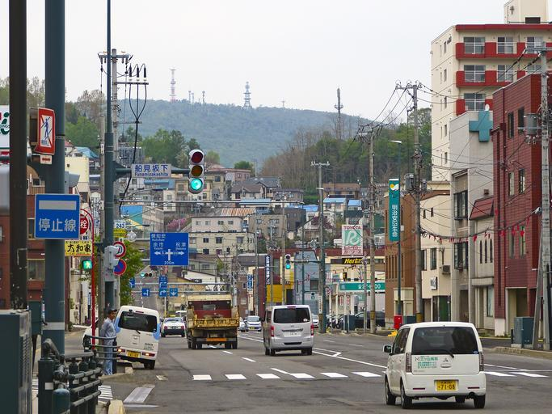

正解を選んだ場合のみ解説が表示されます。

{}
{}
{}
{}

{}
右奥の看板にひらがなが書かれています！ちなみに矢印の看板（固定式視線誘導柱）は積雪が多い地域にしかないため、北海道のような地域が候補になります。
{}

<a href="//commons.wikimedia.org/wiki/User:221.20" title="User:221.20">221.20</a> (<a href="//commons.wikimedia.org/wiki/User_talk:221.20" title="User talk:221.20">talk</a>) - 投稿者自身による著作物, パブリック・ドメイン, <a href="https://commons.wikimedia.org/w/index.php?curid=15535739">リンク</a>による

{}
地名だけでなく市外局番や電柱などを活用すれば、{}の中でさらに地域を特定することができます。そのようなヒントが集まった有志による有名サイト、{}は一番初めに目を通すべき重要なサイトです。
{}

