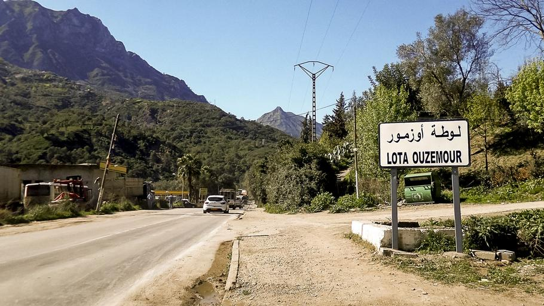
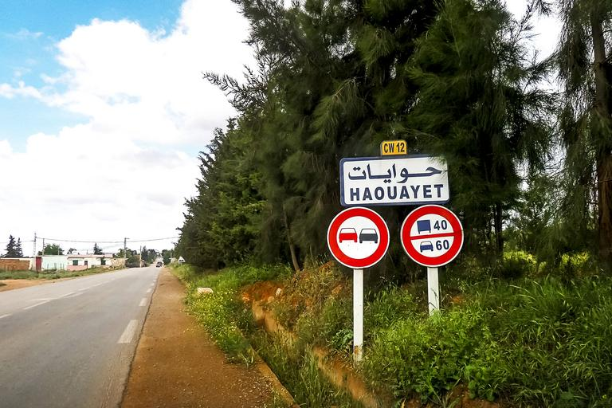
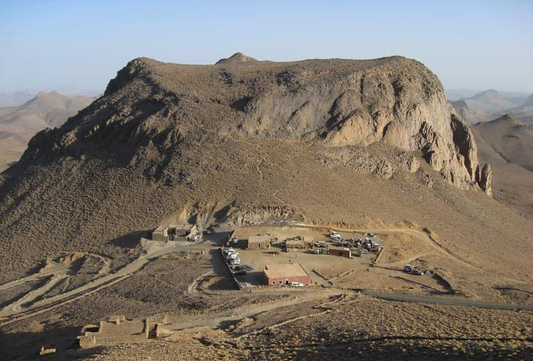

    <h2 class="section-title">{}</h2>
    <ul class="rule-list">
        <li>2023年11月の時点では公式カバレッジは無い</li>
        <li>ドメインは.dz</li>
    </ul>

{}
{}
{}
旧宗主国の{}のものと近い形の電柱が見つかる。
{}

{}
{}の道路番号と同じく、黄色く小さいプレートに番号などが書かれていることがある。標識や路側帯に破線がありえるのもフランスと共通している。
{}

{}
北部にはアトラス山脈が、南部にはホガール山地があり岩場が多い。画像はホガール山脈と思われる。地中海沿岸側は雨量も多く緑も見られる。
{}

{}
{}