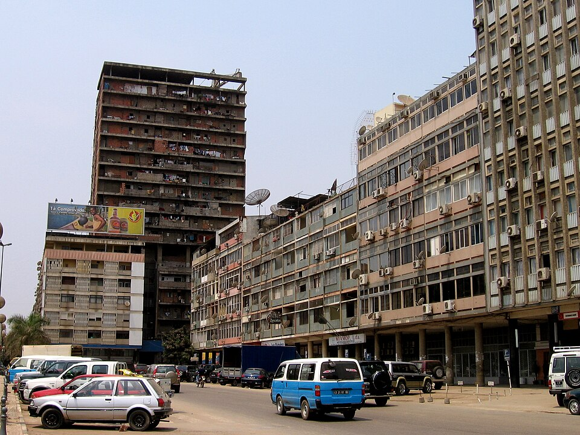

    <h2 class="section-title">{}</h2>
    <ul class="rule-list">
        <li>2023年11月の時点では公式カバレッジは無い</li>
    </ul>

{}
{}
{}
{}の植民地だったため、ポルトガルと同じ電柱や通り名看板が見つかる{}。
{}

By <a href="//commons.wikimedia.org/w/index.php?title=User:Wbkincaid1&amp;action=edit&amp;redlink=1" class="new" title="User:Wbkincaid1 (page does not exist)">Wbkincaid1</a> - Own work, <a href="https://creativecommons.org/licenses/by-sa/4.0" title="Creative Commons Attribution-Share Alike 4.0">CC BY-SA 4.0</a>, <a href="https://commons.wikimedia.org/w/index.php?curid=89132758">Link</a>

{}
黒いナンバープレート。
{}

{}

CC0
{}

{}
内戦が収束した後は大きく経済成長しており、都市部のインフラや建物にはあたらしいものも多い{}。
{}

By Max Roser - <a rel="nofollow" class="external free" href="https://ourworldindata.org/grapher/gdp-per-capita-maddison-2020?country=~AGO">https://ourworldindata.org/grapher/gdp-per-capita-maddison-2020?country=~AGO</a>, <a href="https://creativecommons.org/licenses/by-sa/4.0" title="Creative Commons Attribution-Share Alike 4.0">CC BY-SA 4.0</a>, <a href="https://commons.wikimedia.org/w/index.php?curid=121593651">Link</a>

{}
{}