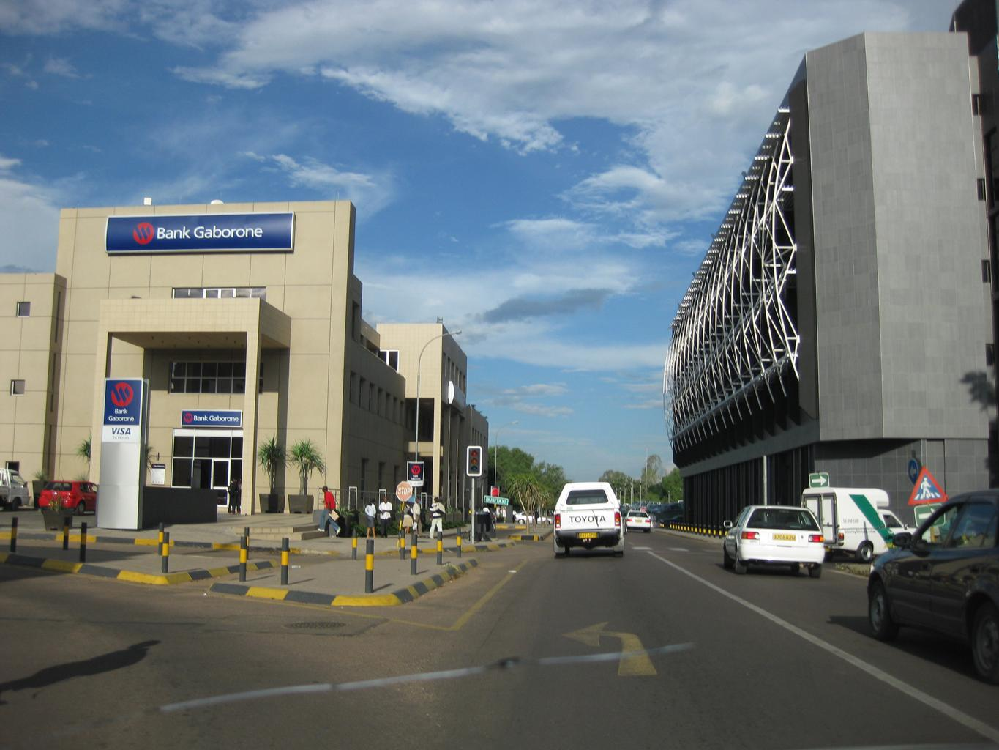
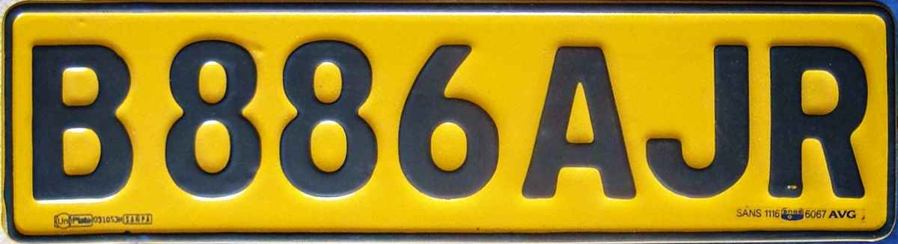
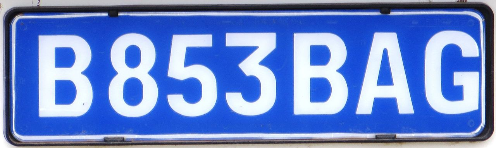
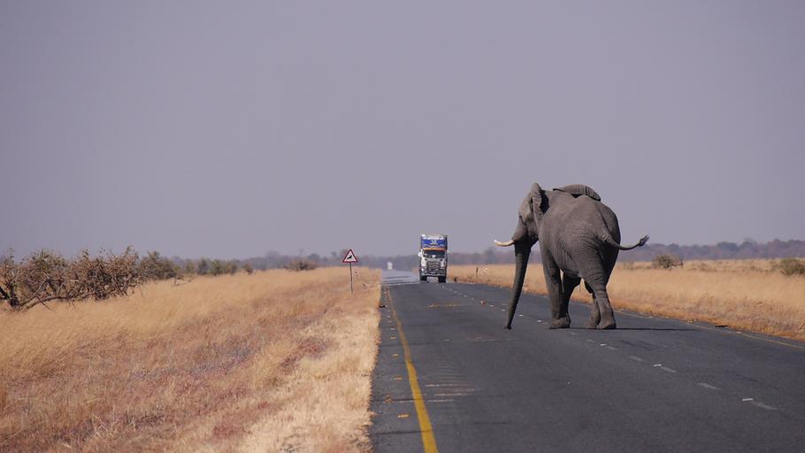

    <h2 class="section-title">{}</h2>
    <ul class="rule-list">
        <li>Los vehículos circulan por el lado izquierdo</li>
        <li>El dominio de internet es .bw</li>
        <li>La mayoría de las matrículas son de color amarillo, azul y blanco</li>
        <li>Los números de las carreteras comienzan con la letra "A" o "B"</li>
        <li>Muchas señales y barandillas tienen franjas de colores amarillo y negro</li>
        <li>Las carreteras tienen superficies rugosas, con arcén de color naranja, aunque en algunos lugares no hay arcén</li>
        <li class="no-evidence">El 70% del país está cubierto por el desierto de Kalahari, y todo el territorio es plano</li>
        <li class="no-evidence">Algunas señales antiguas tienen un fondo de color azul</li>
    </ul>
    {}

{}
{}
{}
Las matrículas son de color amarillo, azul y blanco {}, siendo las matrículas amarillas las más comunes en vehículos particulares. Algunas matrículas traseras de vehículos de servicio público o taxis son de color azul. Además, algunas barandillas y postes de señales tienen franjas de colores amarillo y negro {}. A continuación, se muestra una vista de las calles de Gaborone, la capital.
{}

{}

By <a href="//commons.wikimedia.org/w/index.php?title=User:Vicbrumby&amp;amp;action=edit&amp;amp;redlink=1" class="new" title="User:Vicbrumby (page does not exist)">Vicbrumby</a> - Own work, Public Domain, <a href="https://commons.wikimedia.org/w/index.php?curid=5534911">Link</a>

By Dickelbers - Own work, <a href="https://creativecommons.org/licenses/by-sa/4.0/deed.ja">CC BY-SA 4.0</a>, <a href="https://commons.wikimedia.org/w/index.php?curid=50884040">Wikimedia Commons(Link)</a>
{}

{}
Botsuana alberga el desierto de Kalahari, ofreciendo paisajes planos y amplios. En la mayoría de las áreas, se extienden arbustos dispersos y pastos. En las carreteras pavimentadas, hay pocos árboles a los lados {}.
{}

{}
Los números de las carreteras comienzan con las letras "A" o "B". {} también usa una nomenclatura similar, pero a diferencia de Botsuana, Lesoto tiene un terreno montañoso. En Botsuana, las carreteras son escasas, lo que significa que encontrar una señal y una intersección puede facilitar la navegación con precisión.
{}

{}
{}

<iframe src="https://www.google.com/maps/embed?pb=!4v1680333656244!6m8!1m7!1sB0vsXgiHIVFBQ8c9TvfqZQ!2m2!1d-22.61505114766226!2d21.90309161849819!3f219.95902914190873!4f-5.627427295265889!5f3.198308180943377" width="295" height="295" style="border:0;" allowfullscreen="" loading="lazy" referrerpolicy="no-referrer-when-downgrade"></iframe>
<iframe src="https://www.google.com/maps/embed?pb=!4v1680333753796!6m8!1m7!1sGfABc7yRRHUw7HNiXArdFg!2m2!1d-24.83848735322326!2d25.80635792039931!3f204.56902283008543!4f-16.45011115496507!5f3.008373896358303" width="295" height="295" style="border:0;" allowfullscreen="" loading="lazy" referrerpolicy="no-referrer-when-downgrade"></iframe>

{}
{}

<iframe src="https://www.google.com/maps/embed?pb=!4v1680333684500!6m8!1m7!1soW7o1yUIRD3KNn_Y_-Fipw!2m2!1d-22.61613807395399!2d21.90371286350851!3f352.58773209819617!4f-32.82640496017112!5f3.325193203789971" width="295" height="295" style="border:0;" allowfullscreen="" loading="lazy" referrerpolicy="no-referrer-when-downgrade"></iframe>
<iframe src="https://www.google.com/maps/embed?pb=!4v1680333787901!6m8!1m7!1sVhmFk3m2LvKT6vZnuYngpQ!2m2!1d-24.83768364425675!2d25.80619335577036!3f348.13733369235297!4f-31.010067448505865!5f2.620679684929361" width="295" height="295" style="border:0;" allowfullscreen="" loading="lazy" referrerpolicy="no-referrer-when-downgrade"></iframe>

{}
{}

<iframe src="https://www.google.com/maps/embed?pb=!4v1680333911253!6m8!1m7!1sPqnhRi86h-oadAi2zGI0jQ!2m2!1d-24.61362083666845!2d25.85096206143307!3f224.83022735691694!4f-9.121626467928422!5f3.301164775846444" width="295" height="295" style="border:0;" allowfullscreen="" loading="lazy" referrerpolicy="no-referrer-when-downgrade"></iframe>
<iframe src="https://www.google.com/maps/embed?pb=!4v1680333943597!6m8!1m7!1s6Ft_JedFZP_Gy8taNuGmzg!2m2!1d-24.61436388999356!2d25.85156172381542!3f351.54326706966276!4f-12.718305545687429!5f2.8791885164778845" width="295" height="295" style="border:0;" allowfullscreen="" loading="lazy" referrerpolicy="no-referrer-when-downgrade"></iframe>

{}
{}

    <h2 class="section-title">{}</h2>
    <ul class="rule-list">
        <li class="no-evidence">El clima varía en un gradiente: en el norte es tropical, mientras que en el resto del país es un clima de desierto interior. Parece que, al ir hacia el norte, aumentan las hierbas no punzantes y las plantas altas.</li>
    </ul>

{}
{}
<ul class="rule-list">
    <li>Zona norte: {}</li>
    <li>Zona central: {}</li>
    <li>Zona sur: {}</li>
</ul>
{}
{}

