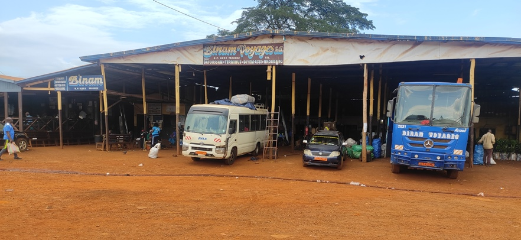
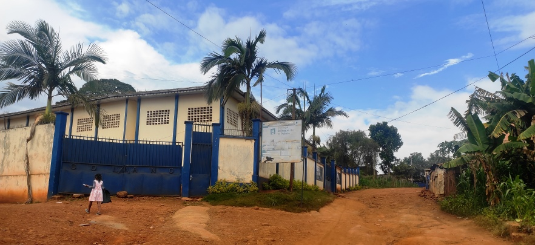

    <h2 class="section-title">{}</h2>
    <ul class="rule-list">
        <li>2023年11月の時点では公式カバレッジは無い</li>
        <li>ドメインは.cm</li>
        <li>公用語はフランス語と英語</li>
    </ul>

{}
{}
{}
商用車はオレンジ色のナンバープレートだと思われる{}。先頭の文字列から地域まで絞り込める。
{}

{}
北西部がイギリス領カメルーン、東南部が{}領カメルーンだった。首都ではフランス電柱が見つかるが、地域差があるのかは不明{}。
{}

{}
幹線道路や地方都市であっても舗装された道は多くない。データ上、舗装された道路は全体の6%超しかない{}。
{}

{}
{}