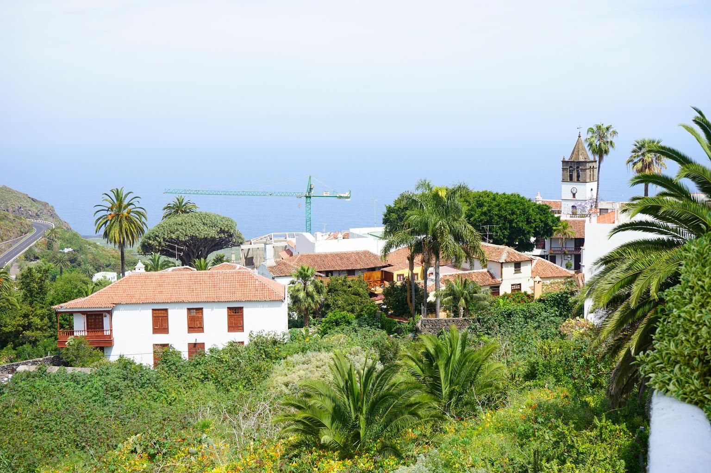

    <h2 class="section-title">{}</h2>
    <ul class="rule-list">
        <li>Pulau-pulau Terluar Spanyol</li>
        <li>Inisial nomor jalan berasal dari nama pulau.（LP・TF・FV・GC・LZ・HI）</li>
        <li>Ada gunung dengan permukaan berbatu terjal dan gunung-gunung yang membulat.</li>
    </ul>

{}
{}
{}
Jika Anda melihat tonggak atau tanda, pergilah ke pulau dengan inisial tersebut.
{}

<iframe src="https://www.google.com/maps/embed?pb=!4v1682037983686!6m8!1m7!1sI33FBYPPZekQ3U0DYi66tw!2m2!1d28.02399221772071!2d-15.65446394285012!3f313.52740197281935!4f-12.402490382719307!5f3.3196154106592397" width="295" height="295" style="border:0;" allowfullscreen="" loading="lazy" referrerpolicy="no-referrer-when-downgrade"></iframe>
<iframe src="https://www.google.com/maps/embed?pb=!4v1683961483815!6m8!1m7!1slxScdBDWW5R6nrzzaKXv2Q!2m2!1d28.81205984010958!2d-17.77336109854824!3f198.43941789326982!4f0.9634944511387005!5f2.1366012456849903" width="295" height="295"style="border:0;" allowfullscreen="" loading="lazy" referrerpolicy="no-referrer-when-downgrade"></iframe>

{}
Kaktus, pohon palem, pohon naga {{% ref "https://ja.wikipedia.org/wiki/%E3%83%AA%E3%83%A5%E3%82%A6%E3%82%B1%E3%83%84%E3%82%B8%E3%83%A5" "ryuketsuju" %}}, dll. Ada campuran dari berbagai tanaman. Vegetasi yang ada sangat berbeda di tempat yang berbeda {} {} serta tonggak reflektif berwarna kuning dan pagar pembatas.
{}

{}
Kadang-kadang gunung-gunungnya berbentuk bulat {}? Pulau ini juga merupakan pulau yang terbuat dari gunung berapi dan memiliki tanah yang berwarna hitam {}{{% ref "https://ja. wikipedia.org/wiki/%E3%82%AB%E3%83%8A%E3%83%AA%E3%82%A2%E8%AB%B8%E5%B3%B6" "Canary Islands" %}}.
{}

{}
{}

<iframe src="https://www.google.com/maps/embed?pb=!4v1683961855176!6m8!1m7!1sqLy_OnqKpwPZQd68i3lDBQ!2m2!1d28.05415393509!2d-16.61176722128879!3f152.99065641382995!4f-19.867513809251804!5f2.956957644608195" width="295" height="295"style="border:0;" allowfullscreen="" loading="lazy" referrerpolicy="no-referrer-when-downgrade"></iframe>
<iframe src="https://www.google.com/maps/embed?pb=!4v1683962035376!6m8!1m7!1slbWNlOJSQ8aJbadodVhZSg!2m2!1d28.17417067673725!2d-14.20887550254355!3f302.509430097875!4f-8.595618580464802!5f1.549797458289862" width="295" height="295"style="border:0;" allowfullscreen="" loading="lazy" referrerpolicy="no-referrer-when-downgrade"></iframe>

{}
{}
