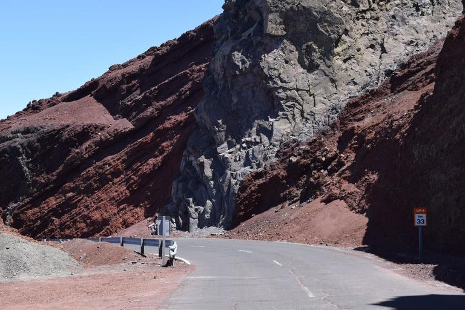

    <h2 class="section-title">{}</h2>
    <ul class="rule-list">
        <li>スペイン領の離島であり、標識のポール・ガードレール・シェブロンは本土と共通している</li>
        <li>道路番号の頭文字は島の名前から来ている（LP・TF・FV・GC・LZ・HI）</li>
        <li>ごつごつした岩肌が見える山や丸みを帯びた山がある</li>
        <li>火山由来の島であり土が黒いことが多い</li>
    </ul>

{}
{}
{}
ボラードや標識を見つけたらそれが頭文字の島に行く{}。
{}

By <a href="//commons.wikimedia.org/w/index.php?title=Iser:Ies&amp;amp;action=edit&amp;amp;redlink=1" class="new" title="Iser:Ies (page does not exist)">Frank Vincentz</a> - Own work, <a href="https://creativecommons.org/licenses/by-sa/3.0" title="Creative Commons Attribution-Share Alike 3.0">CC BY-SA 3.0</a>, <a href="https://commons.wikimedia.org/w/index.php?curid=17606109">Link</a>

{}
{}と同じく黄色い反射板のボラードとガードレールがある。
{}

{}
サボテン・ヤシの木・竜血樹{{% ref "https://ja.wikipedia.org/wiki/%E3%83%AA%E3%83%A5%E3%82%A6%E3%82%B1%E3%83%84%E3%82%B8%E3%83%A5" "リュウケツジュ" %}}などいろいろな植物が入り混じっている。場所によって植生も全然違う{}。
{}

{}
山がなんだか丸みを帯びているときがある{}？また火山でできた島であり土が黒いことが多い{}{{% ref "https://ja.wikipedia.org/wiki/%E3%82%AB%E3%83%8A%E3%83%AA%E3%82%A2%E8%AB%B8%E5%B3%B6" "カナリア諸島" %}}。
{}

{}
{}

<iframe src="https://www.google.com/maps/embed?pb=!4v1683961855176!6m8!1m7!1sqLy_OnqKpwPZQd68i3lDBQ!2m2!1d28.05415393509!2d-16.61176722128879!3f152.99065641382995!4f-19.867513809251804!5f2.956957644608195" width="295" height="295"style="border:0;" allowfullscreen="" loading="lazy" referrerpolicy="no-referrer-when-downgrade"></iframe>
<iframe src="https://www.google.com/maps/embed?pb=!4v1683962035376!6m8!1m7!1slbWNlOJSQ8aJbadodVhZSg!2m2!1d28.17417067673725!2d-14.20887550254355!3f302.509430097875!4f-8.595618580464802!5f1.549797458289862" width="295" height="295"style="border:0;" allowfullscreen="" loading="lazy" referrerpolicy="no-referrer-when-downgrade"></iframe>

{}
{}

    <h2 class="section-title">{}</h2>
    <ul class="rule-list">
        <li class="no-evidence">Caleta de Seboという集落は白い平屋が並んでいる{}{}</li>
    </ul>

{}
{}

{}
{}