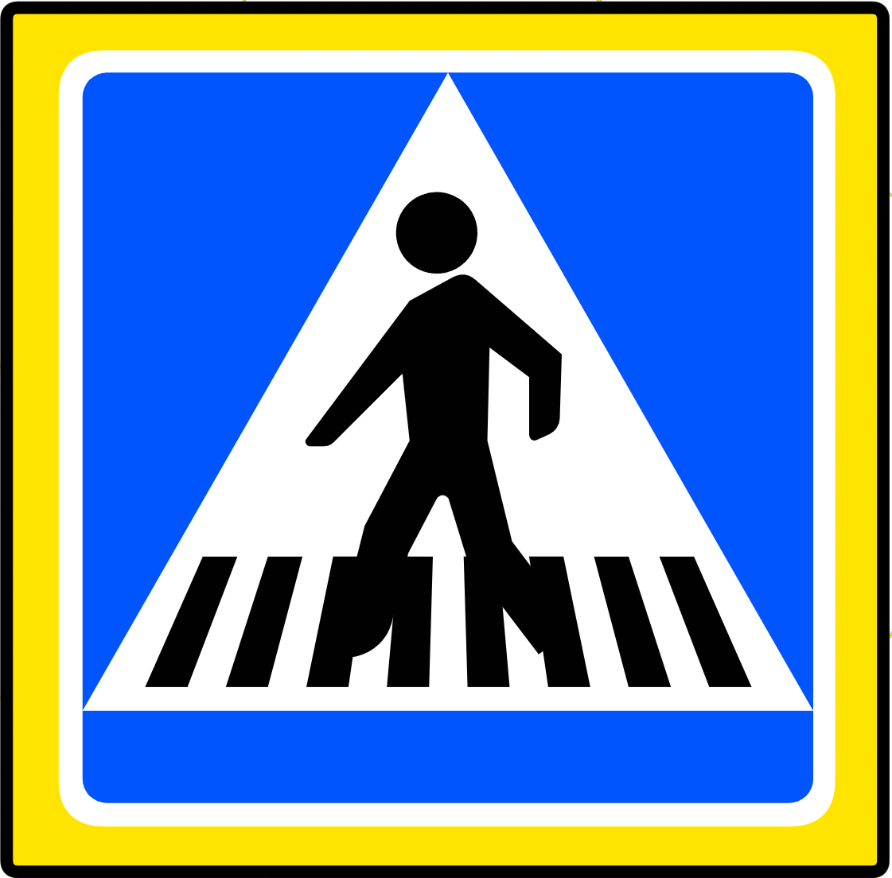
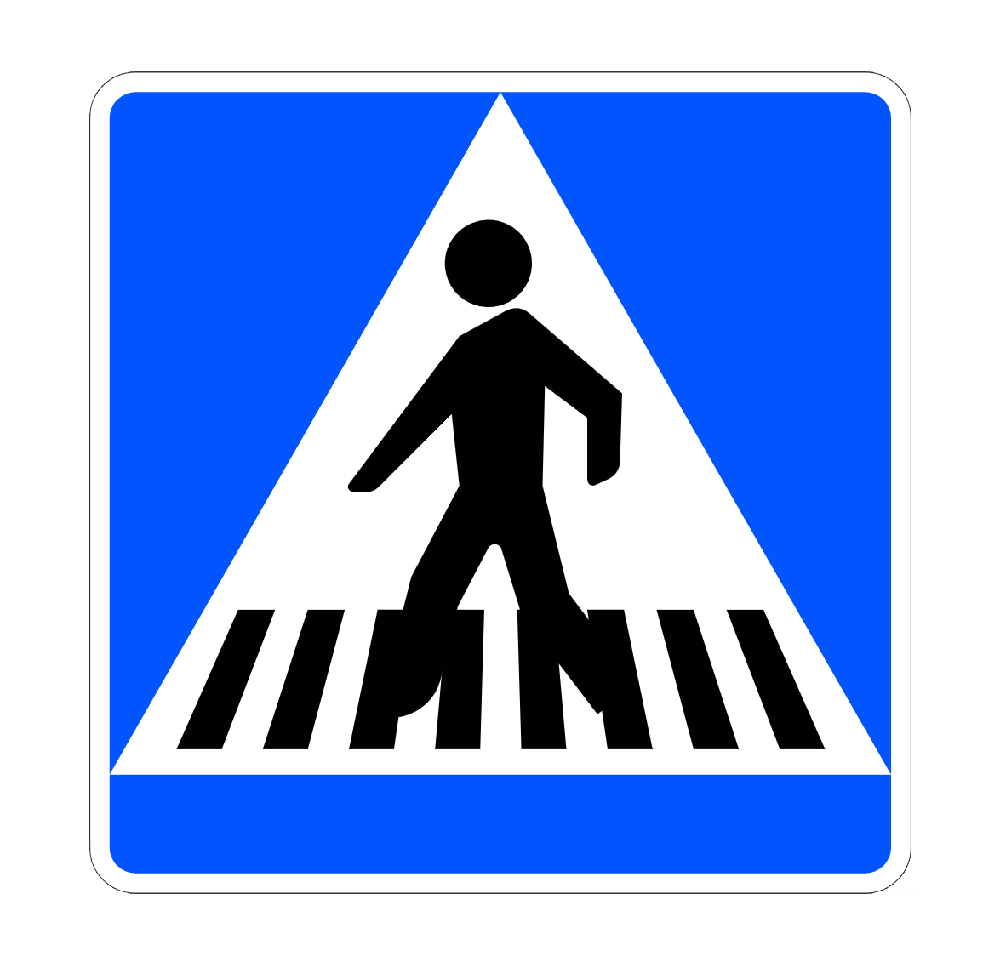

    <h2 class="section-title">{}</h2>
    <ul class="rule-list">
        <li>Cars drive on the right side.</li>
        <li>The domain is .es</li>
        <li>Car is often dirty with sand.</li>
    </ul>
    {}
    

        
国旗画像：<a href="https://creativecommons.org/licenses/by-sa/4.0" title="Creative Commons Attribution-Share Alike 4.0">CC 表示-継承 4.0</a>, <a href="https://commons.wikimedia.org/w/index.php?curid=3951546">リンク</a>より引用

    

{}
{}
{}
Car is often dirty with sand.
{}

<iframe src="https://www.google.com/maps/embed?pb=!4v1687272056955!6m8!1m7!1stL22RyKnT57vsY9_geYs2Q!2m2!1d35.89010160897789!2d-5.331151782401264!3f245.4896356873232!4f-18.96562635913618!5f1.3633853366779287" width="295" height="295" style="border:0;" allowfullscreen="" loading="lazy" referrerpolicy="no-referrer-when-downgrade"></iframe>
<iframe src="https://www.google.com/maps/embed?pb=!4v1687272083436!6m8!1m7!1skRXk8KQFtketlL-yp1SWlg!2m2!1d35.89048972073194!2d-5.292522893086988!3f213.8428761375746!4f-9.551819784404756!5f3.325193203789971" width="295" height="295" style="border:0;" allowfullscreen="" loading="lazy" referrerpolicy="no-referrer-when-downgrade"></iframe>

{}
There are black and white guardrails.
{}

<iframe src="https://www.google.com/maps/embed?pb=!4v1687271629947!6m8!1m7!1si3wbylp1jF2V4__qpdqvAg!2m2!1d35.8919908212407!2d-5.28924916028295!3f113.16507535160343!4f-16.564063876654345!5f0.4000000000000002" width="295" height="295" style="border:0;" allowfullscreen="" loading="lazy" referrerpolicy="no-referrer-when-downgrade"></iframe>
<iframe src="https://www.google.com/maps/embed?pb=!4v1687271854451!6m8!1m7!1scguCvKDYhMCnRAsSlKddEg!2m2!1d35.88355095227662!2d-5.366138991002525!3f165.35081923224843!4f-7.460970743558505!5f2.302293070326543" width="295" height="295" style="border:0;" allowfullscreen="" loading="lazy" referrerpolicy="no-referrer-when-downgrade"></iframe>

{}
Sometimes the crosswalk signs are surrounded by yellow lines.
{}

{}
{}