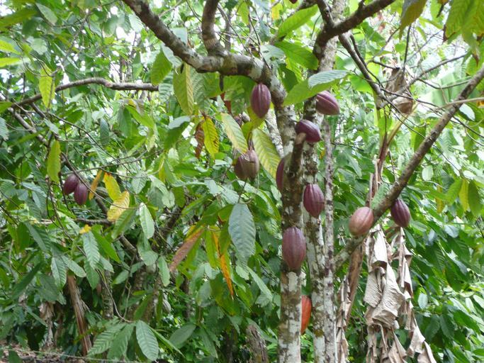

    <h2 class="section-title">{}</h2>
    <ul class="rule-list">
        <li>2023年11月の時点では公式カバレッジは無い</li>
    </ul>

{}
{}
{}
{}の植民地だったものの1960年に独立した。市街地の看板や電柱はフランスと同じ見た目をしている。
{}

{}
カカオの生産量が世界一位{}{}。
{}

{}
{}