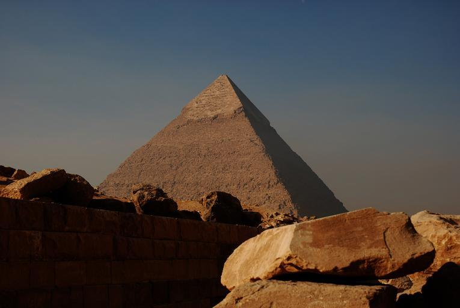
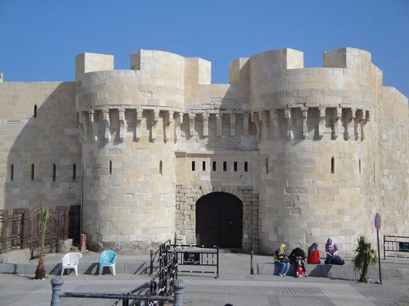
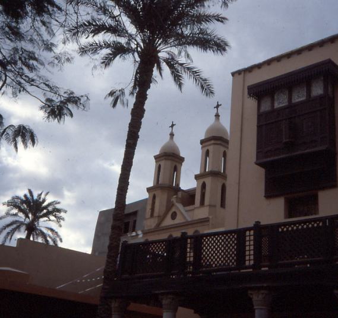
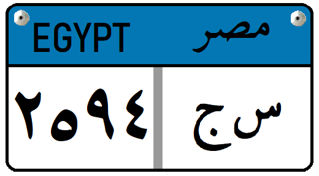
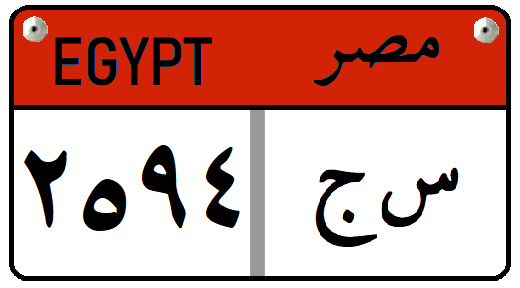

    <h2 class="section-title">{}</h2>
    <ul class="rule-list">
        <li>Domain internet menggunakan .eg</li>
        <li>Banyak tempat wisata seperti Piramida dan Benteng Qaitbay</li>
        <li>Banyak bangunan simetris yang terbuat dari batu bata tanah liat atau batu putih</li>
        <li>Bagian atas pelat nomor kendaraan umum berwarna biru muda</li>
    </ul>

{}
{}
{}
Banyak tempat wisata seperti Piramida {} dan Benteng Qaitbay {}. Bangunan sering kali memiliki bentuk simetris, dibuat dengan batu bata tanah liat dan batu putih {}. ‘Penghormatan terhadap elemen religius yang meningkatkan otoritas raja dan misteri, membuat simetri (keselarasan kiri-kanan) dan satu poros panjang yang memberikan keteraturan ruang secara berkesinambungan’ telah berkembang {{% ref "https://www.news-digest.co.uk/news/index.php?cucoaction%5B0%5D=edit&option=com_content&task=view&id=4218&Itemid=0" "Arsitektur Mesir" %}}.
{}

{}
Pelat nomor kendaraan umum terkadang memiliki bagian atas berwarna biru muda {}. Warna pelat nomor bervariasi tergantung jenis kendaraan, seperti taksi berwarna oranye, truk berwarna merah, dan lainnya {}.
{}

{}

Oleh <a href="//commons.wikimedia.org/wiki/User:Nima_Farid" class="mw-redirect" title="User:Nima Farid">Nima Farid</a> - Karya sendiri, <a href="http://creativecommons.org/publicdomain/zero/1.0/deed.en" title="Creative Commons Zero, Public Domain Dedication">CC0</a>, <a href="https://commons.wikimedia.org/w/index.php?curid=87952324">Link</a>

Dibuat berdasarkan gambar CC0
{}

{}
{}
