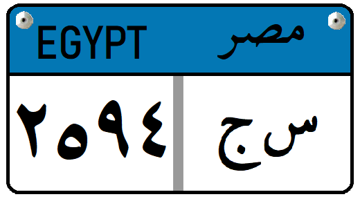

    <h2 class="section-title">{}</h2>
    <ul class="rule-list">
        <li>ドメインは.eg</li>
        <li>ナンバープレートの上が水色</li>
    </ul>

{}
{}
{}
ピラミッドが見えるはず
{}

<iframe src="https://www.google.com/maps/embed?pb=!4v1687074150020!6m8!1m7!1s5VSLyH9gUpMjOzJbRVnnTA!2m2!1d29.98040893145138!2d31.13534148259916!3f213.32940028359056!4f19.06443668414819!5f0.7820865974627469" width="590" height="350" style="border:0;" allowfullscreen="" loading="lazy" referrerpolicy="no-referrer-when-downgrade"></iframe>

{}
停まっている車のナンバープレートの上が水色のときがある。タクシーはオレンジ色など他の色の場合もある。
{}

<iframe src="https://www.google.com/maps/embed?pb=!4v1687074463755!6m8!1m7!1sHytVcOnabPsQfDp8FmLpfA!2m2!1d29.97738017044581!2d31.13260510047675!3f100.00210645043855!4f-11.15775011339558!5f3.325193203789971" width="295" height="295" style="border:0;" allowfullscreen="" loading="lazy" referrerpolicy="no-referrer-when-downgrade"></iframe>

{}

By <a href="//commons.wikimedia.org/wiki/User:Nima_Farid" class="mw-redirect" title="User:Nima Farid">Nima Farid</a> - Own work, <a href="http://creativecommons.org/publicdomain/zero/1.0/deed.en" title="Creative Commons Zero, Public Domain Dedication">CC0</a>, <a href="https://commons.wikimedia.org/w/index.php?curid=87952324">Link</a>
{}

{}
{}