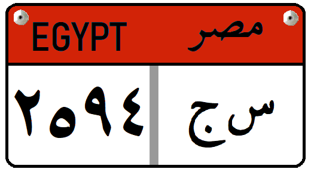

    <h2 class="section-title">{}</h2>
    <ul class="rule-list">
        <li>ドメインは.eg</li>
        <li>ピラミッドやカーイト・ベイの要塞のような観光地が多い</li>
        <li>日干しレンガや白い石でできた左右対称の建物が多い</li>
        <li>一般車のナンバープレートの上が水色</li>
    </ul>

{}
{}
{}
ピラミッドやカーイト・ベイの要塞のような観光地が出る。左右対称な形が多く、日干しレンガと石で作られた建築物が多い。『王の権威や神秘性を高める宗教的要素が重んじられ、それ故にシンメトリー（左右対称性）や一本の長い軸により連続的に空間に秩序付けする方法が発達した』らしい{{% ref "https://www.news-digest.co.uk/news/index.php?cucoaction%5B0%5D=edit&option=com_content&task=view&id=4218&Itemid=0" "エジプト建築" %}}。
{}

<iframe src="https://www.google.com/maps/embed?pb=!4v1687074150020!6m8!1m7!1s5VSLyH9gUpMjOzJbRVnnTA!2m2!1d29.98040893145138!2d31.13534148259916!3f213.32940028359056!4f19.06443668414819!5f0.7820865974627469" width="295" height="295" style="border:0;" allowfullscreen="" loading="lazy" referrerpolicy="no-referrer-when-downgrade"></iframe>
<iframe src="https://www.google.com/maps/embed?pb=!4v1687086418598!6m8!1m7!1stno5NLJlsCNekfMVKHIn3w!2m2!1d31.21362287911513!2d29.88600059673334!3f316.03813673587365!4f4.855447608306946!5f0.7820865974627469" width="295" height="295" style="border:0;" allowfullscreen="" loading="lazy" referrerpolicy="no-referrer-when-downgrade"></iframe>
<iframe src="https://www.google.com/maps/embed?pb=!4v1688790252839!6m8!1m7!1slMyWT6KdlKsSr9m5nbzBUw!2m2!1d30.02951612069242!2d31.26102349615607!3f61.714884153398124!4f18.340014211500417!5f0.4000000000000002" width="295" height="295" style="border:0;" allowfullscreen="" loading="lazy" referrerpolicy="no-referrer-when-downgrade"></iframe>
<iframe src="https://www.google.com/maps/embed?pb=!4v1688790383511!6m8!1m7!1sPxuQ5rCWs0GAacYhbGKqMA!2m2!1d30.00809127391321!2d31.23067608216505!3f118.08698210685318!4f7.038745332678047!5f0.7820865974627469" width="295" height="295" style="border:0;" allowfullscreen="" loading="lazy" referrerpolicy="no-referrer-when-downgrade"></iframe>

{}
停まっている車のナンバープレートの上が水色のときがある。タクシーはオレンジ色・トラックは赤色など車種によって色が異なる{}。
{}

{}

By <a href="//commons.wikimedia.org/wiki/User:Nima_Farid" class="mw-redirect" title="User:Nima Farid">Nima Farid</a> - Own work, <a href="http://creativecommons.org/publicdomain/zero/1.0/deed.en" title="Creative Commons Zero, Public Domain Dedication">CC0</a>, <a href="https://commons.wikimedia.org/w/index.php?curid=87952324">Link</a>

CC0の画像をもとに自作
{}

{}
{}