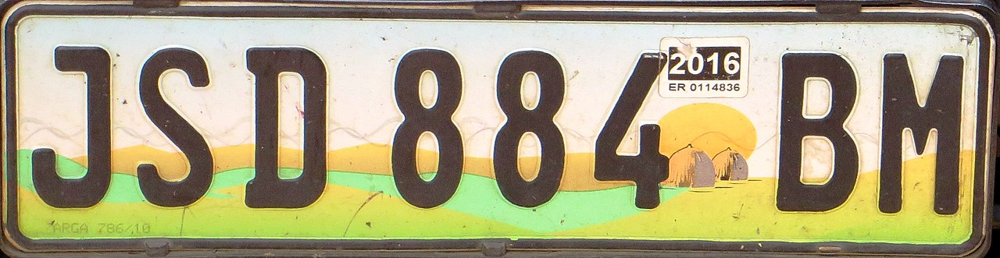

    <h2 class="section-title">{}</h2>
    <ul class="rule-list">
        <li>El dominio es .sz</li>
        <li>Los números de las carreteras incluyen MR</li>
        <li>Los postes eléctricos suelen estar hechos de madera delgada de color marrón oscuro</li>
        <li>La parte inferior de las matrículas parece de color verde lima</li>
        <li class="no-evidence">En la región baja de Lowveld, que tiene muchas zonas llanas, el país está inclinado. En estas carreteras, la vista suele extenderse más en dirección norte-sur, mientras que hacia el este-oeste la vista está más limitada.</li>
        <li class="no-no-evidence">A diferencia de {}, en las zonas de mayor altitud se observa actividad forestal, con filas de árboles del mismo tipo.</li>
    </ul>
    {}

{}
{}

{}
En esta región crece una gran cantidad de hierba fina como esta: {}.
{}

Por <a rel="nofollow" class="external text" href="https://www.flickr.com/people/96803880@N00">thomas</a> - <a rel="nofollow" class="external text" href="https://www.flickr.com/photos/blob79/7045392703/">IMG_0011</a>Subido por <a href="//commons.wikimedia.org/wiki/User:AlbertHerring" class="mw-redirect" title="User:AlbertHerring">AlbertHerring</a>, <a href="https://creativecommons.org/licenses/by-sa/2.0" title="Creative Commons Attribution-Share Alike 2.0">CC BY-SA 2.0</a>, <a href="https://commons.wikimedia.org/w/index.php?curid=28911719">Enlace</a>

{}
Las placas de matrícula suelen ser blancas con verde lima: {}. Tenga en cuenta que las placas en el centro de {} tienen colores similares.
{}

Por Usuario: Bgabel en wikivoyage compartido, <a href="https://creativecommons.org/licenses/by-sa/3.0" title="Creative Commons Attribution-Share Alike 3.0">CC BY-SA 3.0</a>, <a href="https://commons.wikimedia.org/w/index.php?curid=22958562">Enlace</a>

{}

Por <a href="//commons.wikimedia.org/wiki/User:Dickelbers" title="User:Dickelbers">Dickelbers</a> - Obra propia, <a href="https://creativecommons.org/licenses/by-sa/4.0" title="Creative Commons Attribution-Share Alike 4.0">CC BY-SA 4.0</a>, <a href="https://commons.wikimedia.org/w/index.php?curid=45400340">Enlace</a>
{}

{}
{}

<iframe src="https://www.google.com/maps/embed?pb=!4v1682440999935!6m8!1m7!1sGDfHJc0nnrpu67foDQEc1w!2m2!1d-26.84219957385132!2d30.96552003993061!3f280.6662487879977!4f6.783219719504544!5f1.8437648934603765" width="190" height="350" style="border:0;" allowfullscreen="" loading="lazy" referrerpolicy="no-referrer-when-downgrade"></iframe>
<iframe src="https://www.google.com/maps/embed?pb=!4v1682441037874!6m8!1m7!1sLs1icJ_xng-n2EKJZJFYlA!2m2!1d-26.3408159636958!2d31.97036337419647!3f111.3919554764976!4f5.79163102974762!5f1.787292836444836" width="190" height="350" style="border:0;" allowfullscreen="" loading="lazy" referrerpolicy="no-referrer-when-downgrade"></iframe>

{}
{}

{}
El lado occidental del país es una región alta (altitud de 1500 m), mientras que el lado oriental es bajo (altitud de 200 m), haciendo que el país tenga una inclinación general.
{}

{}
{}

    <h2 class="section-title">{}</h2>
    <ul class="rule-list">
        <li>El país está dividido según la altitud en Highveld (zona alta), Middleveld (zona intermedia) y Lowveld (zona baja), y cada una tiene diferentes formas de agricultura.</li>
        <li class="no-evidence">En el Highveld, hay bosques de pinos y eucaliptos utilizados para la silvicultura, plantados en zonas específicas.</li>
        <li class="no-evidence">En el Lowveld, a veces se cultiva caña de azúcar.</li>
    </ul>

{}
{}
{}
En el Highveld, hay bosques de pinos y eucaliptos utilizados para la silvicultura, plantados en zonas específicas {}. Incluso si no hay bosques visibles, puede haber señales de tala reciente {}.
{}

{}
{}

{}
El país está dividido según la altitud en Highveld, Middleveld y Lowveld, y cada una tiene diferentes formas de agricultura. En el Lowveld, a veces se cultiva caña de azúcar.
{}

<iframe src="https://www.google.com/maps/embed?pb=!4v1682436625448!6m8!1m7!1saJY6MDzb1xARd9CzJv9kxw!2m2!1d-26.76722330154598!2d31.92291092356511!3f53.1599899823355!4f-4.437015220855059!5f2.872764259751242" width="295" height="295" style="border:0;" allowfullscreen="" loading="lazy" referrerpolicy="no-referrer-when-downgrade"></iframe>
<iframe src="https://www.google.com/maps/embed?pb=!4v1682438551149!6m8!1m7!1sDF3hfswFXEYScwkJ7fGCcg!2m2!1d-26.8343591585108!2d31.9723227159364!3f255.36907997395818!4f-11.809296463198066!5f1.455857875479618" width="295" height="295" style="border:0;" allowfullscreen="" loading="lazy" referrerpolicy="no-referrer-when-downgrade"></iframe>

{}
{}
