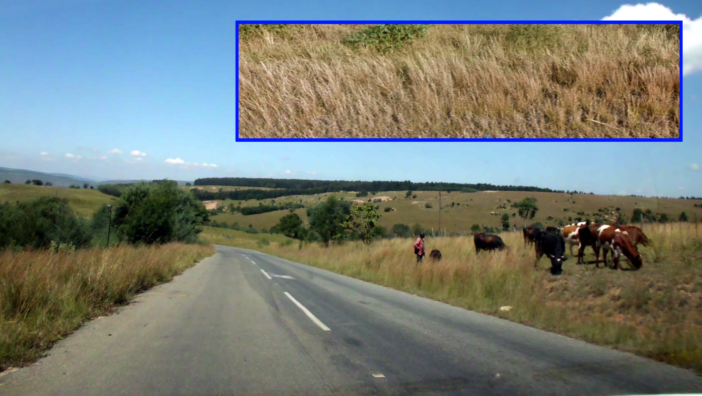
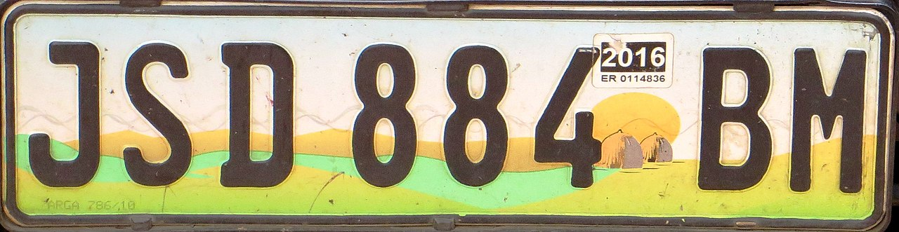
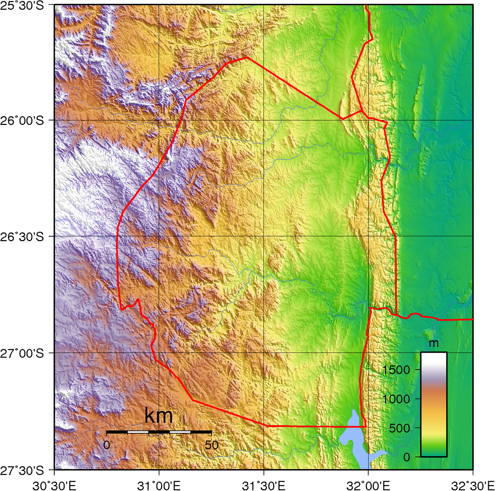

    <h2 class="section-title">{}</h2>
    <ul class="rule-list">
        <li>ドメインは.sz</li>
        <li>道路番号にはMRが付いている</li>
        <li>電柱はこげ茶色っぽい細い木でできていることが多い</li>
        <li>ナンバープレートの下が黄緑色に見える</li>
        <li class="no-evidence">標高が低いローベルトは平地が多いかつ国全体が斜めになっているので、ローベルトの道路上にいる時は南北方向は遠くまで景色が見えて東西は遠くまで見えないことが多い</li>
        <li class="no-no-evidence">{}と異なり標高が高い場所では林業が行われており、同じ種類の木が並んでいる様子が見られるはず</li>
    </ul>
    {}

{}
{}

{}
こんな感じの細い草がたくさん生えている（例<a href="https://goo.gl/maps/QDByu9vY3rrunwQt9">①</a>・<a href="https://goo.gl/maps/mYrQDMMd5k9Beikn9">②</a>）
{}

By <a rel="nofollow" class="external text" href="https://www.flickr.com/people/96803880@N00">thomas</a> - <a rel="nofollow" class="external text" href="https://www.flickr.com/photos/blob79/7045392703/">IMG_0011</a>
Uploaded by <a href="//commons.wikimedia.org/wiki/User:AlbertHerring" class="mw-redirect" title="User:AlbertHerring">AlbertHerring</a>, <a href="https://creativecommons.org/licenses/by-sa/2.0" title="Creative Commons Attribution-Share Alike 2.0">CC BY-SA 2.0</a>, <a href="https://commons.wikimedia.org/w/index.php?curid=28911719">Link</a>

{}
電柱はこげ茶色の細い木でできていて１～３本のコードが張られている
{}

<iframe src="https://www.google.com/maps/embed?pb=!4v1682821573530!6m8!1m7!1scKYowqlah7eCEnkXE76cqQ!2m2!1d-26.84151182200207!2d30.96616186490692!3f66.72130030000376!4f23.399425204274294!5f3.325193203789971" width="295" height="295" style="border:0;" allowfullscreen="" loading="lazy" referrerpolicy="no-referrer-when-downgrade"></iframe>
<iframe src="https://www.google.com/maps/embed?pb=!4v1682821665705!6m8!1m7!1stvXX7dOvI9y9u1ynHviBhQ!2m2!1d-27.02500643545952!2d31.93532396224216!3f344.43606243762974!4f12.645054239222944!5f1.655499308789675" width="295" height="295" style="border:0;" allowfullscreen="" loading="lazy" referrerpolicy="no-referrer-when-downgrade"></iframe>

{}
ナンバープレートが白と黄緑色に見える。{}の中央部で使われるナンバープレートも同じような色に見えるので注意。
{}

<iframe src="https://www.google.com/maps/embed?pb=!4v1686315521446!6m8!1m7!1sx2W_8QdSo1XWfGZuW7m0rw!2m2!1d-26.38619079032152!2d31.17023469102327!3f68.27969989031288!4f-27.929373629586024!5f3.325193203789971" width="400" height="250" style="border:0;" allowfullscreen="" loading="lazy" referrerpolicy="no-referrer-when-downgrade"></iframe>

{}

By <a href="//commons.wikimedia.org/wiki/User:Dickelbers" title="User:Dickelbers">Dickelbers</a> - Own work, <a href="https://creativecommons.org/licenses/by-sa/4.0" title="Creative Commons Attribution-Share Alike 4.0">CC BY-SA 4.0</a>, <a href="https://commons.wikimedia.org/w/index.php?curid=45400340">Link</a>
{}

{}
{}

<iframe src="https://www.google.com/maps/embed?pb=!4v1682440999935!6m8!1m7!1sGDfHJc0nnrpu67foDQEc1w!2m2!1d-26.84219957385132!2d30.96552003993061!3f280.6662487879977!4f6.783219719504544!5f1.8437648934603765" width="190" height="350" style="border:0;" allowfullscreen="" loading="lazy" referrerpolicy="no-referrer-when-downgrade"></iframe>
<iframe src="https://www.google.com/maps/embed?pb=!4v1682441037874!6m8!1m7!1sLs1icJ_xng-n2EKJZJFYlA!2m2!1d-26.3408159636958!2d31.97036337419647!3f111.3919554764976!4f5.79163102974762!5f1.787292836444836" width="190" height="350" style="border:0;" allowfullscreen="" loading="lazy" referrerpolicy="no-referrer-when-downgrade"></iframe>

{}
{}
{}
西側が高地（標高1500m）で東側が低地（標高200m）と国全体が斜めになっている。
{}

{}
{}

    <h2 class="section-title">{}</h2>
    <ul class="rule-list">
        <li>標高によって標高の高いハイベルト・中間のミドルベルト・標高の低いローベルトに分かれていて農業の形態もそれぞれ異なる</li>
        <li class="no-evidence">ローベルトではサトウキビが育てられていることがある</li>
        <li class="no-evidence">ハイベルトでは松やユーカリの林業が行われており植林による森林が存在する</li>
    </ul>

{}
{}

{}
標高によってハイベルト・ミドルベルト・ローベルトに分かれていて農業の形態もそれぞれ異なる。ローベルトではサトウキビが育てられていることがある。
{}

<iframe src="https://www.google.com/maps/embed?pb=!4v1682436625448!6m8!1m7!1saJY6MDzb1xARd9CzJv9kxw!2m2!1d-26.76722330154598!2d31.92291092356511!3f53.1599899823355!4f-4.437015220855059!5f2.872764259751242" width="295" height="295" style="border:0;" allowfullscreen="" loading="lazy" referrerpolicy="no-referrer-when-downgrade"></iframe>
<iframe src="https://www.google.com/maps/embed?pb=!4v1682438551149!6m8!1m7!1sDF3hfswFXEYScwkJ7fGCcg!2m2!1d-26.8343591585108!2d31.9723227159364!3f255.36907997395818!4f-11.809296463198066!5f1.455857875479618" width="295" height="295" style="border:0;" allowfullscreen="" loading="lazy" referrerpolicy="no-referrer-when-downgrade"></iframe>

{}
{}
{}
ハイベルトでは松やユーカリの林業が行われており、植林による森林が存在する。森林が無くても、森林が伐採された跡があるかも。
{}

<iframe src="https://www.google.com/maps/embed?pb=!4v1682437918561!6m8!1m7!1su4hFvVYT2FiC5uoEuBVJpg!2m2!1d-26.99985045048718!2d31.24975573404177!3f195.39575852855015!4f4.358548636269049!5f1.5956652534074234" width="295" height="295" style="border:0;" allowfullscreen="" loading="lazy" referrerpolicy="no-referrer-when-downgrade"></iframe>
<iframe src="https://www.google.com/maps/embed?pb=!4v1682437875329!6m8!1m7!1sd8eq9WtszCHu406Awkv2yg!2m2!1d-26.59319998991595!2d30.93987315666483!3f291.904046917961!4f-8.515279937503635!5f3.3241210508286905" width="295" height="295" style="border:0;" allowfullscreen="" loading="lazy" referrerpolicy="no-referrer-when-downgrade"></iframe>

{}
{}