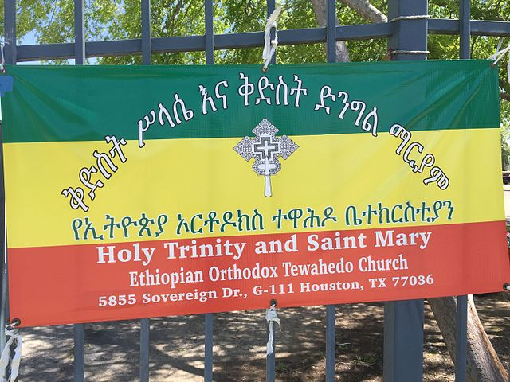

    <h2 class="section-title">{}</h2>
    <ul class="rule-list">
        <li>A partir de noviembre de 2023, no hay cobertura oficial.</li>
        <li>El dominio es .et</li>
        <li>Se utilizan cinco idiomas, incluyendo amhárico (አማርኛ) e inglés.</li>
    </ul>
    {}

{}
{}
{}
El amhárico (አማርኛ) se utiliza en señales y carteles.
{}

{}
{}
