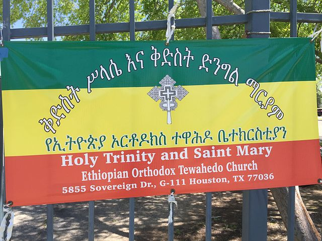

    <h2 class="section-title">{}</h2>
    <ul class="rule-list">
        <li>2023年11月の時点では公式カバレッジは無い</li>
        <li>ドメインは.et</li>
        <li>アムハラ語（አማርኛ）や英語など5言語が使用されている</li>
    </ul>
    {}

{}
{}
{}
アムハラ語（አማርኛ）が看板などで使用されている。
{}

{}
{}