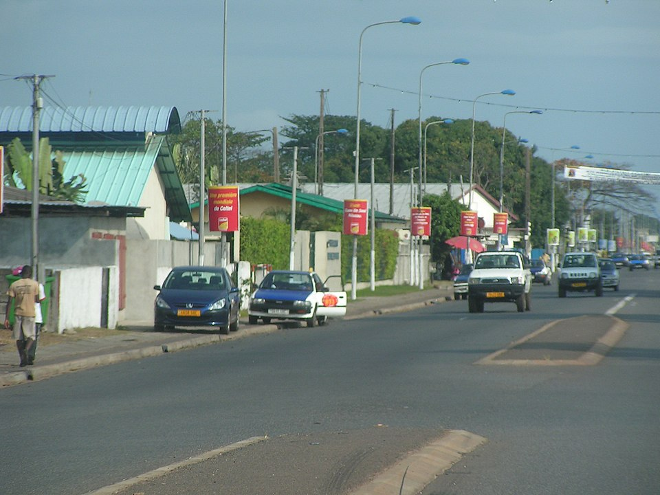

    <h2 class="section-title">{}</h2>
    <ul class="rule-list">
        <li>2023年11月の時点では公式カバレッジは無い</li>
        <li>フランスの植民地だったため、フランスと同じ電柱が見つかる</li>
    </ul>

{}
{}
{}
ナンバープレートはほとんどが黄色{}。
{}

{}
{}