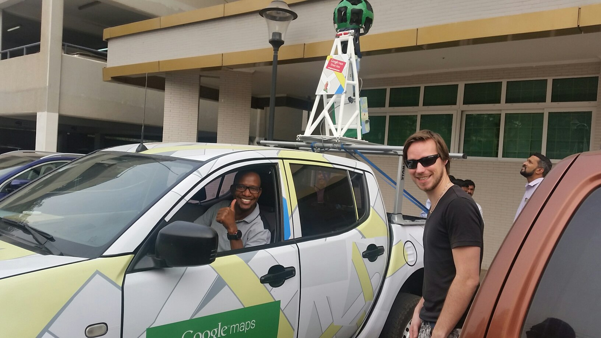
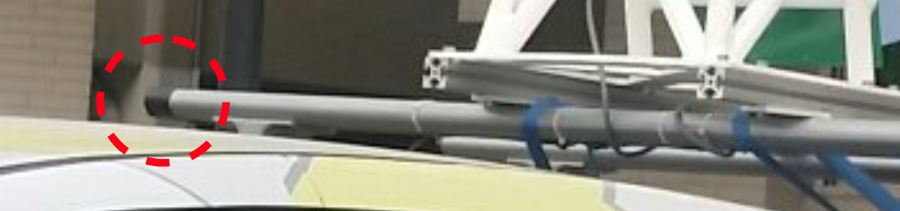
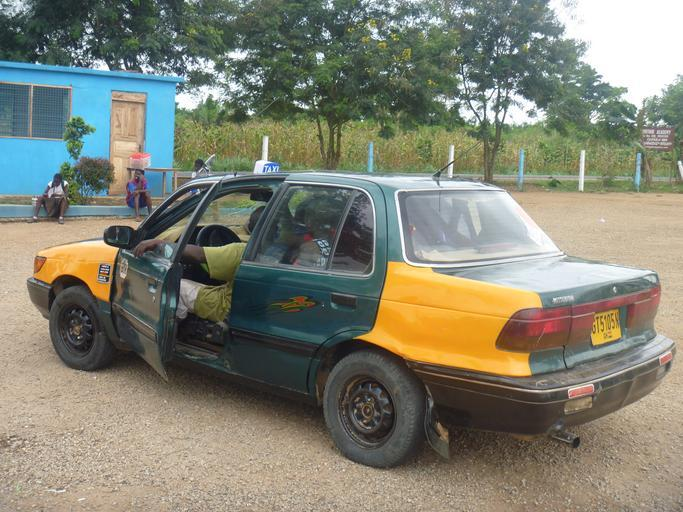
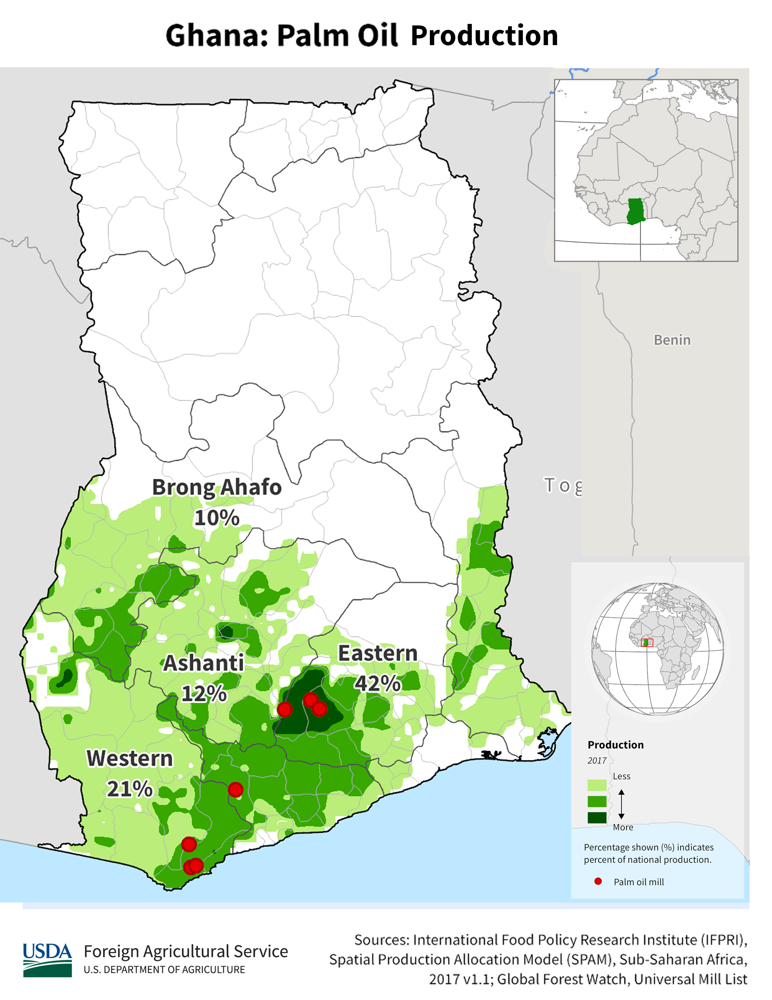
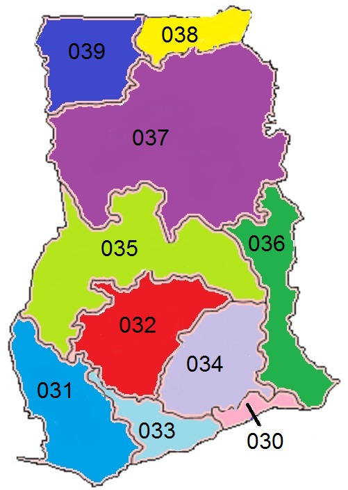
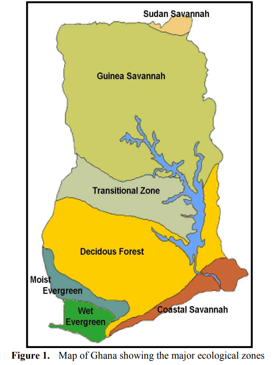

    <h2 class="section-title">{}</h2>
    <ul class="rule-list">
        <li>Language is English.</li>
        <li>Cars drive on the right side and cabs have yellow colored license plates</li>
        <li>The domain is .gh.</li>
        <li>Black duct tape wrapped around the front right.{}</li>
    </ul>

{}
{}

{}
You can see black gummed tape wrapped around the front right{}{}. If the tape is right behind {}. Also, on rare occasions, cars are not visible or are hidden by foliage{}.
{}

From <a href="https://twitter.com/fortune_sibanda">@fortune_sibanda's tweet</a> (confirmed for publication in person*)

{}
If you look down you will find black gummed tape wrapped around the front right.
{}

<iframe src="https://www.google.com/maps/embed?pb=!4v1691936131460!6m8!1m7!1sgAvxIUWO5pIl0fftp9X35Q!2m2!1d4.911854235499209!2d-2.292108674069918!3f106.90794429100063!4f-89!5f0.4000000000000002"width="590" height="300" style="border:0;" allowfullscreen="" loading="lazy" referrerpolicy="no-referrer-when-downgrade"></iframe>

{}
The cabs are painted in a unique {} and yellow color license plate numbers. Cabs are not equipped with a fare meter, and the fare is determined by negotiation at the time of boarding (however, if you use Uber, the fare is determined in advance).
{}

{}
{}

<iframe src="https://www.google.com/maps/embed?pb=!4v1691936074659!6m8!1m7!1sbWjAaSiNj0iNokuIWgBQpA!2m2!1d7.193594791103338!2d-0.1592029517019!3f176.3866237572617!4f-5.728917588183265!5f1.6483086962926574"width="590" height="300" style="border:0;" allowfullscreen="" loading="lazy" referrerpolicy="no-referrer-when-downgrade"></iframe>

{}
{}

    <h2 class="section-title">{}</h2>
    <ul class="rule-list">
        <li>Agriculture and vegetation varies from place to place
            <ul>
                <li>Oil palm and banana trees are common in the south.</li>
                <li>Data Source:<a href="https://ipad.fas.usda.gov/countrysummary/default.aspx?id=GH">Ghana Country Summary - U.S. Department of Agriculture(USDA)</a>・Some images have been processed.</li>
            </ul>
        </li>
        <li>In case you're wondering, they say the area code can sometimes tell you the area.
            <ul>
                <li>030：{}</li>
                <li>031：{}</li>
                <li>032：{}</li>
                <li>037：{}</li>
            </ul>
        </li>
        <li>The further south you go, the more palm trees and the higher the tree density. The north has more savanna climate.</li>
    </ul>

{}
{}

{}
Oil palm and banana trees are common in the south. If these trees are not available, try to place them in the north.
{}
{}
{}

{}
It's best to memorize them, but since there is a good chance you won't find them outside of the city and there are many cell phones, I think it's better to prioritize memorizing the names of the cities and the vegetation and atmosphere of each area. If I happen to see a fax number, I will refer to it.
{}
{}
{}

{}
For myself, I often try to go to the upper half of the savanna climate if there is a lot of exposed ground or shrubbery{{% ref "https://d1wqtxts1xzle7.cloudfront.net/57120260/Land_Use_and_Misuse_Human_Appropriation_20180802-5137-92o7ak-libre.pdf?1533217497=&response-content-disposition=inline%3B+filename%3DLand_Use_and_Misuse_Human_Appropriation.pdf&Expires=1693657799&Signature=EPz7LUYs-Gph~ht6xfQIYrg2~RCzjdm2R3cTQxBmzPU61diG~82GbDe3X~s21V~N9hSVDFCxND4FEIF~R58Mx6HaxFCpIvziLzQ6S5Fk9FH4WE4KINyoxz82kD6McTR0ksBqZ5ftFv~Sog~2svocE6Q1LCFXEPby6Rh2Lz0Fh6hHjMvTUWsycsxTzVmHb-P1Xr94mVN9maqkpMMCIa5rMwwAm2hVeJUCM4aPKq6Z1xR79HFC574wFF~daGENtBk-iQQeU6D5VJGGjgNmvYv6bQ1DqCiwNx~sZfjViro7MgPlGvK4AWHEY7p-pW~SUEslBtqfrbDTjRAxJNPkEqhBcg__&Key-Pair-Id=APKAJLOHF5GGSLRBV4ZA" "Appiah, Divine Odame, Balikisu Osman, and James Boafo. 『Land use and misuse; Human appropriation of land ecosystems services in Ghana.』 International Journal of Ecosystem 4.1 (2014): 24-33." %}}. Image taken from Ref.
{}
{}
{}

{}
<li><a href="https://twitter.com/fortune_sibanda/status/693167610054250496?s=20">*Original tweet『Google StreetView driving in Ghana started today. #MoreVim! from @fortune_sibanda』</a></li>
{}

