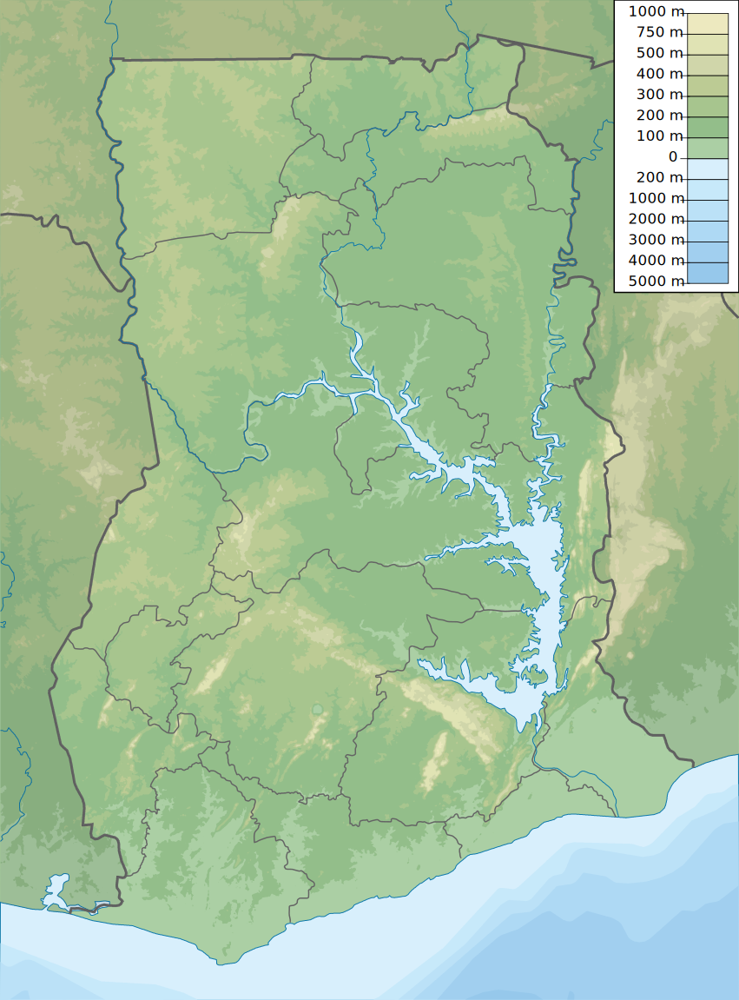

    <h2 class="section-title">{}</h2>
    <ul class="rule-list">
        <li>The language is English.</li>
        <li>Vehicles drive on the right side, and taxis have yellow license plates.</li>
        <li>The domain is .gh.</li>
        <li>Black duct tape is wrapped around the front right corner{}.</li>
    </ul>

{}
{}

{}
Black duct tape wrapped around the front right corner can be observed {}{}. If the tape is at the rear right, then it is likely {}. Note that occasionally, the tape may not be visible due to obscuring leaves or when the car itself is not visible {}.
{}

<a href="https://twitter.com/fortune_sibanda">Tweet by @fortune_sibanda</a>

{}
Looking downward, you should be able to spot the black duct tape wrapped around the front right corner.
{}

<iframe src="https://www.google.com/maps/embed?pb=!4v1691936131460!6m8!1m7!1sgAvxIUWO5pIl0fftp9X35Q!2m2!1d4.911854235499209!2d-2.292108674069918!3f106.90794429100063!4f-89!5f0.4000000000000002" width="590" height="300" style="border:0;" allowfullscreen="" loading="lazy" referrerpolicy="no-referrer-when-downgrade"></iframe>

{}
Taxi paint designs are distinctive {} with yellow license plates. Taxis do not have fare meters, and fares are negotiated at the time of boarding (although using Uber allows fares to be fixed in advance).
{}

{}
Small shops that appear to be lottery stands (red, yellow, and green boxes on the left side of the image) are frequently found {}{}. The lottery system is reportedly operated by the government.
{}

{}
{}

<iframe src="https://www.google.com/maps/embed?pb=!4v1691936074659!6m8!1m7!1sbWjAaSiNj0iNokuIWgBQpA!2m2!1d7.193594791103338!2d-0.1592029517019!3f176.3866237572617!4f-5.728917588183265!5f1.6483086962926574" width="590" height="300" style="border:0;" allowfullscreen="" loading="lazy" referrerpolicy="no-referrer-when-downgrade"></iframe>

{}
{}

    <h2 class="section-title">{}</h2>
    <ul class="rule-list">
        <li>Agriculture and vegetation vary by location:
            <ul>
                <li>Oil palms and banana trees are common in the southern region.</li>
                <li>Data source: <a href="https://ipad.fas.usda.gov/countrysummary/default.aspx?id=GH">Ghana Country Summary - U.S. Department of Agriculture (USDA)</a>; some images have been edited.</li>
            </ul>
        </li>
        <li>Area codes can sometimes help identify regions:
            <ul>
                <li>030: {}</li>
                <li>031: {}</li>
                <li>032: {}</li>
                <li>037: {}</li>
            </ul>
        </li>
        <li>The further south you go, the more palm trees and denser forests you will find. The northern regions are predominantly savanna climate.</li>
    </ul>

{}
{}

{}
Oil palms and banana trees are common in the southern region. If these trees are absent, consider the northern region.
{}
{}
{}

{}
While it's helpful to remember area codes, they may not be visible outside urban areas. Mobile numbers are more common, so it may be better to focus on recognizing city names, regional vegetation, and overall atmosphere. If you happen to see a fax number, use it as a reference.
{}
{}
{}

{}
In my experience, if the ground is more exposed or if there are many shrubs, it is likely to be in the upper half with a savanna climate {{% ref "https://d1wqtxts1xzle7.cloudfront.net/57120260/Land_Use_and_Misuse_Human_Appropriation_20180802-5137-92o7ak-libre.pdf?1533217497=&response-content-disposition=inline%3B+filename%3DLand_Use_and_Misuse_Human_Appropriation.pdf&Expires=1693657799&Signature=EPz7LUYs-Gph~ht6xfQIYrg2~RCzjdm2R3cTQxBmzPU61diG~82GbDe3X~s21V~N9hSVDFCxND4FEIF~R58Mx6HaxFCpIvziLzQ6S5Fk9FH4WE4KINyoxz82kD6McTR0ksBqZ5ftFv~Sog~2svocE6Q1LCFXEPby6Rh2Lz0Fh6hHjMvTUWsycsxTzVmHb-P1Xr94mVN9maqkpMMCIa5rMwwAm2hVeJUCM4aPKq6Z1xR79HFC574wFF~daGENtBk-iQQeU6D5VJGGjgNmvYv6bQ1DqCiwNx~sZfjViro7MgPlGvK4AWHEY7p-pW~SUEslBtqfrbDTjRAxJNPkEqhBcg__&Key-Pair-Id=APKAJLOHF5GGSLRBV4ZA" "Appiah, Divine Odame, Balikisu Osman, and James Boafo. 'Land use and misuse; Human appropriation of land ecosystems services in Ghana.' International Journal of Ecosystem 4.1 (2014): 24-33." %}}. The image is sourced from the referenced document.
{}
{}
{}

    <ul class="rule-list">
        <li>The area around the southeastern lakes is often mountainous.</li>
    </ul>

{}
{}
{}
The white parts of this map indicate areas with high mountains {}.
{}

{}
{}

{}
<li><a href="https://twitter.com/fortune_sibanda/status/693167610054250496?s=20">*Original tweet: "Google StreetView driving in Ghana started today. #MoreVim!" by @fortune_sibanda</a>, shared with permission from the author.</li>
{}
