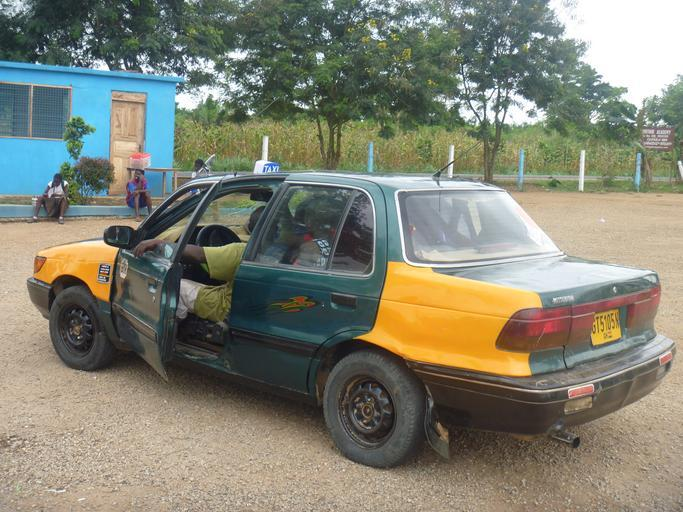
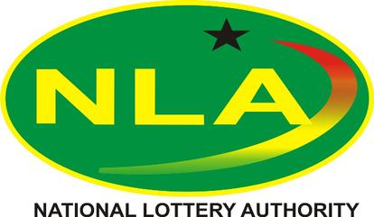

    <h2 class="section-title">{}</h2>
    <ul class="rule-list">
        <li>Bahasa utama adalah Inggris</li>
        <li>Kendaraan melaju di sisi kanan, dan taksi menggunakan pelat nomor kuning</li>
        <li>Domain internet menggunakan .gh</li>
        <li>Terdapat lakban hitam di bagian depan kanan pada Google Car {}</li>
    </ul>

{}
{}

{}
Lakban hitam dapat ditemukan di bagian depan kanan Google Car {}. Jika lakban berada di bagian belakang kanan, kemungkinan lokasi adalah {}. Perhatikan bahwa terkadang kendaraan tidak terlihat atau tertutup dedaunan {}.
{}

<a href="https://twitter.com/fortune_sibanda">@fortune_sibanda di Twitter</a>

{}
Lakban hitam di bagian depan kanan harus terlihat saat melihat ke bawah.
{}

<iframe src="https://www.google.com/maps/embed?pb=!4v1691936131460!6m8!1m7!1sgAvxIUWO5pIl0fftp9X35Q!2m2!1d4.911854235499209!2d-2.292108674069918!3f106.90794429100063!4f-89!5f0.4000000000000002" width="590" height="300" style="border:0;" allowfullscreen="" loading="lazy" referrerpolicy="no-referrer-when-downgrade"></iframe>

{}
Taksi di Ghana memiliki desain unik {} dan menggunakan pelat nomor kuning. Taksi tidak memiliki argo; tarif ditentukan melalui negosiasi saat naik (kecuali menggunakan Uber, yang tarifnya ditentukan sebelumnya).
{}

{}
Gerai kecil yang menjual lotere (biasanya berupa kotak merah, kuning, dan hijau) dapat ditemukan {} {}. Lotere ini dikelola oleh pemerintah.
{}

{}
{}

<iframe src="https://www.google.com/maps/embed?pb=!4v1691936074659!6m8!1m7!1sbWjAaSiNj0iNokuIWgBQpA!2m2!1d7.193594791103338!2d-0.1592029517019!3f176.3866237572617!4f-5.728917588183265!5f1.6483086962926574" width="590" height="300" style="border:0;" allowfullscreen="" loading="lazy" referrerpolicy="no-referrer-when-downgrade"></iframe>

{}
{}

    <h2 class="section-title">{}</h2>
    <ul class="rule-list">
        <li>Jenis pertanian dan vegetasi berbeda di tiap wilayah
            <ul>
                <li>Pohon kelapa sawit dan pisang lebih banyak ditemukan di bagian selatan</li>
                <li>Sumber data: <a href="https://ipad.fas.usda.gov/countrysummary/default.aspx?id=GH">Ghana Country Summary - U.S. Department of Agriculture (USDA)</a>; beberapa gambar telah diolah.</li>
            </ul>
        </li>
        <li>Kode area telepon dapat menunjukkan lokasi:
            <ul>
                <li>030: {}</li>
                <li>031: {}</li>
                <li>032: {}</li>
                <li>037: {}</li>
            </ul>
        </li>
        <li>Semakin ke selatan, pohon kelapa dan vegetasi semakin padat. Bagian utara cenderung memiliki iklim sabana.</li>
    </ul>

{}
{}

{}
Pohon kelapa sawit dan pisang lebih sering ditemukan di bagian selatan. Jika pohon ini tidak ditemukan, kemungkinan berada di wilayah utara.
{}
{}
{}

{}
Meskipun menghafal kode area bisa membantu, kode ini jarang ditemukan di luar kota, dan lebih banyak digunakan untuk telepon rumah dibandingkan ponsel. Sebaiknya pelajari ciri khas vegetasi dan suasana setiap wilayah.
{}
{}
{}

{}
Jika banyak area tanah yang terbuka atau semak belukar, kemungkinan berada di bagian utara dengan iklim sabana {{% ref "https://d1wqtxts1xzle7.cloudfront.net/57120260/Land_Use_and_Misuse_Human_Appropriation_20180802-5137-92o7ak-libre.pdf?1533217497=&response-content-disposition=inline%3B+filename%3DLand_Use_and_Misuse_Human_Appropriation.pdf&Expires=1693657799&Signature=EPz7LUYs-Gph~ht6xfQIYrg2~RCzjdm2R3cTQxBmzPU61diG~82GbDe3X~s21V~N9hSVDFCxND4FEIF~R58Mx6HaxFCpIvziLzQ6S5Fk9FH4WE4KINyoxz82kD6McTR0ksBqZ5ftFv~Sog~2svocE6Q1LCFXEPby6Rh2Lz0Fh6hHjMvTUWsycsxTzVmHb-P1Xr94mVN9maqkpMMCIa5rMwwAm2hVeJUCM4aPKq6Z1xR79HFC574wFF~daGENtBk-iQQeU6D5VJGGjgNmvYv6bQ1DqCiwNx~sZfjViro7MgPlGvK4AWHEY7p-pW~SUEslBtqfrbDTjRAxJNPkEqhBcg__&Key-Pair-Id=APKAJLOHF5GGSLRBV4ZA" "Appiah, Divine Odame, Balikisu Osman, and James Boafo. 『Land use and misuse; Human appropriation of land ecosystems services in Ghana.』 International Journal of Ecosystem 4.1 (2014): 24-33." %}}.
{}
{}
{}

    <ul class="rule-list">
        <li>Wilayah sekitar danau di tenggara cenderung bergunung-gunung.</li>
    </ul>

{}
{}
{}
Bagian putih pada peta ini menunjukkan daerah pegunungan {}.
{}

{}
{}

{}
<li><a href="https://twitter.com/fortune_sibanda/status/693167610054250496?s=20">*Tweet asli: "Google StreetView driving in Ghana started today. #MoreVim!" oleh @fortune_sibanda</a>, digunakan dengan izin.</li>
{}
