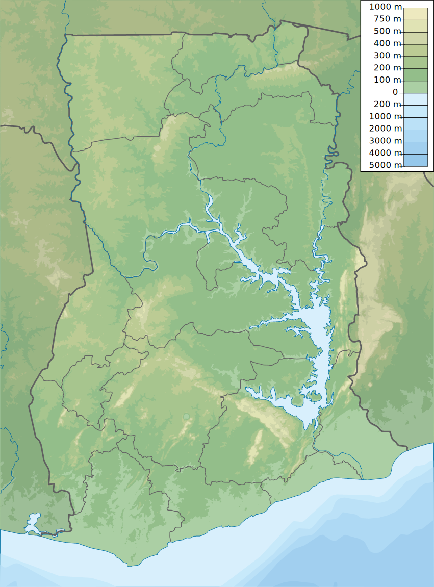

    <h2 class="section-title">{}</h2>
    <ul class="rule-list">
        <li>言語は英語</li>
        <li>車は右側通行でタクシーは黄色ナンバー</li>
        <li>ドメインは.gh</li>
        <li>右前に黒いガムテープが巻かれている{}</li>
    </ul>

{}
{}

{}
右前に黒いガムテープが巻かれている{}様子が確認できる{}。テープが右後ろならば{}になる点に注意。また、稀に車が見えない時や葉っぱで隠れている時もある{}。
{}

<a href="https://twitter.com/fortune_sibanda">@fortune_sibanda のツイート</a>より

{}
下を向けば右前に黒いガムテープが巻かれているのが見つかるはず。
{}

<iframe src="https://www.google.com/maps/embed?pb=!4v1691936131460!6m8!1m7!1sgAvxIUWO5pIl0fftp9X35Q!2m2!1d4.911854235499209!2d-2.292108674069918!3f106.90794429100063!4f-89!5f0.4000000000000002"width="590" height="300" style="border:0;" allowfullscreen="" loading="lazy" referrerpolicy="no-referrer-when-downgrade"></iframe>

{}
タクシーの色の塗り方が独特{}で黄色のナンバー。タクシーは料金メーターが付いておらず料金は乗車時に交渉で決める（ただしUberを使う場合は事前に確定する）らしい。
{}

{}
宝くじ売り場と思われる小さいお店（画像左側の赤黄緑の箱）が見つかる{}{}。宝くじは政府によって運営されているらしい。
{}

{}
{}

<iframe src="https://www.google.com/maps/embed?pb=!4v1691936074659!6m8!1m7!1sbWjAaSiNj0iNokuIWgBQpA!2m2!1d7.193594791103338!2d-0.1592029517019!3f176.3866237572617!4f-5.728917588183265!5f1.6483086962926574"width="590" height="300" style="border:0;" allowfullscreen="" loading="lazy" referrerpolicy="no-referrer-when-downgrade"></iframe>

{}
{}

    <h2 class="section-title">{}</h2>
    <ul class="rule-list">
        <li>農業や植生が場所によって異なる
            <ul>
                <li>アブラヤシやバナナの木は南部に多い</li>
                <li>データ提供元：<a href="https://ipad.fas.usda.gov/countrysummary/default.aspx?id=GH">Ghana Country Summary - U.S. Department of Agriculture(USDA)</a>・一部画像を加工しています</li>
            </ul>
        </li>
        <li>一応市外局番で地域が分かることがあるらしい
            <ul>
                <li>030：{}</li>
                <li>031：{}</li>
                <li>032：{}</li>
                <li>037：{}</li>
            </ul>
        </li>
        <li>南へ行くほどヤシの木があり木の密度も高い。北はサバンナ気候の場所が多い。</li>
    </ul>

{}
{}

{}
アブラヤシやバナナの木は南部に多い。これらの木がないならば北部に置いてみる。
{}
{}
{}

{}
覚えるに越したことはないけれど街中以外では見つからない可能性が高い上に携帯が多いので、都市名と地域ごとの植生や雰囲気を覚えることを優先した方がいいように思う。たまたまFAXの番号を見かけたら参考にしてみる。
{}
{}
{}

{}
自分の場合は地面が露出している場所が多かったり低木が多いならば上半分のサバンナ気候の場所に行ってみることが多い{{% ref "https://d1wqtxts1xzle7.cloudfront.net/57120260/Land_Use_and_Misuse_Human_Appropriation_20180802-5137-92o7ak-libre.pdf?1533217497=&response-content-disposition=inline%3B+filename%3DLand_Use_and_Misuse_Human_Appropriation.pdf&Expires=1693657799&Signature=EPz7LUYs-Gph~ht6xfQIYrg2~RCzjdm2R3cTQxBmzPU61diG~82GbDe3X~s21V~N9hSVDFCxND4FEIF~R58Mx6HaxFCpIvziLzQ6S5Fk9FH4WE4KINyoxz82kD6McTR0ksBqZ5ftFv~Sog~2svocE6Q1LCFXEPby6Rh2Lz0Fh6hHjMvTUWsycsxTzVmHb-P1Xr94mVN9maqkpMMCIa5rMwwAm2hVeJUCM4aPKq6Z1xR79HFC574wFF~daGENtBk-iQQeU6D5VJGGjgNmvYv6bQ1DqCiwNx~sZfjViro7MgPlGvK4AWHEY7p-pW~SUEslBtqfrbDTjRAxJNPkEqhBcg__&Key-Pair-Id=APKAJLOHF5GGSLRBV4ZA" "Appiah, Divine Odame, Balikisu Osman, and James Boafo. 『Land use and misuse; Human appropriation of land ecosystems services in Ghana.』 International Journal of Ecosystem 4.1 (2014): 24-33." %}}。画像は参考文献より引用。
{}
{}
{}

    <ul class="rule-list">
        <li>南東の湖周りは山がちなエリアが多い</li>
    </ul>

{}
{}
{}
このマップの白い部分は高い山が多い{}。
{}

{}
{}

{}
<li><a href="https://twitter.com/fortune_sibanda/status/693167610054250496?s=20">*オリジナルのツイート『Google StreetView driving in Ghana started today. #MoreVim! from @fortune_sibanda』</a>, 本人に掲載許可頂いてます.</li>
{}

