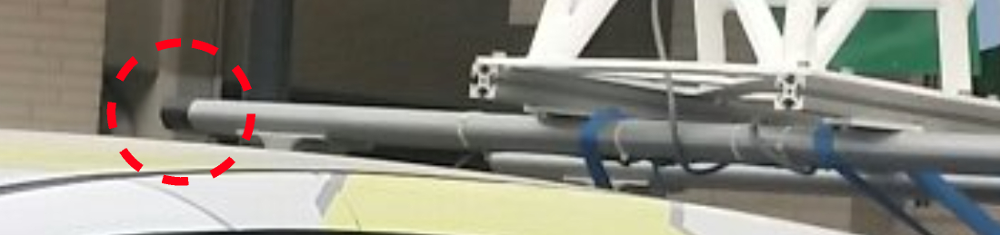
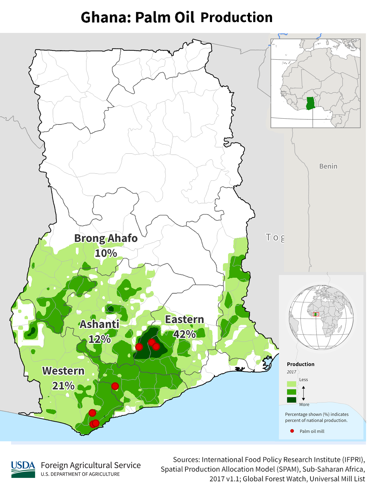

    <h2 class="section-title">{}</h2>
    <ul class="rule-list">
        <li>言語は英語</li>
        <li>車は右側通行でタクシーは黄色ナンバー</li>
        <li>ドメインは.gh</li>
        <li>右前に黒いガムテープが巻かれている{}</li>
    </ul>

{}
{}

{}
右前に黒いガムテープが巻かれている{}様子が確認できる{}。テープが右後ろならば{}になる点に注意。また、稀に車が見えない時や葉っぱで隠れている時もある{}。
{}

<a href="https://twitter.com/fortune_sibanda">@fortune_sibanda のツイート</a>より（本人に掲載確認済み*）

{}
タクシーの色の塗り方が独特{}で黄色のナンバー。タクシーは料金メーターが付いておらず料金は乗車時に交渉で決める（ただしUberを使う場合は事前に確定する）らしい。
{}

{}
{}

<iframe src="https://www.google.com/maps/embed?pb=!4v1691936131460!6m8!1m7!1sgAvxIUWO5pIl0fftp9X35Q!2m2!1d4.911854235499209!2d-2.292108674069918!3f106.90794429100063!4f-89!5f0.4000000000000002"width="590" height="300" style="border:0;" allowfullscreen="" loading="lazy" referrerpolicy="no-referrer-when-downgrade"></iframe>
<iframe src="https://www.google.com/maps/embed?pb=!4v1691936074659!6m8!1m7!1sbWjAaSiNj0iNokuIWgBQpA!2m2!1d7.193594791103338!2d-0.1592029517019!3f176.3866237572617!4f-5.728917588183265!5f1.6483086962926574"width="590" height="300" style="border:0;" allowfullscreen="" loading="lazy" referrerpolicy="no-referrer-when-downgrade"></iframe>

{}
{}

    <h2 class="section-title">{}</h2>
    <ul class="rule-list">
        <li>農業や植生が場所によって異なる
            <ul>
                <li>アブラヤシやバナナの木は南部に多い</li>
                <li>データ提供元：<a href="https://ipad.fas.usda.gov/countrysummary/default.aspx?id=GH">Ghana Country Summary - U.S. Department of Agriculture(USDA)</a>・一部画像を加工しています</li>
            </ul>
        </li>
        <li>一応市外局番で地域が分かることがあるらしい
            <ul>
                <li>030：{}</li>
                <li>031：{}</li>
                <li>032：{}</li>
                <li>037：{}</li>
            </ul>
        </li>
    </ul>

{}
{}

{}
アブラヤシやバナナの木は南部に多い。これらの木がないならば北部に置いてみる。
{}
{}
{}

{}
覚えるに越したことはないけれど街中以外では見つからない可能性が高い上に携帯が多いので、都市名と地域ごとの植生や雰囲気を覚えることを優先した方がいいように思う。たまたまFAXの番号を見かけたら参考にしてみる。
{}
{}
{}

{}
<li><a href="https://twitter.com/fortune_sibanda/status/693167610054250496?s=20">*オリジナルのツイート『Google StreetView driving in Ghana started today. #MoreVim! from @fortune_sibanda』</a></li>
{}

