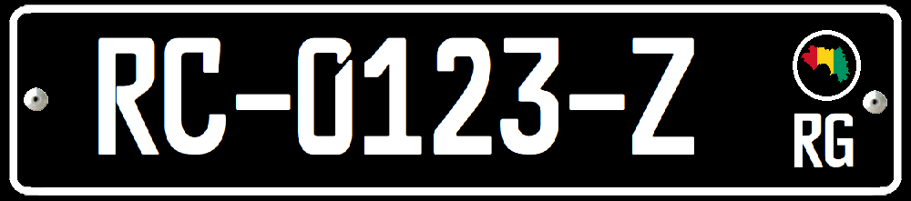

    <h2 class="section-title">{}</h2>
    <ul class="rule-list">
        <li>2023年11月の時点では公式カバレッジは無い</li>
    </ul>

{}
{}
{}
個人の車は赤、タクシーなど商用車は黒のナンバープレートを付けている{}。
{}

{}

CC0

CC0
{}

{}
アフリカでボーキサイトの生産が一番多い地域{}{}。北西側の都市に主な鉱山があり、土も赤に近い色をしている。下の図は2018年のギニアの輸出の構成。
{}

{}
{}