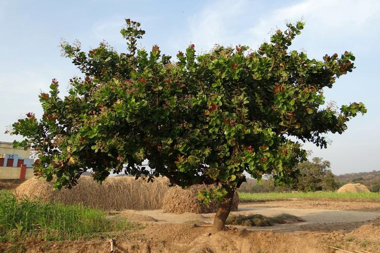

    <h2 class="section-title">{}</h2>
    <ul class="rule-list">
        <li>2023年11月の時点では公式カバレッジは無い</li>
        <li>公用語はポルトガル語</li>
        <li>カシューナッツの生産が盛ん</li>
    </ul>

{}
{}

{}
ポルトガル植民地だったため{}語圏であり、{}や{}と同じ電柱が見つかる。
{}

{}
正確なデータがないものの、カシューナッツの生産に従事する国民が多くカシューナッツの木が見つかるはず。マットなどの上にナッツを干す様子も見つかるかもしれないが、ストリートビューや画像が少ないため正確な様子はわからない。鉱業や資源の生産は少ない。
{}

<iframe width="560" height="315" src="https://www.youtube.com/embed/mB4VuVWkh1k?si=slXDfmqXALxffWUe" title="YouTube video player" frameborder="0" allow="accelerometer; autoplay; clipboard-write; encrypted-media; gyroscope; picture-in-picture; web-share" referrerpolicy="strict-origin-when-cross-origin" allowfullscreen></iframe>

{}
{}