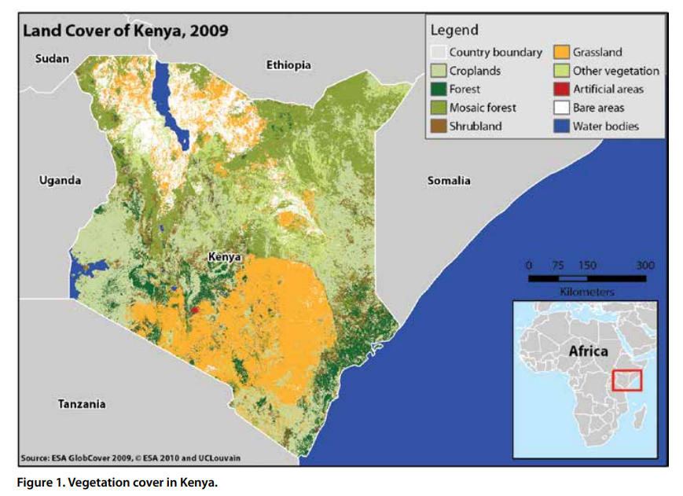

    <h2 class="section-title">{}</h2>
    <ul class="rule-list">
        <li>車は左側通行</li>
        <li>車の後ろナンバーが大き目の黄色</li>
        <li>ドメインは.ke</li>
        <li>言語は英語とスワヒリ語が使用される</li>
        <li>標識は{}のものに近い見た目</li>
        <li>Google Carが特徴的</li>
    </ul>

{}
{}
{}
車は左側通行であり、車の後ろナンバーが大き目の黄色{}。バイクも前にはプレートは無いかもしれないが大き目の黄色ナンバーが後ろについている{}。
{}

{}

By kenyanmagazine - <a rel="nofollow" class="external free" href="https://kenyanmagazine.co.ke/wp-content/uploads/2022/08/20220830_191002.jpg">オリジナル画像</a>, <a href="https://creativecommons.org/licenses/by-sa/4.0" title="Creative Commons Attribution-Share Alike 4.0">CC BY-SA 4.0</a>, <a href="https://commons.wikimedia.org/w/index.php?curid=125713405">Link</a> を加工しています
{}

{}
JETROなどによると、STEERS(ファストフード){}、Safaricom（通信）{}、Java（コーヒーブランド？）などが大き目の現地企業。とりわけSafaricomは歩いていると見かけるかも{}？
{}

{}
かつて{}の保護領だったためか、標識の見た目はイギリスに似ている。街中で標識を見かけることはそれほど多くない。
{}

{}
Google Carが特徴的で何種類か存在する。車の屋根が見えたり{}シュノーケル（Vehicle snorkel）と呼ばれる黒いパーツが付いていたり{}サイドミラーが見えたりする{}。黒い車もいる{}。稀にGoogle Carが映っていない時もある{}ので注意。
{}

<iframe src="https://www.google.com/maps/embed?pb=!4v1706661584779!6m8!1m7!1sNKDg-2MfNl-12qbEN5-Y1Q!2m2!1d0.2511892980565865!2d37.92610937796032!3f209.33301176809235!4f-14.499122211949398!5f0.4000000000000002" width="70%" height="350" style="border:0;" allowfullscreen="" loading="lazy" referrerpolicy="no-referrer-when-downgrade"></iframe>

{}
{}

<iframe src="https://www.google.com/maps/embed?pb=!4v1689602344627!6m8!1m7!1skDJpJQE9Q3f5-Fu3WcGH_Q!2m2!1d-1.896337136460409!2d36.29041041792873!3f340.1124427594091!4f0.2480216390300427!5f2.950964112637595"width="295" height="295" style="border:0;" allowfullscreen="" loading="lazy" referrerpolicy="no-referrer-when-downgrade"></iframe>

{}
{}

    <h2 class="section-title">{}</h2>
    <ul class="rule-list">
        <li>植生が場所によって異なる
            <ul>
                <li>東の海沿い：細いヤシの木のようなものが生えている</li>
            </ul>
        </li>
    </ul>

{}
{}

{}{}
{}

{}
{}

<iframe src="https://www.google.com/maps/embed?pb=!4v1694924718412!6m8!1m7!1s57gQl4murZAHOYv_irM2IQ!2m2!1d-3.872518787254868!2d39.78164550750251!3f201.9618370086089!4f-7.606157894095659!5f0.4000000000000002" width="295" height="295" style="border:0;" allowfullscreen="" loading="lazy" referrerpolicy="no-referrer-when-downgrade"></iframe>
<iframe src="https://www.google.com/maps/embed?pb=!4v1694924807359!6m8!1m7!1s810FgmQL0CUm6OpPSvuYZQ!2m2!1d-4.424506753838949!2d39.50188631452412!3f90.71852339945418!4f2.7050358541516317!5f0.7820865974627469" width="295" height="295" style="border:0;" allowfullscreen="" loading="lazy" referrerpolicy="no-referrer-when-downgrade"></iframe>

{}
{}

{}
{}

<iframe src="https://www.google.com/maps/embed?pb=!4v1694925053890!6m8!1m7!1sRoPwIx9bSo6DftrZMzIWQQ!2m2!1d3.515174464846655!2d35.22271852414578!3f232.62532757736392!4f3.918786919933595!5f0.4000000000000002" width="295" height="295" style="border:0;" allowfullscreen="" loading="lazy" referrerpolicy="no-referrer-when-downgrade"></iframe>
<iframe src="https://www.google.com/maps/embed?pb=!4v1694925093290!6m8!1m7!1s8rxI0-wKb44vShiCfYwJjA!2m2!1d3.982079956011404!2d35.48063603389876!3f188.16585448349875!4f6.136168804688722!5f0.4000000000000002" width="295" height="295" style="border:0;" allowfullscreen="" loading="lazy" referrerpolicy="no-referrer-when-downgrade"></iframe>

{}
上部が平坦な木が多い？
{}

{}
{}