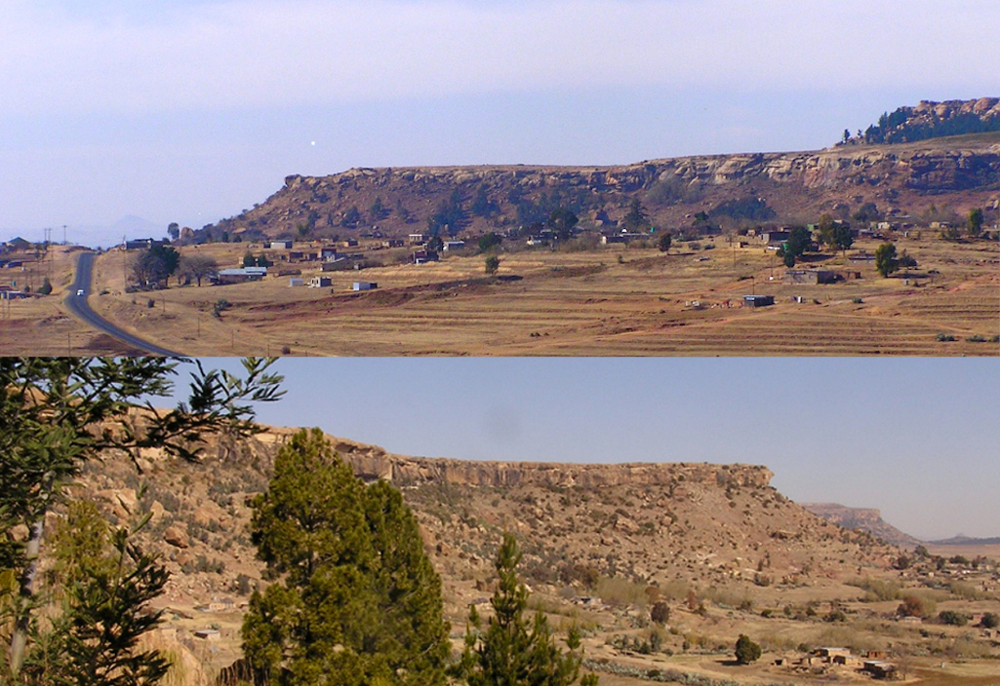
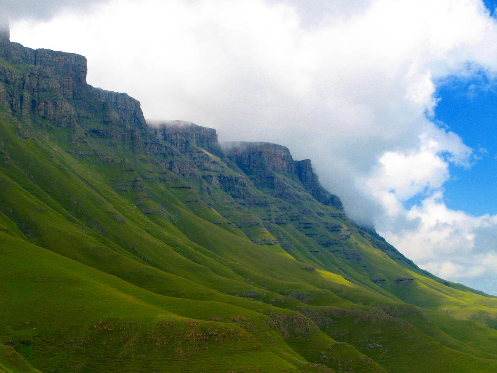

    <h2 class="section-title">{}</h2>
    <ul class="rule-list">
        <li>ドメインは.ls</li>
        <li>地形について、国全体がドラケンスバーグ山脈の中にあり平らな場所が少ない。上が平らな山が多い。木でおおわれた山はおそらく無い。</li>
        <li>温暖湿潤気候に近く、木がまばらに生えた草原が広がっている。</li>
    </ul>
    {}

{}
{}
{}
ドラケンスバーグ山脈の中に国が存在し全体的に標高が高くごつごつした隆起や上が平らな山が多い{}。草は生えていて羊や牛などの牧畜がたまに見える。{}も標高が高い場所があるがエスワティニの標高が高い場所では林業が盛んで木が多い。一方でレソトは木が生えていないことが多い。
{}

{}
伝統的な形の家がある{}{}。
{}

{}
{}と比較すると草の長さは非常に短いことが多い{}。
{}

{}
{}

<iframe src="https://www.google.com/maps/embed?pb=!4v1679071286013!6m8!1m7!1svOlntoCNjqKh75WbhcWaTw!2m2!1d-29.31540480409747!2d27.48959154561095!3f96.10363228499693!4f-29.491597698979618!5f2.8252987156531377" width="295" height="295" style="border:0;" allowfullscreen="" loading="lazy" referrerpolicy="no-referrer-when-downgrade"></iframe>
<iframe src="https://www.google.com/maps/embed?pb=!4v1679071388618!6m8!1m7!1sSUXT5SjPaXUN3cbVshi8Yg!2m2!1d-29.31553200346037!2d27.49091116678589!3f91.92507026601447!4f0.1550730138376082!5f3.325193203789971" width="295" height="295" style="border:0;" allowfullscreen="" loading="lazy" referrerpolicy="no-referrer-when-downgrade"></iframe>

{}
{}