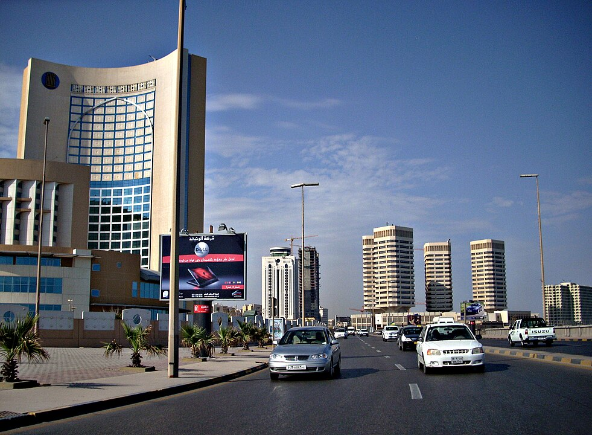

    <h2 class="section-title">{}</h2>
    <ul class="rule-list">
        <li>2023年11月の時点では公式カバレッジは無い</li>
    </ul>

{}
{}
{}
1959年以降は産油国となり、現在の輸出の大部分が石油となっている。一人当たりのGDPは隣国のエジプトやリビアの4~5倍以上あり、周辺国と比較すると綺麗なインフラや建物が見られる{}。
{}

{}
1947年に連合国へ領土を割譲するまでは{}領リビアだった。標識のスタイルはイタリアと共通している。
{}

By <a href="//commons.wikimedia.org/wiki/User:Jaw101ie" title="User:Jaw101ie">Abdul-Jawad Elhusuni (عبدالجواد الحسوني)</a> - Own work, <a href="https://creativecommons.org/licenses/by-sa/3.0" title="Creative Commons Attribution-Share Alike 3.0">CC BY-SA 3.0</a>, <a href="https://commons.wikimedia.org/w/index.php?curid=20468600">Link</a>

{}
{}