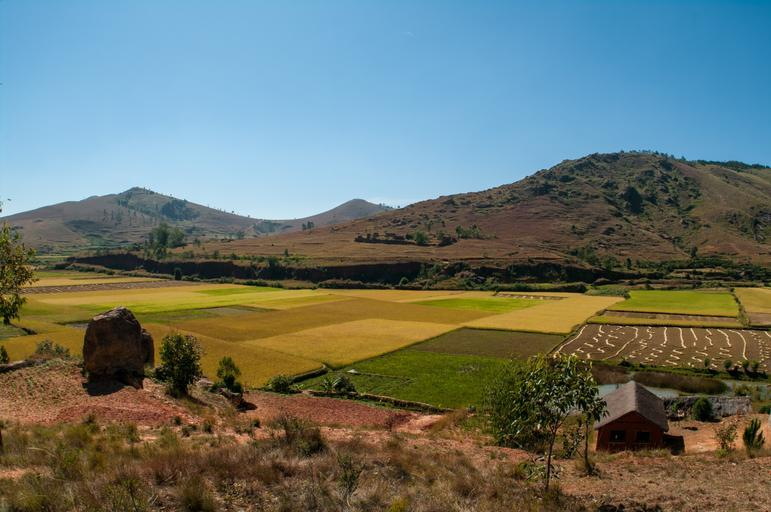
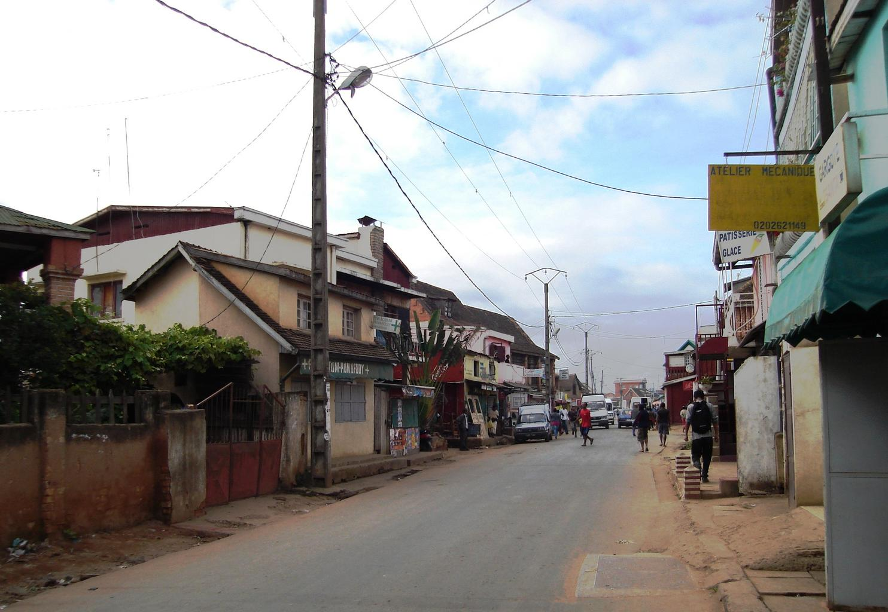

    <h2 class="section-title">{}</h2>
    <ul class="rule-list">
        <li>ドメインは.mg</li>
        <li>Google Carを使用している場所が無く場所も限定されているので、すべての場所を覚える必要がある</li>
    </ul>

{}
{}

{}トレッカー（歩木での撮影）や船・牛に乗った撮影ばかりなので、丸暗記すればすぐにわかる{}。
{}

<iframe width="560" height="315" src="https://www.youtube.com/embed/EQx88t1-FAM?start=3190" title="YouTube video player" frameborder="0" allow="accelerometer; autoplay; clipboard-write; encrypted-media; gyroscope; picture-in-picture; web-share" allowfullscreen></iframe>

{}これ以降の情報は、Geoguessrをプレイする上では役に立つことはほとんどありません
{}

{}主食はコメであり、郊外ではアジアの田舎に近い景色が広がっている{}。
{}

{}「アフリカの年」である1960年に主権国家として独立を回復したもののフランス依存はその後も続き、フランスの工業製品の消費地となっていた。道端の電柱などはフランス本国と同じ形のものが見つかる{}。
{}

{}
{}

<iframe src="https://www.google.com/maps/embed?pb=!4v1681432674789!6m8!1m7!1sAY9_EEKUCnppOC7UJcRoOg!2m2!1d-22.21717804510507!2d43.27859531339001!3f298.32003224073003!4f-8.301811380990216!5f0.4000000000000002" width="590" height="300" style="border:0;" allowfullscreen="" loading="lazy" referrerpolicy="no-referrer-when-downgrade"></iframe>
<iframe src="https://www.google.com/maps/embed?pb=!4v1681432842668!6m8!1m7!1sA3Nwp5mbVkMHUB_Y9cJRZA!2m2!1d-21.82954985767571!2d43.29258799976509!3f347.32169245851566!4f-19.93599673144614!5f0.4000000000000002" width="590" height="300" style="border:0;" allowfullscreen="" loading="lazy" referrerpolicy="no-referrer-when-downgrade"></iframe>

{}
{}

<iframe src="https://www.google.com/maps/embed?pb=!4v1681432367131!6m8!1m7!1sT_x6tKUcG9AYJuql40_4Xg!2m2!1d-22.10519356015425!2d43.25158079458464!3f335.6901864595806!4f-27.15287173309057!5f0.7244172100979407" width="590" height="300" style="border:0;" allowfullscreen="" loading="lazy" referrerpolicy="no-referrer-when-downgrade"></iframe>

{}
{}