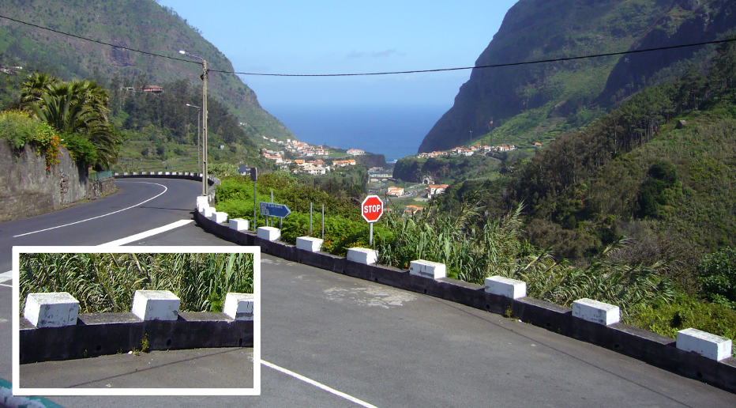
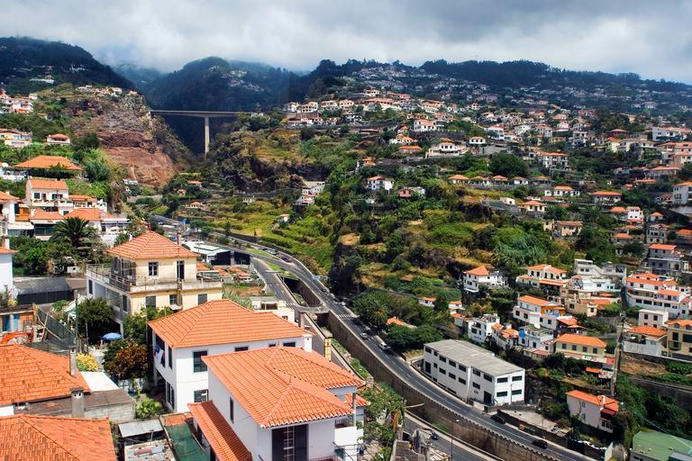

    <h2 class="section-title">{}</h2>
    <ul class="rule-list">
        <li>ポルトガル領の離島でナンバープレート・標識・電柱も本土と共通している</li>
        <li>島の海岸線は海食崖の岩場が多い</li>
        <li>コンクリート製の特徴的な見た目の欄干やボラードがある</li>
        <li>エリアコードは291</li>
        <li class="no-evidence">海上の湿った空気と貿易風がぶつかることで霧が発生しやすい</li>
        <li class="no-evidence">{}よりも起伏が激しい</li>
    </ul>

{}
{}
{}
{}領の離島でナンバープレート・標識・電柱{}はポルトガルと共通している
{}

{}

<a href="//commons.wikimedia.org/wiki/User:Willtron" title="User:Willtron">by Willtron</a>, <a href="https://creativecommons.org/licenses/by-sa/3.0" title="Creative Commons Attribution-Share Alike 3.0">CC 表示-継承 3.0</a> <a href="https://commons.wikimedia.org/w/index.php?curid=4614860">Wikimedia Commons(link)</a>
{}

{}
橋の欄干や道の柵がコンクリート製で白いブロックが乗っている{}。
{}

{}
コンクリート製と思われる特徴的な見た目のボラードがある{}。また霧が発生しやすく遠くが見えないときがある{}。違うタイプのボラードもたまにある{}。
{}

{}
こんな感じの紫や白の花が咲いている{}。
{}

{}

{}
他の写真からも分かるように、島は風化や侵食により形成された丘と谷があり地形が平坦ではない{}{{% ref "https://ja.wikipedia.org/wiki/%E3%83%9E%E3%83%87%E3%82%A4%E3%83%A9%E8%AB%B8%E5%B3%B6" "マデイラ諸島" %}}。
{}

{}
