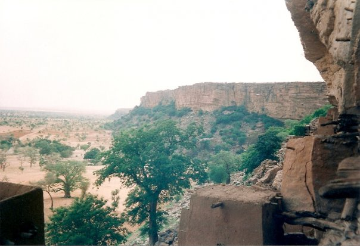

    <h2 class="section-title">{}</h2>
    <ul class="rule-list">
        <li>Los vehículos circulan por el lado derecho.</li>
        <li>El dominio es .ml.</li>
        <li>Los idiomas son francés y lenguas locales.</li>
        <li>Malí es conocido por sus edificaciones de barro, que tienen un aspecto muy distintivo {}.</li>
        <li>Hay muchas vistas de Street View cerca de los lugares Patrimonio de la Humanidad como {}, {}, {}, y {}, además de otros puntos más pequeños.</li>
    </ul>

{}
{}
{}
En Malí, las edificaciones hechas de barro tienen un aspecto característico. A menudo, las paredes presentan varas de palma (llamadas "tron") o tubos que sobresalen {}.
{}

{}
Las casas están construidas con ladrillos de barro secados al sol. El clima seco y con poca lluvia hace que los edificios tengan techos planos {}.
{}

Por <a rel="nofollow" class="external text" href="https://www.flickr.com/people/48600082269@N01">upyernoz</a> desde Haverford, USA - <a rel="nofollow" class="external text" href="https://www.flickr.com/photos/upyernoz/6917662/">Timbuktu Street</a>
Subido por <a href="//commons.wikimedia.org/wiki/User:AlbertHerring" class="mw-redirect" title="User:AlbertHerring">AlbertHerring</a>, <a href="https://creativecommons.org/licenses/by/2.0" title="Creative Commons Attribution 2.0">CC BY 2.0</a>, <a href="https://commons.wikimedia.org/w/index.php?curid=29240121">Link</a>

{}
En las áreas remotas, los Acantilados de Bandiagara ocupan una extensión muy pequeña {}.
{}

{}
{}
