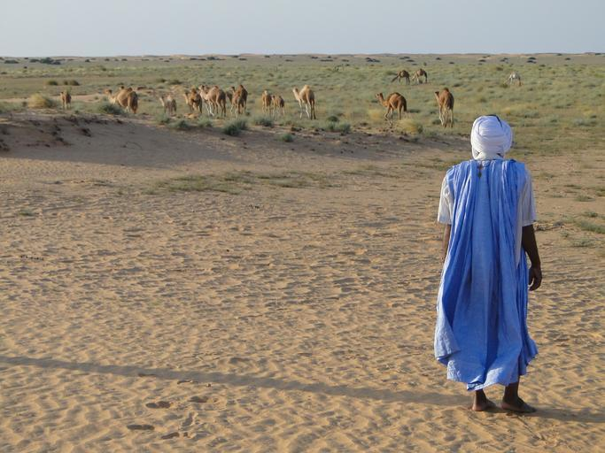
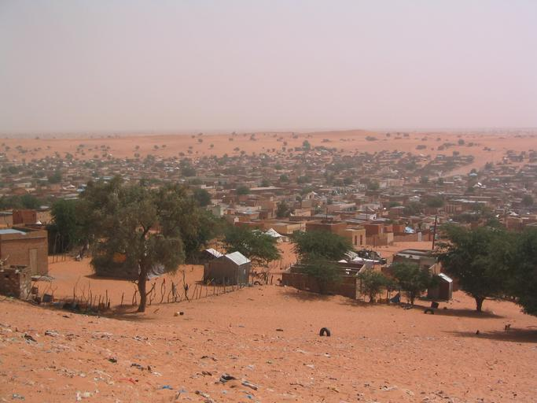
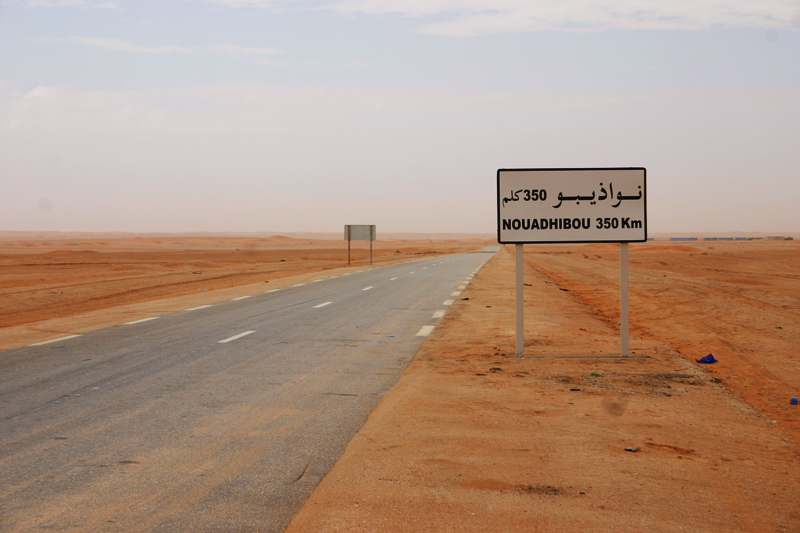

    <h2 class="section-title">{}</h2>
    <ul class="rule-list">
        <li class="no-evidence">公式ストリートビューは無い</li>
        <li>国土のほとんどが砂漠であり農業はセネガル川の沿岸でしか行われない</li>
    </ul>

{}
{}
{}
農業ができる場所は国土の0.5%に満たない、そのため農業よりもラクダなどの牧畜を見つける可能性の方が高い{}。
{}

{}
レンガ・岩・藁で作られた家がほとんどだという{}。
{}

{}
全体的に平坦で、岩が露出する広大な乾燥平野が広がっている{}。
{}

{}
{}
