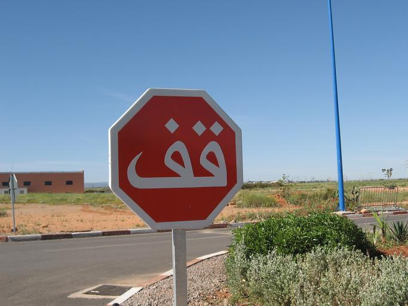
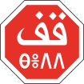
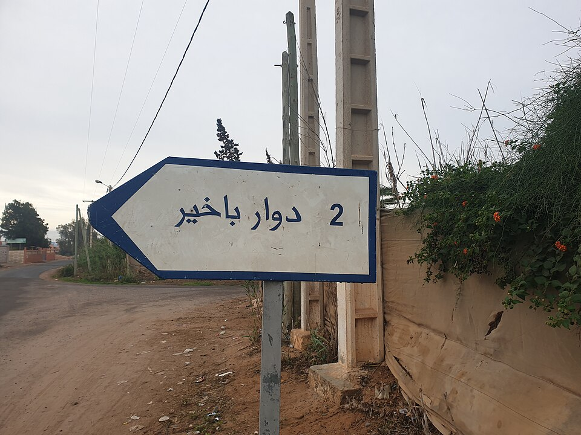
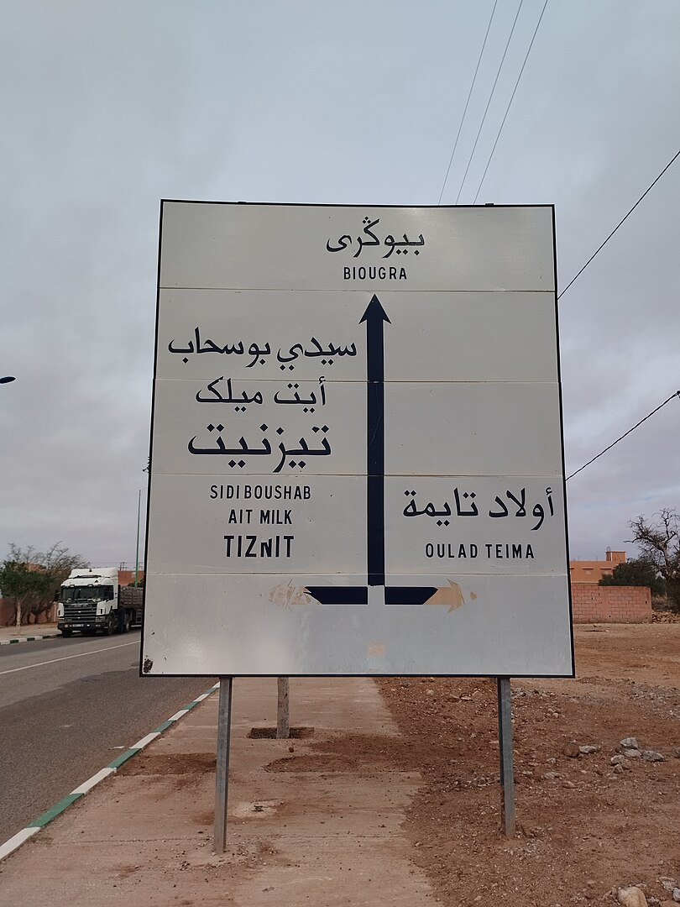

    <h2 class="section-title">{}</h2>
    <ul class="rule-list">
        <li>2023年11月の時点では公式カバレッジは無い</li>
    </ul>

{}
{}
{}
止まれの標識が独特。
{}

{}
電柱はフランスなどに見られる仕切りのある電柱が見つかる{}。1956年までは大部分がフランス保護領モロッコだった。
{}

{}
アラビア語とフランス語の表記がある。ベルベル語の表記も見つかる{{% ref "https://ja.wikipedia.org/wiki/%E3%83%99%E3%83%AB%E3%83%99%E3%83%AB%E8%AA%9E%E6%B4%BE" "ベルベル語" %}}。
{}

{}
{}