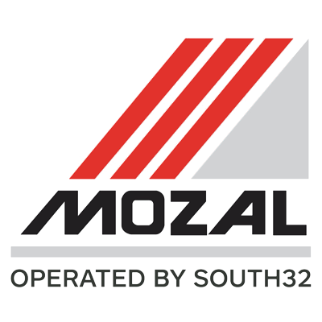

    <h2 class="section-title">{}</h2>
    <ul class="rule-list">
        <li>2023年11月の時点では公式カバレッジは無い</li>
    </ul>

{}
{}
{}
日本は石炭や液化天然ガスの輸入をしており、対モザンビークは貿易赤字となっている{}。Mozal社のような日本企業が出資している会社が国内最大企業として成長したりと日本との関係は実は深い。
{}

{}
{}