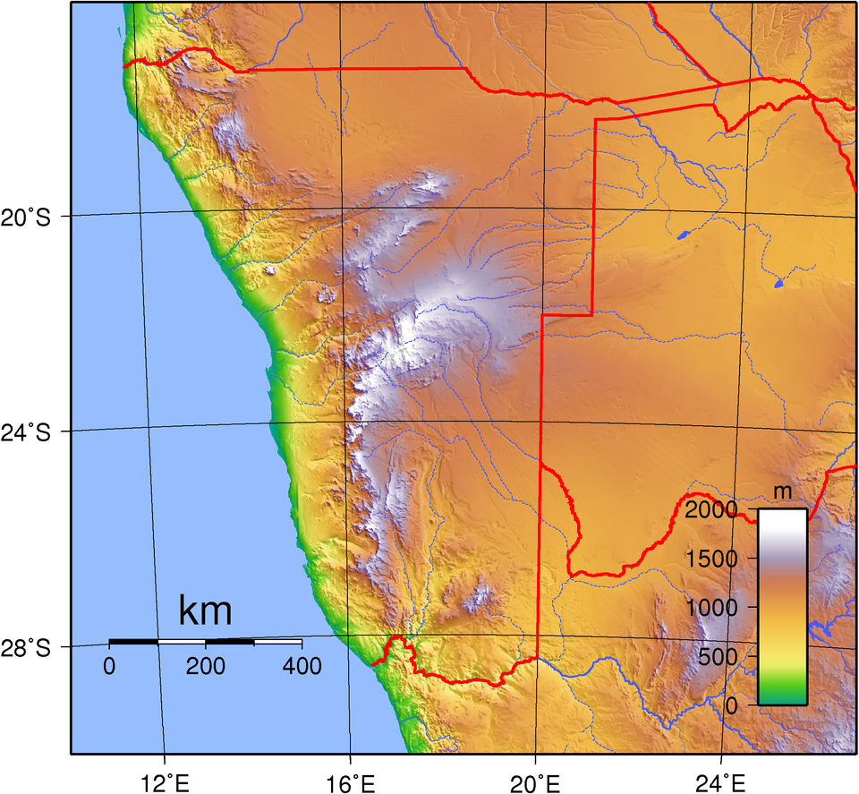
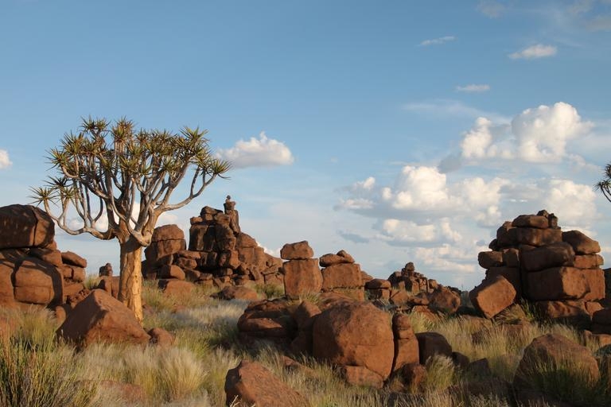
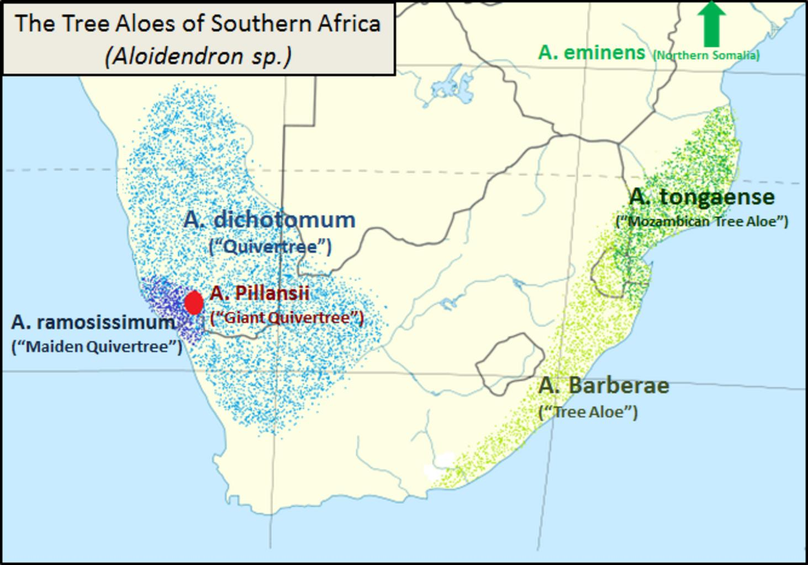
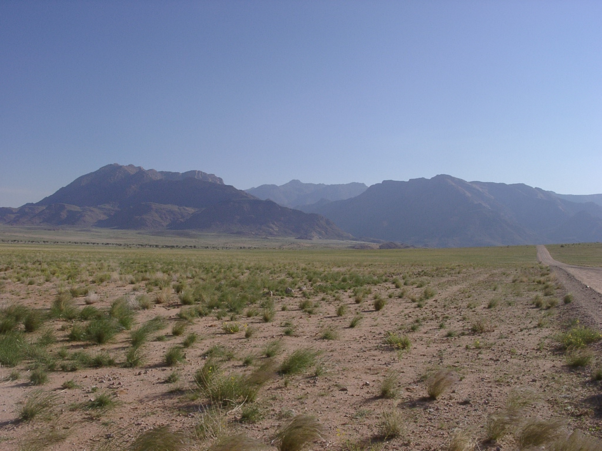

    <h2 class="section-title">{}</h2>
    <ul class="rule-list">
        <li>Cars drive on the left side</li>
        <li>Official language is English</li>
        <li>Standard passenger vehicles have yellow license plates</li>
        <li>Street names derived from German can be found</li>
        <li>Domain is .na</li>
    </ul>
    {}

{}
{}

{}Standard passenger vehicles have yellow license plates{} and drive on the left side.
{}

{}

By <a href="//commons.wikimedia.org/wiki/User:Dickelbers" title="User:Dickelbers">Dickelbers</a> - Own work, <a href="https://creativecommons.org/licenses/by-sa/4.0" title="Creative Commons Attribution-Share Alike 4.0">CC BY-SA 4.0</a>, <a href="https://commons.wikimedia.org/w/index.php?curid=45401926">Link</a>
{}

{}The flat Namib Desert spreads along the coast{}. It is classified as a west coast desert, similar to the {}{{% ref "https://ja.wikipedia.org/wiki/%E8%A5%BF%E5%B2%B8%E7%A0%82%E6%BC%A0" "west coast deserts" %}}.
{}

{}After colonization by {}, Namibia was under the mandate of the Union of South Africa. As a result, street names with German sounds can be seen{}.
{}

By <a href="//commons.wikimedia.org/wiki/User:Zairon" title="User:Zairon">Zairon</a> - Own work, <a href="https://creativecommons.org/licenses/by-sa/4.0" title="Creative Commons Attribution-Share Alike 4.0">CC BY-SA 4.0</a>, <a href="https://commons.wikimedia.org/w/index.php?curid=71217869">Link</a>

{}
Despite the low population, Namibia is rich in mineral resources like diamonds and uranium. As a result, urban areas tend to be relatively safe and well-developed in terms of housing and infrastructure{}.
In places like Swakopmund, European-style architecture influenced by {} still remains{}{{% ref "https://ja.wikipedia.org/wiki/%E3%82%B9%E3%83%AF%E3%82%B3%E3%83%97%E3%83%A0%E3%83%B3%E3%83%88" "Swakopmund" %}}.
{}

{}
{}

    <h2 class="section-title">{}</h2>
    <h4 class="section-title">Scenery</h4>
    <ul class="rule-list">
        <li>Elevation varies by region, with mountainous areas beyond the coastal lowlands
            <ul>
                <li>The coastal Namib Desert is extremely flat{} </li>
            </ul>
        </li>
        <li>The amount of vegetation varies by region{}
            <ul>
                <li>■ Areas where over 80% is covered{}</li>
                <li>■ Areas where trees grow but not fully covered by grass</li>
                <li>■ Nama Karoo areas, characterized by shrubs and small grass, with no large trees</li>
                <li>■ Namib Desert</li>
                <li>■ River areas with white</li>
            </ul>
        </li>
        <li>Railroads are used to transport containers from the most important port, Walvis Bay, and Lüderitz, which was the only major port until the end of apartheid
            <ul>
                <li>Walvis Bay{} (tracks raise the ground slightly)</li>
                <li>Lüderitz{}</li>
            </ul>
        </li>
    </ul>

{}
{}

{}
Beyond the coastal lowland area that makes up the Namib Desert lies the Great Escarpment, a mountainous zone where elevation increases by about 1000 meters. In central Namibia and elevated areas, rugged rocky hills can be seen.
{}

{}
{}

{}
Green areas are over 80% covered, while light green areas show more exposed ground.
{}

{}
{}

{}
Railroads center around Walvis Bay, the most important port (tracks shown in black-and-white lines on the island map). Until the end of apartheid and the incorporation of Walvis Bay, Lüderitz was the only port along Namibia’s coast capable of handling large ships. Thinking of this alongside history can make it easier to remember.
{}

By <a href="//commons.wikimedia.org/wiki/User:Htonl" title="User:Htonl">Htonl</a> - Own work / <a href="https://en.wikipedia.org/wiki/en:OpenStreetMap" class="extiw" title="w:en:OpenStreetMap">OpenStreetMap</a> geodata., <a href="https://creativecommons.org/licenses/by-sa/2.0" title="Creative Commons Attribution-Share Alike 2.0">CC BY-SA 2.0</a>, <a href="https://commons.wikimedia.org/w/index.php?curid=20231852">Link</a>

{}
{}

    <h4 class="section-title">Vegetation</h4>
    <ul class="rule-list">
        <li>Pterocarpus angolensis (commonly known as wild teak) grows naturally along the northeastern Caprivi Strip</li>
        <li>Colophospermum mopane is only found in northwestern Namibia{}</li>
        <li>The so-called "exploding palm" is distributed near northern Angola and along the northwestern coast{}</li>
        <li>Aloe dichotoma grows only in {} and southwestern Namibia</li>
    </ul>

{}
{}
{}
Wild teak is frequently recorded along the northeastern Caprivi Strip{}. You can observe its round, brown pod-like fruit{}.
{}

<iframe src="https://www.google.com/maps/embed?pb=!4v1749047427382!6m8!1m7!1sg9MuciuFgXQ55f4YluD14g!2m2!1d-18.05073644654441!2d20.93175947601597!3f192.49570894906978!4f12.245689334005007!5f1.7262685934902433" width="600" height="450" style="border:0;" allowfullscreen="" loading="lazy" referrerpolicy="no-referrer-when-downgrade"></iframe>

{}
{}
{}
It appears bushy and spread out from low branches{}.
{}

By <a href="//commons.wikimedia.org/wiki/User:Erc%C3%A9" title="User:Ercé">Roger Culos</a> - Own work, <a href="https://creativecommons.org/licenses/by-sa/3.0" title="Creative Commons Attribution-Share Alike 3.0">CC BY-SA 3.0</a>, <a href="https://commons.wikimedia.org/w/index.php?curid=34066751">Link</a>

{}
{}
{}
The so-called "exploding palm" is distributed near northern Angola and along the northwestern coast{}.
{}

{}
{}
{}
Although its silhouette is distinctive, it may not be often seen due to the lack of roads along the border where it grows{}.
{}

{}
The distribution area is shown in the light blue dot region in the image below (CC0 image){}.
{}

{}
{}

    <h2 class="section-title">{}</h2>
    <ul class="rule-list">
        <li>At Walvis Bay, the largest port in the Republic of Namibia, you can see freight trains and container terminals</li>
        <li>There are regions where you can see Brandberg Mountain, Namibia’s highest peak</li>
    </ul>

{}
{}

{}
Walvis Bay is the largest port in Namibia{}. It was incorporated into Namibia in August 1993, coinciding with the end of apartheid. It serves as a hub for import and export of goods to {}, Zambia, and other regions, which is why railroads extend from this town. You can often spot container terminals{} and logistics companies{}.
{}

{}
{}

{}
Located in northern Namibia, the vast flat-topped Brandberg Mountain is a prominent feature{}.
{}

{}
{}
