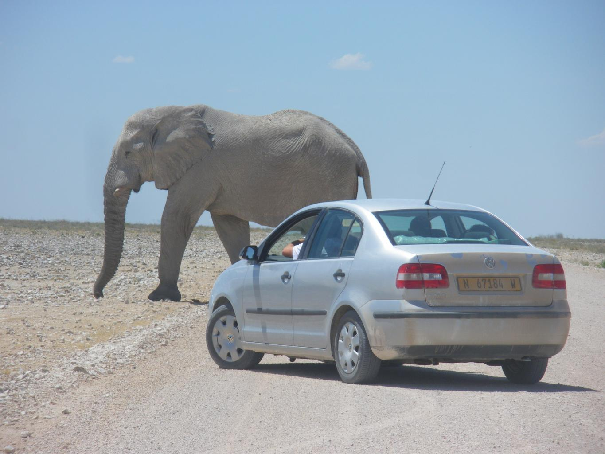

    <h2 class="section-title">{}</h2>
    <ul class="rule-list">
        <li>Los vehículos circulan por el lado izquierdo.</li>
        <li>Los automóviles particulares tienen matrículas de color amarillo.</li>
        <li>El dominio de internet es .na.</li>
    </ul>
    {}

{}
{}

{}
Los automóviles particulares tienen matrículas de color amarillo {}.
{}

{}

Por <a href="//commons.wikimedia.org/wiki/User:Dickelbers" title="User:Dickelbers">Dickelbers</a> - Trabajo propio, <a href="https://creativecommons.org/licenses/by-sa/4.0" title="Creative Commons Attribution-Share Alike 4.0">CC BY-SA 4.0</a>, <a href="https://commons.wikimedia.org/w/index.php?curid=45401926">Link</a>
{}

{}
El vasto y plano desierto de Namib se extiende a lo largo del país.
{}

{}
{}
