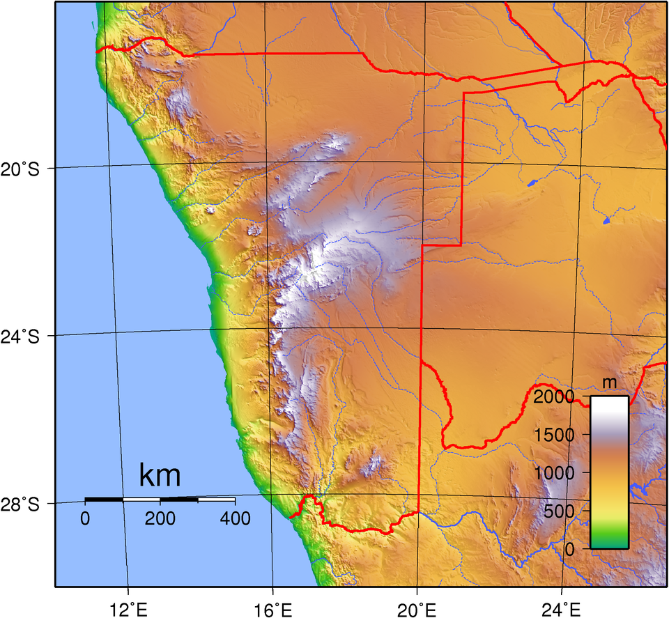
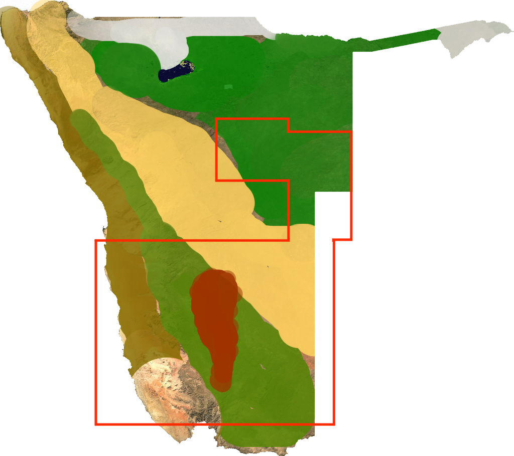
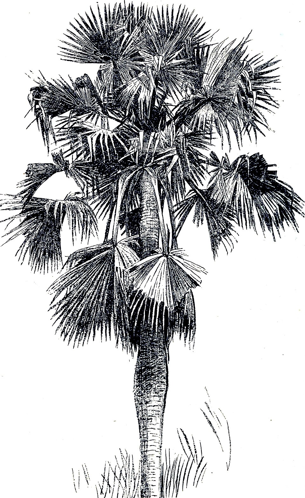
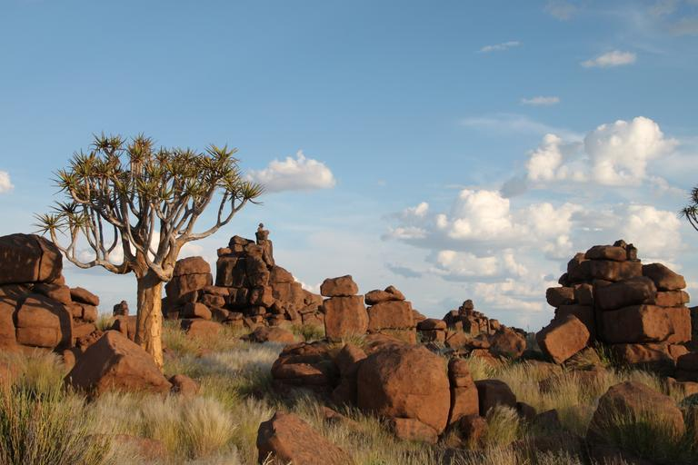
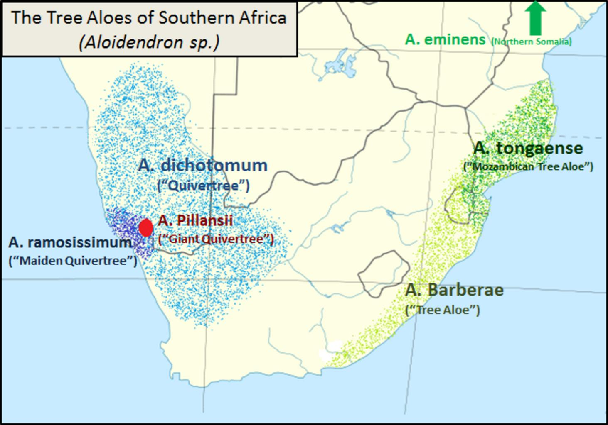
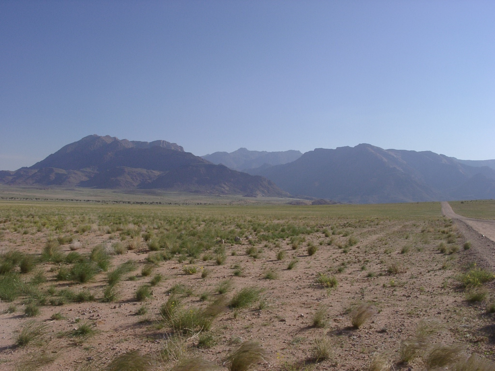

    <h2 class="section-title">{}</h2>
    <ul class="rule-list">
        <li>車は左側通行</li>
        <li>一般の乗用車は黄色のナンバープレート</li>
        <li>ドイツ語由来の通り名が見つかる</li>
        <li>ドメインは.na</li>
    </ul>
    {}

{}
{}

{}一般の乗用車は黄色のナンバープレート{}
{}

{}

By <a href=&quot;//commons.wikimedia.org/wiki/User:Dickelbers&quot; title=&quot;User:Dickelbers&quot;>Dickelbers</a> - Own work, <a href="https://creativecommons.org/licenses/by-sa/4.0" title="Creative Commons Attribution-Share Alike 4.0">CC BY-SA 4.0</a>, <a href="https://commons.wikimedia.org/w/index.php?curid=45401926">Link</a>
{}

{}海沿いには平坦なナミブ砂漠が広がっている。{}と同じ西岸砂漠に部類される{{% ref "https://ja.wikipedia.org/wiki/%E8%A5%BF%E5%B2%B8%E7%A0%82%E6%BC%A0" "西岸砂漠" %}}。
{}

{}{}による植民地支配を経て、南アフリカ連邦の委任統治下になった。そのためドイツ語の響きがある通り名を見かける{}。
{}

By <a href="//commons.wikimedia.org/wiki/User:Zairon" title="User:Zairon">Zairon</a> - Own work, <a href="https://creativecommons.org/licenses/by-sa/4.0" title="Creative Commons Attribution-Share Alike 4.0">CC BY-SA 4.0</a>, <a href="https://commons.wikimedia.org/w/index.php?curid=71217869">Link</a>

{}
{}

    <h2 class="section-title">{}</h2>
    <h4 class="section-title">景色</h4>
    <ul class="rule-list">
        <li>標高は地域によって異なり海岸低地を超えると山がちなエリアになる
            <ul>
                <li>海沿いのナミブ砂漠は非常に平坦{} </li>
            </ul>
        </li>
        <li>地面が草原で覆われている割合が地域によって異なる</li>
        <li>最も重要な港であるWalvis Bayを中心に鉄道が走っている</li>
    </ul>

{}
{}

{}
ナミブ砂漠となっている海岸低地を超えると、大急崖帯という山がちなエリアになりここで標高が1000mほど上昇する。
{}

{}
{}

{}
緑の地域はほぼ全体が、黄緑の地域は20%くらい生えてそう。
{}

{}
{}

{}
最も重要な港であるWalvis Bayを中心に鉄道が走っている(線路は島マップの白黒線)。
{}

By <a href="//commons.wikimedia.org/wiki/User:Htonl" title="User:Htonl">Htonl</a> - Own work / <a href="https://en.wikipedia.org/wiki/en:OpenStreetMap" class="extiw" title="w:en:OpenStreetMap">OpenStreetMap</a> geodata., <a href="https://creativecommons.org/licenses/by-sa/2.0" title="Creative Commons Attribution-Share Alike 2.0">CC BY-SA 2.0</a>, <a href="https://commons.wikimedia.org/w/index.php?curid=20231852">Link</a>

{}
{}

    <h4 class="section-title">植生</h4>
    <ul class="rule-list">
        <li>Pterocarpus angolensis（アンゴラカリン）は北東のカプリビ回廊沿いに自生する</li>
        <li>Colophospermum mopaneはナミビア北西部にしか生えていない{}</li>
        <li>いわゆる爆発ヤシは北部アンゴラ近くと北西部海沿いに分布する{}</li>
        <li>Aloe dichotomaは{}～ナミビア南西部にしか生えていない</li>
    </ul>

{}
{}
{}
アンゴラカリンは北東のカプリビ回廊沿いの記録が多い{}。丸く茶色い実のカラのようなものが観察できる{}。
{}

<iframe src="https://www.google.com/maps/embed?pb=!4v1749047427382!6m8!1m7!1sg9MuciuFgXQ55f4YluD14g!2m2!1d-18.05073644654441!2d20.93175947601597!3f192.49570894906978!4f12.245689334005007!5f1.7262685934902433" width="600" height="450" style="border:0;" allowfullscreen="" loading="lazy" referrerpolicy="no-referrer-when-downgrade"></iframe>

{}
{}
{}
なんか低いところかわ分岐してうわーってなっている感じ{}。
{}

By <a href="//commons.wikimedia.org/wiki/User:Erc%C3%A9" title="User:Ercé">Roger Culos</a> - Own work, <a href="https://creativecommons.org/licenses/by-sa/3.0" title="Creative Commons Attribution-Share Alike 3.0">CC BY-SA 3.0</a>, <a href="https://commons.wikimedia.org/w/index.php?curid=34066751">Link</a>

{}
{}
{}
いわゆる爆発ヤシは北部アンゴラ近くと北西部海沿いに分布する{}。
{}

{}
{}
{}
シルエットから分かりやすいが、生えいている国境沿いの道路などに道が少ないため見かけることは少ないかも{}。
{}

{}
分布エリアは下図の水色点エリアとなる（CC0画像）{}。
{}

{}
{}

    <h2 class="section-title">{}</h2>
    <ul class="rule-list">
        <li>ナミビア共和国で最大の港であるWalvis Bayでは鉄道貨物やコンテナターミナルが見える</li>
        <li>ナミビア最高峰であるBrandberg山が見える地域がある</li>
    </ul>

{}
{}

{}
ウォルビスベイは、ナミビア共和国で最大の港{}。1993年8月、アパルトヘイト終結のタイミングでナミビアへ編入された。{}やザンビアの他の地域への貨物の輸出入にも活用されるため、この町を起点にして鉄道が走っている。
{}

{}
{}

{}
ナミビア北部にあり、平たく巨大な山が見える{}。
{}

{}
{}

