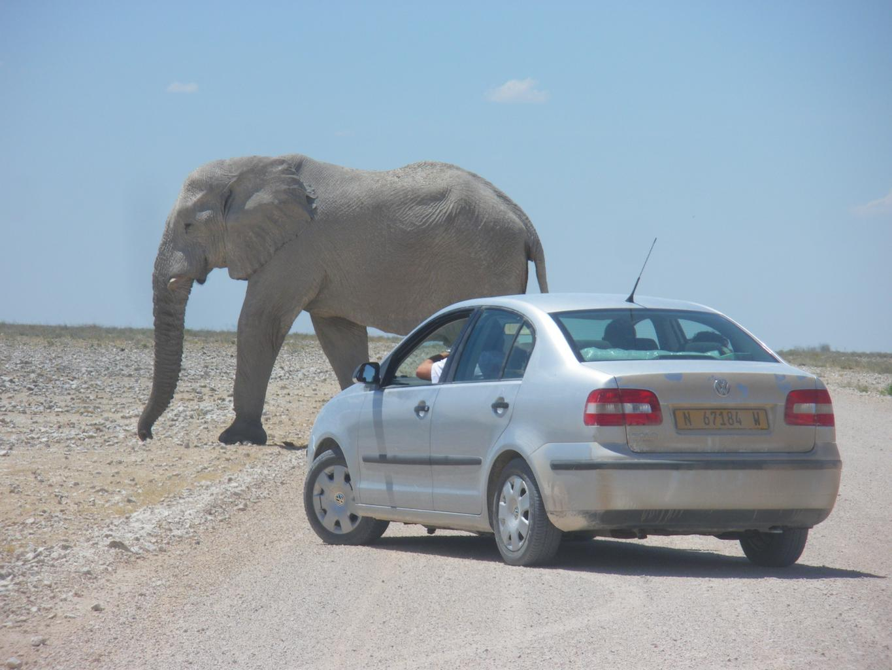
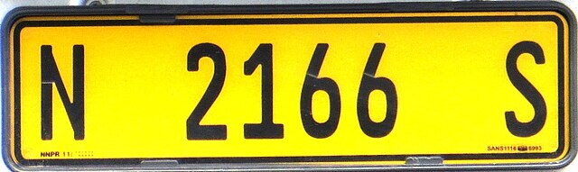
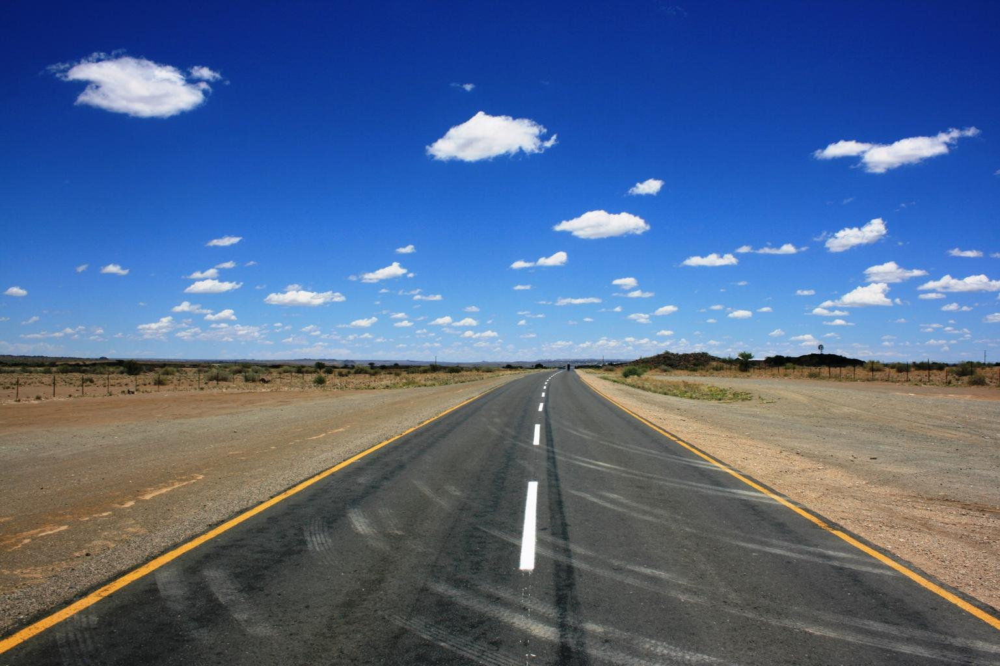

    <h2 class="section-title">{}</h2>
    <ul class="rule-list">
        <li>公式カバレッジは2023年9月の時点では無い</li>
        <li>車は左側通行</li>
        <li>一般の乗用車は黄色のナンバープレート</li>
        <li>ドメインは.na</li>
    </ul>
    {}

{}
{}

{}一般の乗用車は黄色のナンバープレート{}
{}

{}

By <a href=&quot;//commons.wikimedia.org/wiki/User:Dickelbers&quot; title=&quot;User:Dickelbers&quot;>Dickelbers</a> - Own work, <a href="https://creativecommons.org/licenses/by-sa/4.0" title="Creative Commons Attribution-Share Alike 4.0">CC BY-SA 4.0</a>, <a href="https://commons.wikimedia.org/w/index.php?curid=45401926">Link</a>
{}

{}平坦なナミブ砂漠が広がっている
{}

{}
{}
