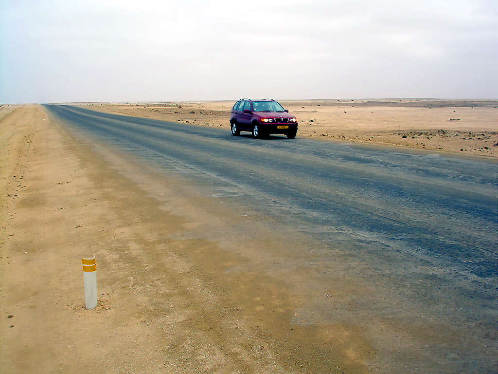
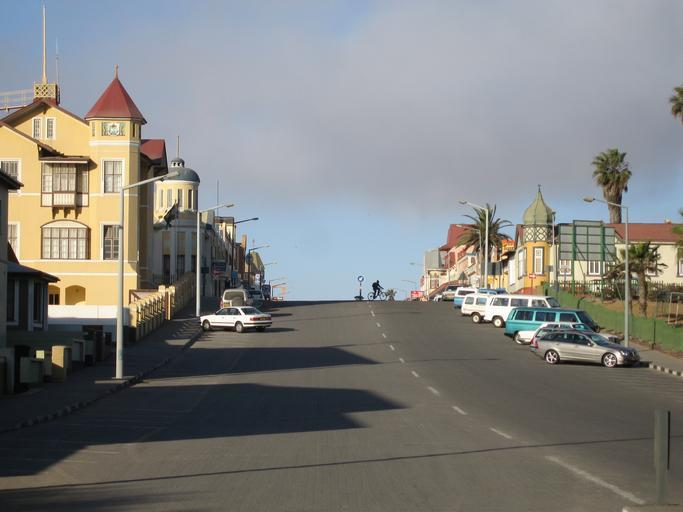
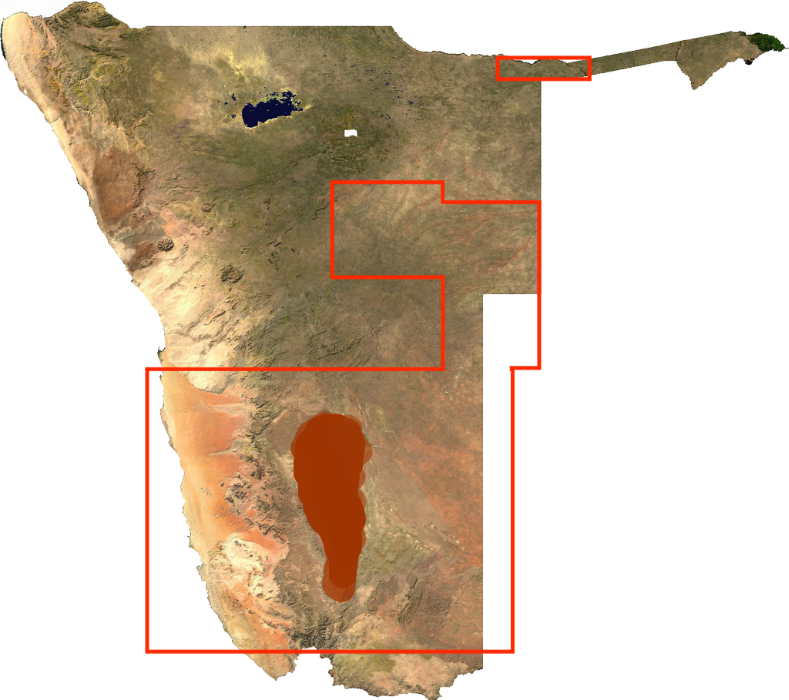
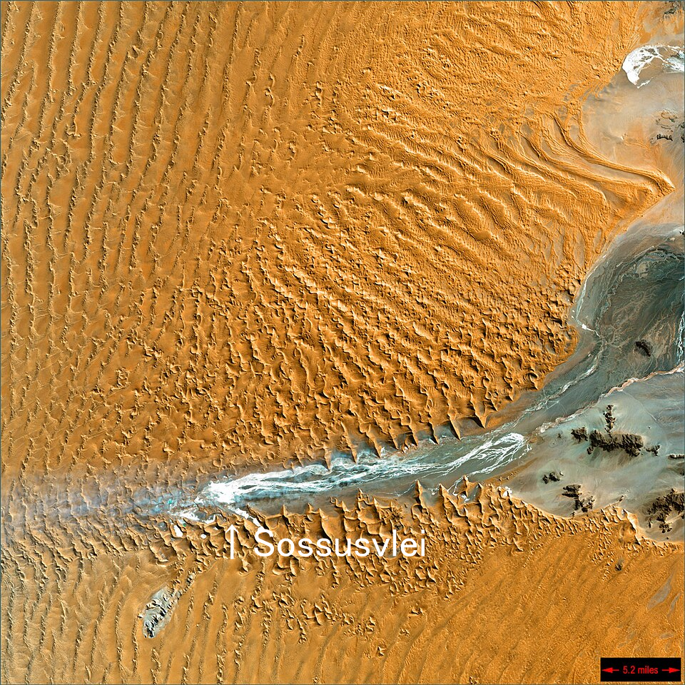

    <h2 class="section-title">{}</h2>
    <ul class="rule-list">
        <li>車は左側通行</li>
        <li>公用語は英語</li>
        <li>一般の乗用車は黄色のナンバープレート</li>
        <li>ドイツ語由来の通り名が見つかる</li>
        <li>ドメインは.na</li>
    </ul>
    {}

{}
{}

{}一般の乗用車は黄色のナンバープレート{}であり左側通行。
{}

{}

By <a href=&quot;//commons.wikimedia.org/wiki/User:Dickelbers&quot; title=&quot;User:Dickelbers&quot;>Dickelbers</a> - Own work, <a href="https://creativecommons.org/licenses/by-sa/4.0" title="Creative Commons Attribution-Share Alike 4.0">CC BY-SA 4.0</a>, <a href="https://commons.wikimedia.org/w/index.php?curid=45401926">Link</a>
{}

{}海沿いには平坦なナミブ砂漠が広がっている{}。何種類か、ナミビア以外では見かけないボラードも見つかる{}。ナミブ砂漠は{}のアタカマ砂漠と同じ西岸砂漠に部類される{{% ref "https://ja.wikipedia.org/wiki/%E8%A5%BF%E5%B2%B8%E7%A0%82%E6%BC%A0" "西岸砂漠" %}}。
{}

{}{}による植民地支配を経て、南アフリカ連邦の委任統治下になった。そのためドイツ語の響きがある通り名を見かける{}。
{}

By <a href="//commons.wikimedia.org/wiki/User:Zairon" title="User:Zairon">Zairon</a> - Own work, <a href="https://creativecommons.org/licenses/by-sa/4.0" title="Creative Commons Attribution-Share Alike 4.0">CC BY-SA 4.0</a>, <a href="https://commons.wikimedia.org/w/index.php?curid=71217869">Link</a>

{}
人口が少ない割にダイヤモンドやウランのような鉱物資源が豊富なため、都市部では比較的治安が良く家やインフラも整備されている{}。
Swakopmundなどでは{}の影響を受けた洋風の建築物も残っているという{}{{% ref "https://ja.wikipedia.org/wiki/%E3%82%B9%E3%83%AF%E3%82%B3%E3%83%97%E3%83%A0%E3%83%B3%E3%83%88" "スワコプムント" %}}。
{}

{}
Google Carは白い屋根が見える{}かおおきなぼかしが映っている{}。{}や{}と間違えないように注意。
{}

<iframe src="https://www.google.com/maps/embed?pb=!4v1749386178763!6m8!1m7!1sOOCV-xBLiy53cHjU1_WGEw!2m2!1d-19.26354072670183!2d17.70210560998813!3f174.30194864447998!4f2.562978388532102!5f0.4908833535131307" width="600" height="450" style="border:0;" allowfullscreen="" loading="lazy" referrerpolicy="no-referrer-when-downgrade"></iframe>

{}
{}

    <h2 class="section-title">{}</h2>
    <h4 class="section-title">景色</h4>
    <ul class="rule-list">
        <li>標高は地域によって異なり海岸低地を超えると山がちなエリアになる
            <ul>
                <li>海沿いのナミブ砂漠は非常に平坦{} </li>
            </ul>
        </li>
        <li>木や草の生える割合が地域によって異なる{}
            <ul>
                <li>■80%以上覆われている地域{}</li>
                <li>■木は生えるが草原では覆われない地域</li>
                <li>■Nama Karooという分類のエリアであり低木や小型の草のみ生え大型の木は生えない、草で覆われることもない</li>
                <li>■ナミブ砂漠{}</li>
                <li>■白っぽい地面{}</li>
                <li>■枠内部：土がすこし赤っぽいエリア{}</li>
                <li>■土がこげ茶色っぽいエリア{}</li>
            </ul>
        </li>
    </ul>

{}
{}

{}
ナミブ砂漠となっている海岸低地を超えると、大急崖帯という山がちなエリアになりここで標高が1000mほど上昇する。ナミビア中央部や標高が上がるエリアではごつごつした岩山も見える。
{}

{}
{}

{}
緑の地域は80%以上、黄緑の地域は地面も目立つ。
{}

{}
{}

    <h4 class="section-title">産業</h4>
    <ul class="rule-list">
        <li>最も重要な港であるWalvis Bay、アパルトヘイト終了までの唯一の港だったLüderitz。この２か所を起点にコンテナを輸送するための鉄道が走っている{}。
            <ul>
                <li>Walvis Bay{}（線路を走っている箇所の土が盛り上がっている）</li>
                <li>Lüderitz{}</li>
            </ul>
        </li>
        <li>北西部の山脈では銅・亜鉛・ウラン・ゴールドなどさまざまな鉱山が稼働しており、たまに看板がみつかる{}
            <ul>
                <li>亜鉛{}</li>
                <li>金{}</li>
                <li>錫{}</li>
            </ul>
        </li>
    </ul>

{}
{}

{}
最も重要な港であるWalvis Bayを中心に鉄道が走っている(線路は島マップの白黒線)。また、アパルトヘイトが終了しWalvis Bayが編入されるまでナミビア沿岸で大型船が寄れる港はüderitzだけだった。そのため、このふたつの町にはコンテナを輸送するための鉄道が走っていると考えると歴史とともに頭に入りやすい（かも）。
{}

By <a href="//commons.wikimedia.org/wiki/User:Htonl" title="User:Htonl">Htonl</a> - Own work / <a href="https://en.wikipedia.org/wiki/en:OpenStreetMap" class="extiw" title="w:en:OpenStreetMap">OpenStreetMap</a> geodata., <a href="https://creativecommons.org/licenses/by-sa/2.0" title="Creative Commons Attribution-Share Alike 2.0">CC BY-SA 2.0</a>, <a href="https://commons.wikimedia.org/w/index.php?curid=20231852">Link</a>

{}
{}

{}
銅・亜鉛・ウラン・ゴールドなどさまざまなものが産出するが、これらの鉱山はほぼ首都Windhoekより北の西部の山脈にある{}。道端に鉱山の看板が見つかるかも{}。
{}

By <a href="https://atlasofnamibia.online/chapter-2/minerals" title="User:Htonl">Atlas of Namibia</a> - Own work, <a href="https://creativecommons.org/licenses/by/4.0/" title="CC BY 4.0">CC BY 4.0</a>, <a href="https://atlasofnamibia.online/chapter-2/minerals">Link</a>

{}
{}

    <h4 class="section-title">植生</h4>
    <ul class="rule-list">
        <li>いわゆる爆発ヤシは北部アンゴラ近くと北西部海沿いに分布する{}</li>
        <li>Pterocarpus angolensis（アンゴラカリン）は北東のカプリビ回廊沿いに自生する</li>
        <li>Colophospermum mopaneはナミビア北西部にしか生えていない{}</li>
        <li>Aloe dichotomaは{}～ナミビア南西部にしか生えていない</li>
        <li>Welwitschiaは北西部にしか生えていないが道端で見つかるかは分からない{}</li>
    </ul>

{}
{}
{}
いわゆる爆発ヤシは北部アンゴラ近くと北西部海沿いに分布する{}。
{}

{}
{}
{}
アンゴラカリンは北東のカプリビ回廊沿いの記録が多い{}。丸く茶色い実のカラのようなものが観察できる{}。
{}

<iframe src="https://www.google.com/maps/embed?pb=!4v1749047427382!6m8!1m7!1sg9MuciuFgXQ55f4YluD14g!2m2!1d-18.05073644654441!2d20.93175947601597!3f192.49570894906978!4f12.245689334005007!5f1.7262685934902433" width="600" height="450" style="border:0;" allowfullscreen="" loading="lazy" referrerpolicy="no-referrer-when-downgrade"></iframe>

{}
{}
{}
なんか低いところから分岐して広がっている感じ{}。
{}

By <a href="//commons.wikimedia.org/wiki/User:Erc%C3%A9" title="User:Ercé">Roger Culos</a> - Own work, <a href="https://creativecommons.org/licenses/by-sa/3.0" title="Creative Commons Attribution-Share Alike 3.0">CC BY-SA 3.0</a>, <a href="https://commons.wikimedia.org/w/index.php?curid=34066751">Link</a>

{}
{}
{}
南アフリカ北西～ナミビア南西部{}。シルエットから分かりやすいが、生えいている国境沿いに道が少ないため見かけることは少ないかも{}。
{}

{}
分布エリアは下図の水色点エリアとなる（CC0画像）{}。
{}

{}
{}
{}
アフリカのアンゴラとナミビアのナミブ砂漠にしか分布していない種で、記録のほとんどは海岸から80km圏内で見つかっている{}。見かけたらレア。固有種は他にも多く存在する{}。
{}

{}
{}

    <h2 class="section-title">{}</h2>
    <ul class="rule-list">
        <li>Aussenkehrには特徴的な茅葺の家の街並みが見つかる</li>
        <li>Oranjemundはもともとダイヤモンド会社の私有地で、等間隔に家とインフラが整備されている</li>
        <li>Sossusvleiと呼ばれる観光地へ向かう、高い赤い砂丘に囲まれた平野への道がある{}</li>
        <li>ナミビア最高峰であるBrandberg山が見える地域がある</li>
    </ul>

{}
{}

{}
Aussenkehrの街並み{}。周辺には農場が広がっている{}。
{}

{}
{}

{}
ダイヤモンド企業であるデビアスの私有地だった場所であり、古い家は無くインフラもかなり整備されている。
{}

<iframe src="https://www.google.com/maps/embed?pb=!4v1749539510067!6m8!1m7!1sPybl_PrpcY_gOw4Z80T2lw!2m2!1d-28.55043324632372!2d16.43642097172851!3f88.63650154363451!4f2.0828538216717334!5f0.7820865974627469" width="600" height="450" style="border:0;" allowfullscreen="" loading="lazy" referrerpolicy="no-referrer-when-downgrade"></iframe>

{}
{}

{}
Sossusvleiと呼ばれる観光地へ向かう、高い赤い砂丘に囲まれた平野への道がある{}{}。衛星写真を見るとSossusvleiへの道だけ平野になっており、周りが砂丘になっていることがわかる。
{}

{}
{}

{}
ナミビア北部にあり、平たく巨大な山が見える{}。
{}

{}
{}

