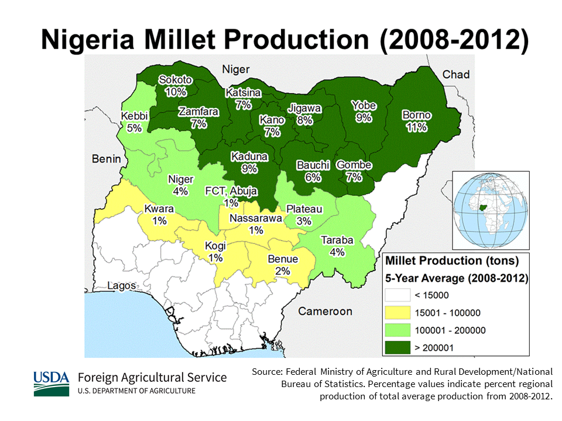

    <h2 class="section-title">{}</h2>
    <ul class="rule-list">
        <li>English is official language.</li>
        <li>Cars drive on the right side.</li>
        <li>The domain is .ng</li>
        <li>Yellow small cabs in town</li>
        <li>police cars often follow behind Google Car{}</li>
        <li>50% of the population is Muslim.</li>
    </ul>
    {}

{}
{}

{}
A small yellow cab is running in town{}. The signs are written in English.
{}

{}
Patrol cars often follow{}. Note that there may be no police car or a car that is not a police car{}.
{}

<iframe src="https://www.google.com/maps/embed?pb=!4v1694923075149!6m8!1m7!1sMFHpePbjTWB7Jd6bVMV7HA!2m2!1d12.042902428128!2d8.553263047472695!3f25.310524109619454!4f-6.629539560981968!5f2.0179041743374317" width="600" height="295" style="border:0;" allowfullscreen="" loading="lazy" referrerpolicy="no-referrer-when-downgrade"></iframe>

{}
You will find section-poles. And Nigeria drives on the right side of the road. There are multiple license plates, which can appear vaguely green, blue, or red{}.
{}

{}

By <a href="//commons.wikimedia.org/w/index.php?title=User:Phedmose&amp;amp;action=edit&amp;amp;redlink=1" class="new" title="User:Phedmose (page does not exist)">Pharm Ede Moses</a> - Own work, <a href="https://creativecommons.org/licenses/by-sa/4.0" title="Creative Commons Attribution-Share Alike 4.0">CC BY-SA 4.0</a>, <a href="https://commons.wikimedia.org/w/index.php?curid=47463054">Link</a>
{}

{}
{}

<iframe src="https://www.google.com/maps/embed?pb=!4v1679854349351!6m8!1m7!1sVEmCuj_hJ169SRu1sEqsuA!2m2!1d6.460371642532762!2d7.493418113273444!3f23.871891209378983!4f-10.141513841761409!5f3.3246080442816175" width="295" height="295" style="border:0;" allowfullscreen="" loading="lazy" referrerpolicy="no-referrer-when-downgrade"></iframe>

{}
{}

<iframe src="https://www.google.com/maps/embed?pb=!4v1679854562480!6m8!1m7!1syiEjGBhayoOdpLrXFIOsag!2m2!1d6.67266544030606!2d3.312221930570927!3f188.50999469130915!4f-8.341239190692107!5f1.6021556725762478" width="295" height="295" style="border:0;" allowfullscreen="" loading="lazy" referrerpolicy="no-referrer-when-downgrade"></iframe>
<iframe src="https://www.google.com/maps/embed?pb=!4v1686927253225!6m8!1m7!1s1M70fWp0fJw_8P-adNJrpA!2m2!1d6.474586597493951!2d3.562058211014273!3f282.62577029999335!4f3.2687283677445436!5f1.3205476195043677" width="295" height="295" style="border:0;" allowfullscreen="" loading="lazy" referrerpolicy="no-referrer-when-downgrade"></iframe>

{}
{}

{}
Seven-Up seems to be popular{}.
{}

<iframe src="https://www.google.com/maps/embed?pb=!4v1679887010318!6m8!1m7!1sE_F2ShVxPyhM75vdTArfRg!2m2!1d6.59987404201229!2d3.375620061922172!3f338.51068283511484!4f1.650537544582619!5f1.5380782434409297" width="295" height="295" style="border:0;" allowfullscreen="" loading="lazy" referrerpolicy="no-referrer-when-downgrade"></iframe>

{}
{}

<iframe src="https://www.google.com/maps/embed?pb=!4v1679854300975!6m8!1m7!1sCYZAITnbOsjhWpqv6oCQHw!2m2!1d6.460632962556097!2d7.494037638197613!3f62.47937376131735!4f-55.67352482695545!5f0.4224407218370322" width="295" height="295" style="border:0;" allowfullscreen="" loading="lazy" referrerpolicy="no-referrer-when-downgrade"></iframe>
<iframe src="https://www.google.com/maps/embed?pb=!4v1679854467975!6m8!1m7!1sTDDOWCZ_zO9HpMhL3Unjaw!2m2!1d6.674669558817172!2d3.310991907104836!3f147.01826933090518!4f-89!5f0.7820865974627469" width="295" height="295" style="border:0;" allowfullscreen="" loading="lazy" referrerpolicy="no-referrer-when-downgrade"></iframe>
<iframe src="https://www.google.com/maps/embed?pb=!4v1679887228862!6m8!1m7!1sUfpxtTNF_4S8exKiYR8Avg!2m2!1d6.60009298151657!2d3.377843834579361!3f131.48897303132352!4f-41.12882916360397!5f0.6823642230179563" width="295" height="295" style="border:0;" allowfullscreen="" loading="lazy" referrerpolicy="no-referrer-when-downgrade"></iframe>

{}
{}

    <h2 class="section-title">{}</h2>
    <ul class="rule-list">
        <li>Vegitation varies from place to place.
            <ul>
                <li>Along the coast: The area of Swamp Forest by the sea has few roads except around the city.</li>
                <li>Southeast: oil palms grow in abundance.</li>
                <li>Central: Grass and shrubs cover the entire area.</li>
                <li>Around Jos: The area around Jos is high in elevation. Craggy rocks and small mountains can be seen.</li>
                <li>Northernmost part: Suburbs have very little grass.</li>
            </ul>
        </li>
    </ul>

{}
{}

{}
The further north you go, the drier and less woody it becomes, with plateaus to the northeast of Abuja and around Jos{}.
{}

{}
{}

<iframe src="https://www.google.com/maps/embed?pb=!4v1694922659581!6m8!1m7!1s8Ow3R10tby2art2YesIBlw!2m2!1d6.757971852293207!2d4.072611256527883!3f287.1758311113074!4f2.552881295514595!5f0.4000000000000002" width="295" height="295" style="border:0;" allowfullscreen="" loading="lazy" referrerpolicy="no-referrer-when-downgrade"></iframe>
<iframe src="https://www.google.com/maps/embed?pb=!4v1694922815201!6m8!1m7!1sALfyi8fAIXmXQDaY8JO52w!2m2!1d7.326160575887643!2d5.117616271521185!3f116.83449045305156!4f8.98622789867845!5f0.4000000000000002" width="295" height="295" style="border:0;" allowfullscreen="" loading="lazy" referrerpolicy="no-referrer-when-downgrade"></iframe>

{}
Compared to the north, there are more trees, and seeing far into the distance is almost impossible.
{}

{}
{}

<iframe src="https://www.google.com/maps/embed?pb=!4v1694922465819!6m8!1m7!1s5D-67W3qJx_B47R8ojyqlA!2m2!1d4.957508083081821!2d7.795402982020307!3f356.1577924893183!4f1.1070556752259932!5f0.43104953548325736" width="295" height="295" style="border:0;" allowfullscreen="" loading="lazy" referrerpolicy="no-referrer-when-downgrade"></iframe>
<iframe src="https://www.google.com/maps/embed?pb=!4v1694922582144!6m8!1m7!1sJVoWS-1saoouj4S6wi9R6g!2m2!1d5.754522304901496!2d6.833269569646347!3f214.18065068166888!4f5.041693218708318!5f0.7820865974627469" width="295" height="295" style="border:0;" allowfullscreen="" loading="lazy" referrerpolicy="no-referrer-when-downgrade"></iframe>

{}
Oil palms are abundantly distributed. Between the yellow-green area in the figure (Uyo to Onitsha), plantations can be seen in the suburbs.
{}

{}
{}

<iframe src="https://www.google.com/maps/embed?pb=!4v1694920652400!6m8!1m7!1spbNZsSW1jZvF2rvZfxg3Sw!2m2!1d9.220760012148732!2d6.987817592291801!3f40.40875856146784!4f7.827803101586696!5f0.4000000000000002" width="295" height="295" style="border:0;" allowfullscreen="" loading="lazy" referrerpolicy="no-referrer-when-downgrade"></iframe>
<iframe src="https://www.google.com/maps/embed?pb=!4v1694920742384!6m8!1m7!1sKZjp7uFbRYC523mCwseRTQ!2m2!1d8.605920472044955!2d4.545701002316861!3f326.5511355370544!4f4.811703667130132!5f0.4000000000000002" width="295" height="295" style="border:0;" allowfullscreen="" loading="lazy" referrerpolicy="no-referrer-when-downgrade"></iframe>

{}
In the Southern Guinea Zone (orange), the ground is covered with grass.
{}

{}
{}

<iframe src="https://www.google.com/maps/embed?pb=!4v1694921507309!6m8!1m7!1sEg2c4qjuRldmMje3p1CzNw!2m2!1d9.898031716232492!2d8.775364589305285!3f235.2207725069892!4f7.114521570548945!5f0.7820865974627469" width="295" height="295" style="border:0;" allowfullscreen="" loading="lazy" referrerpolicy="no-referrer-when-downgrade"></iframe>
<iframe src="https://www.google.com/maps/embed?pb=!4v1694921639932!6m8!1m7!1s5ST0megklOZKmw6mmN5yng!2m2!1d9.708268146594355!2d8.837216293574693!3f34.59653391858231!4f10.336302358820376!5f0.4000000000000002" width="295" height="295" style="border:0;" allowfullscreen="" loading="lazy" referrerpolicy="no-referrer-when-downgrade"></iframe>

{}
Elevation is high, and tree density is not high. Rocks and small mountains can be seen in the distance.
{}

{}
{}

<iframe src="https://www.google.com/maps/embed?pb=!4v1694920671133!6m8!1m7!1sco-q4U7hnVHuNzqsDfl1bw!2m2!1d12.87564040084701!2d5.330013076013167!3f308.12011447783345!4f-0.5166071281412172!5f0.7820865974627469" width="295" height="295" style="border:0;" allowfullscreen="" loading="lazy" referrerpolicy="no-referrer-when-downgrade"></iframe>
<iframe src="https://www.google.com/maps/embed?pb=!4v1694920692373!6m8!1m7!1sm7MRdea3pUl08MtwHLxh8Q!2m2!1d12.30165511873427!2d9.44727254592812!3f62.21921406649807!4f2.5967336208821763!5f0.4000000000000002" width="295" height="295" style="border:0;" allowfullscreen="" loading="lazy" referrerpolicy="no-referrer-when-downgrade"></iframe>

{}
The Sudan Zone (gray area) has almost no grass.
{}

{}
{}

    <ul class="rule-list">
        <li>Different regions have different agricultural practices.
            <ul>
                <li>Oil palm is common in coastal areas.</li>
                <li>{}</li>
            </ul>
        </li>
    </ul>

{}
{}

{}
Oil palm is only found in the coastal area.
{}
{}
{}

{}
コメは中央エリアに多い
{}
{}
{}

{}
何種類かあるらしいけれど画質のせいで違いがわからなかった。乾燥した熱帯のエリアで育てられる？
{}
{}
{}

{}
中央から北部にかけて多いが海沿い以外はどこでも存在する可能性あり
{}
{}
{}

    <h2 class="section-title">{}</h2>
    <ul class="rule-list">
        <li>Zuma Rock is located in Abuja{}.</li>
    </ul>

{}
{}

By <a href="//commons.wikimedia.org/w/index.php?title=User:3.29Fatima&amp;amp;action=edit&amp;amp;redlink=1" class="new" title="User:3.29Fatima (page does not exist)">Fatima </a> - Own work, <a href="https://creativecommons.org/licenses/by-sa/4.0" title="Creative Commons Attribution-Share Alike 4.0">CC BY-SA 4.0</a>, <a href="https://commons.wikimedia.org/w/index.php?curid=86993524">Link</a>

{}
{}